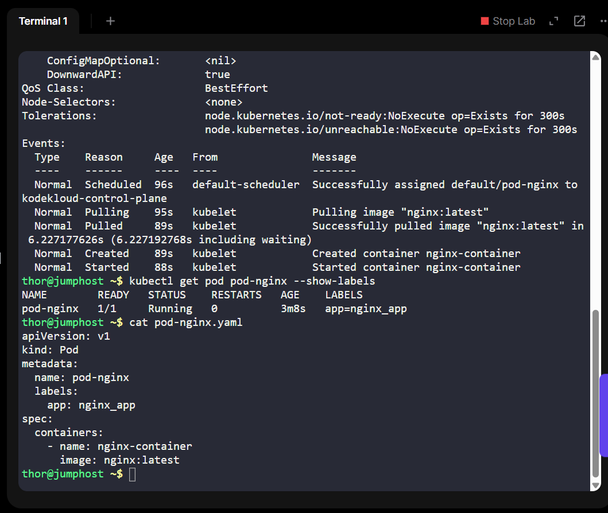

# Day 1 - Kubernetes Pod Deployment: NGINX on Kubernetes with YAML

As part of my #100DaysOfDevOps challenge, I worked with Kubernetes to create a basic Pod using the `kubectl` CLI tool.

## 📌 Task Details

The goal was to create a Kubernetes Pod that runs the `nginx` web server. This involved:

- Creating a Pod named **`pod-nginx`**
- Using the Docker image **`nginx:latest`**
- Naming the container **`nginx-container`**
- Adding a label: `app=nginx_app`

## 🚀 Why This Project Matters

While this is a basic pod deployment, it's representative of real-world scenarios where:

- **Containers** serve APIs, static websites, or reverse proxy layers (like NGINX)
- **YAML manifests** are used for version-controlled Infrastructure as Code (IaC)
- **Labels** allow fine-grained control over deployments, monitoring, scaling, and service discovery
- **kubectl** is used by DevOps/SRE teams to manage containerized workloads at scale

- In enterprise DevOps, even the most complex CI/CD pipelines boil down to applying these core building blocks at scale and with automation.

## 🚀 Commands Used

Create the pod: 
kubectl apply -f pod.yaml

Check pod status: kubectl get pods

Describe the pod (to verify container name, image, etc.): kubectl describe pod pod-nginx

## ✅ Outcome
Pod successfully created and running

Verified correct image, labels, and container name

📸 Screenshots
Command Output	Description
Pod creation and verification via CLI

## 📈 Real-World Use Cases
Web Hosting: Deploying NGINX as a static file server or reverse proxy

Ingress Controllers: NGINX is often used in Kubernetes ingress for routing traffic

Labeling Strategy: Labeling is key in production for managing thousands of pods with selectors

## 🔗 Related Tools
Kubernetes

kubectl

Docker (for container image)

YAML

Linux(CLI)

🔁 Stay tuned for more as I continue through the 100 Days of DevOps challenge!
