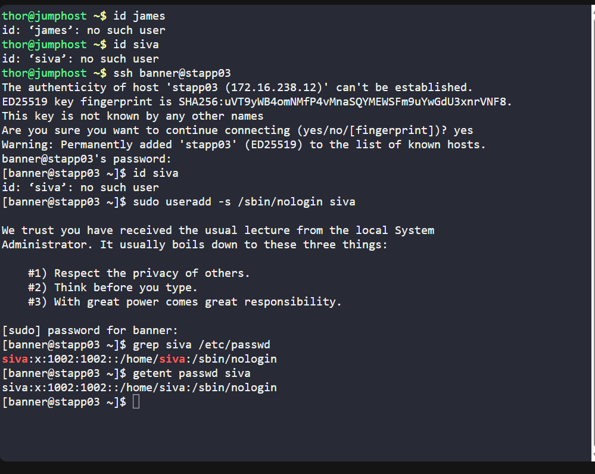

# 📅 Day 01 – xFusionCorp (Project Nautilus)

## 🎯 Task

Create a Linux user named `siva` on `App Server 3 (stapp03)` with a **non-interactive shell**, to be used by a **backup agent** tool that requires secure system access without login privileges.

---

## ✅ Business Context

**Project Nautilus** is a critical naval platform under xFusionCorp Industries, supporting smart procurement and operational readiness across unmanned and manned maritime systems.

To maintain **security and automation standards**, backup agents must run under restricted system accounts. This task reflects real-world DevOps responsibilities like:

- Enforcing **least privilege access**
- Preventing interactive logins for automation accounts
- Securing access to production servers

---

## 🔧 Step-by-step Breakdown

### 🟩 Step 1: Log in to the Jump Host (Control Server)
The KodeKloud environment provides a **jump host** (a gateway server) where access begins:

thor@jump_host $
This jump host connects to all app servers securely.

### 🟩 Step 2: SSH into App Server 3
Connect to App Server 3 (stapp03) using SSH:

ssh banner@stapp03
⚠️ Password was be provided by the training environment.

### ✅ Step 3: Verify user does not already exist
 id siva

### ✅ Step 4: Create the User siva with a Non-Interactive Shell
Once inside stapp03, create the user:

sudo useradd -s /sbin/nologin siva
sudo – Run with admin privileges

useradd – Command to add user

-s /sbin/nologin – Assign a shell that prevents login

This ensures siva cannot log in but still exists as a valid system user for the backup process.

### 🔍 Step 5: Verify the User
Check the /etc/passwd file to verify the user was created with the correct shell:

grep siva /etc/passwd

Expected output:

siva:x:1002:1002::/home/siva:/sbin/nologin

This confirms:

User exists

Has correct home directory

Uses a non-interactive shell

💡 Testing the login with su - siva would have the access denied.

### 🧠 What I Learned
Importance of non-interactive users for automation tooling

How to harden production servers using minimal access principles

Practical user management in Linux

Navigating multi-server infrastructure using Jump Hosts (bastion architecture)

### 💬 Reflection
Even simple user creation can have huge implications in production environments. This task reflects what DevOps professionals must consider daily: automation, access control, and compliance, while ensuring the system remains safe and maintainable.
