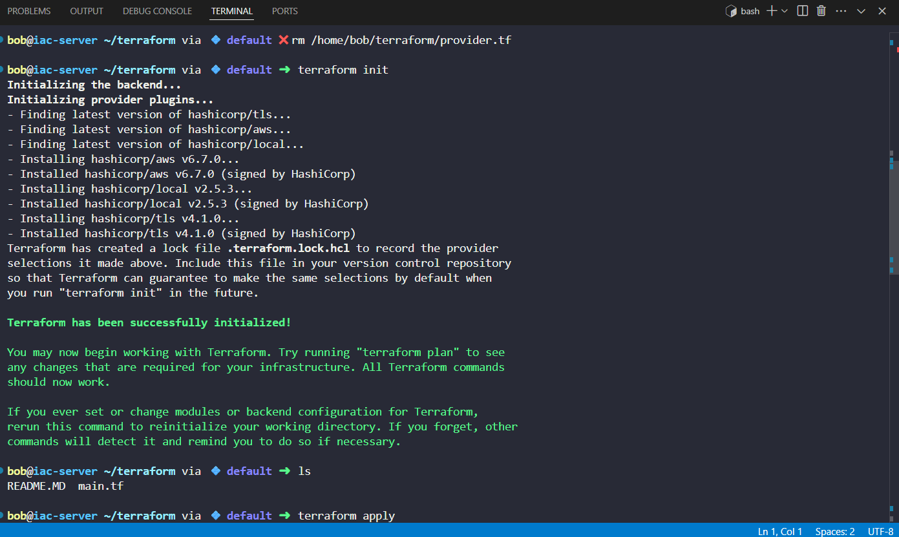
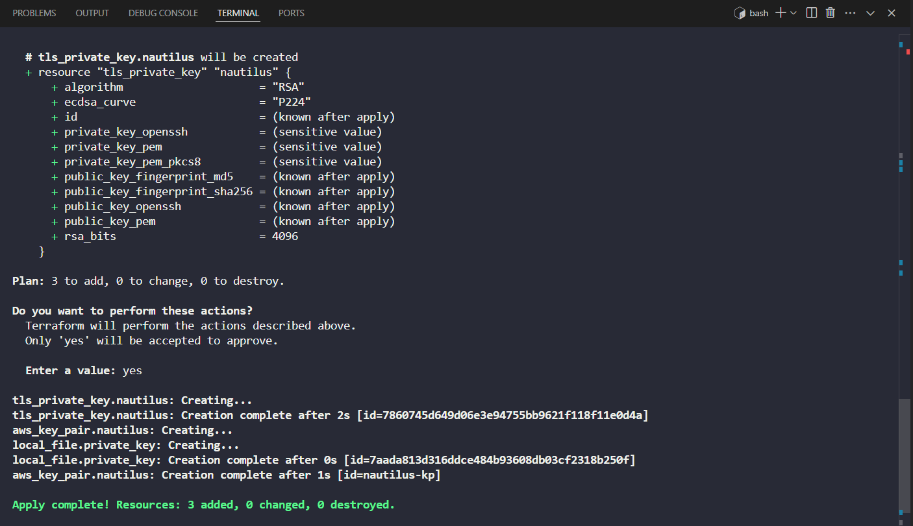
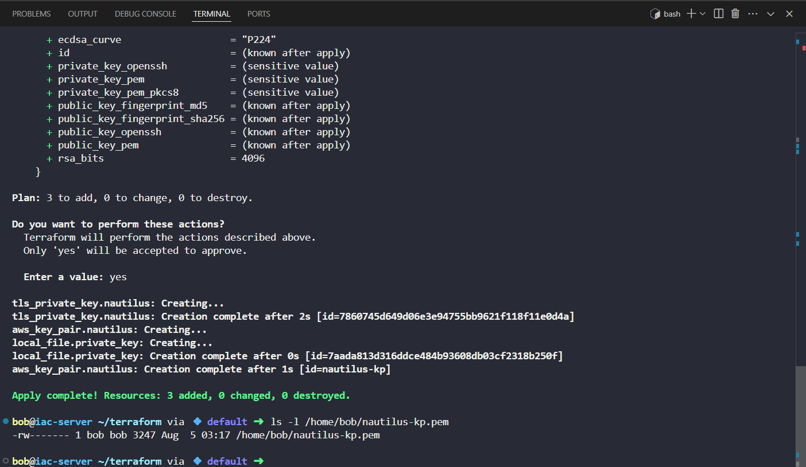

# 100-days-of-devops

# Day 01 – Terraform Lab: AWS Key Pair Generation

This project was completed as part of a hands-on lab from [KodeKloud](https://kodekloud.com/). It demonstrates how to use **Terraform** to generate an RSA key pair and create an AWS EC2 Key Pair resource, with the private key securely stored on the local system.

---

## 📌 Objectives

- Create a Terraform configuration in `main.tf`
- Use the **TLS provider** to generate a 4096-bit RSA private key
- Use the **AWS provider** to create a Key Pair (`nautilus-kp`) with the generated public key
- Save the private key to `/home/bob/nautilus-kp.pem` with secure permissions

---

## 🛠️ Tools & Technologies

- **Terraform** v1.x
- **AWS Provider**
- **TLS Provider**
- **Local File Resource**
- **VS Code**
- **Linux Terminal**

---

## ⚙️ How It Works

1. **TLS provider** generates an RSA private key
2. The public key is passed to the **AWS Key Pair** resource
3. The **local_file** resource writes the private key to disk
4. Permissions are set to `0600` for security

---

## 🚀 Usage (Reproducible Steps)

### Change into the Terraform working directory
cd /home/bob/terraform

### Initialize Terraform
terraform init

### Apply the configuration
terraform apply

When prompted, type yes to confirm.

### ✅ Output Verification
Check the generated PEM file:

ls -l /home/bob/nautilus-kp.pem

Expected output:

-rw------- 1 bob bob 3243 Aug 05 12:34 /home/bob/nautilus-kp.pem

## 🧠 What I Learned
How to generate SSH key pairs using Terraform

How to manage local files and permissions securely

How to create AWS resources using Terraform’s declarative syntax

Better understanding of how providers like tls and aws interact
