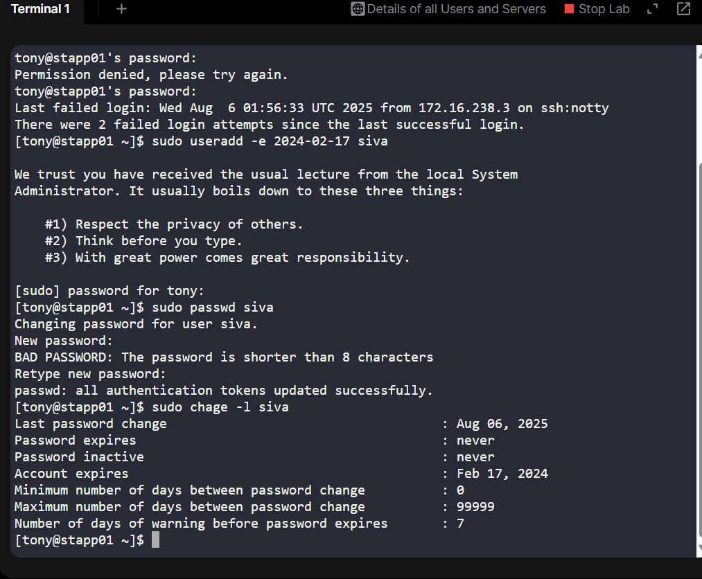
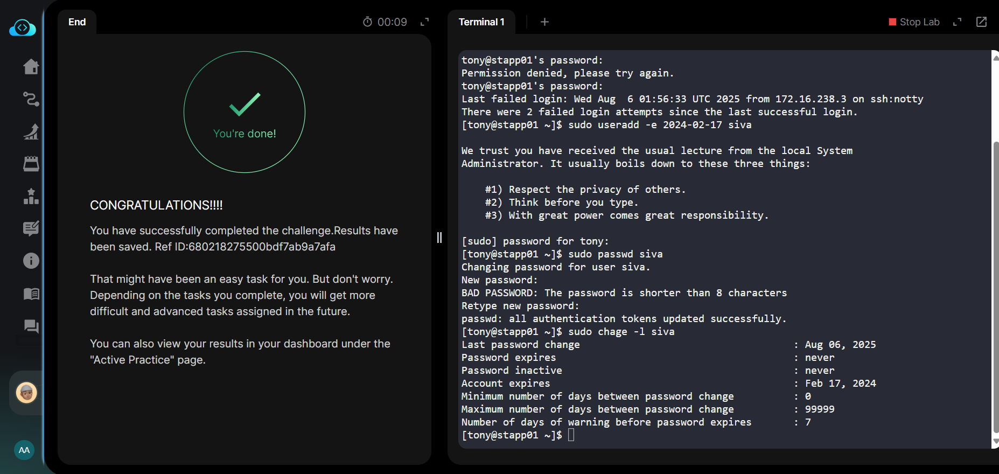

# 🚀 Day 2 - Temporary User Creation for Nautilus Project

## 🧑‍💻 Task Summary

As part of a temporary assignment on the **Nautilus Project**, a developer (`siva`) required short-term access to App Server 1. The requirement was to create a **user account with an automatic expiration date** to simplify access management and reduce manual revocation errors.

## ✅ Objective

- Create a user named `siva`
- Set an expiry date of `2024-02-17`
- Set a password for secure login
- Verify the account and its expiry

---

## 💻 Commands Used

### Create user with expiry
sudo useradd -e 2024-02-17 siva

### Set user password
sudo passwd siva

### Verify user and expiry date
sudo chage -l siva

### 📈 Business Relevance
In real-world enterprise projects like Nautilus:

Developers are frequently onboarded temporarily to contribute to specific features or bug fixes.

Manually tracking and removing accounts is error-prone and a security risk.

Creating users with automated expiry ensures that least-privilege principles are enforced without extra ops overhead.

By automating user expiry:

We reduce security risks due to stale accounts.

Align with compliance requirements (e.g., ISO 27001, SOC 2).

Enable clean offboarding workflows.

### 🧠 Skills Demonstrated
Linux user and access management

useradd, passwd, and chage commands

Security and compliance awareness

Basic terminal skills
