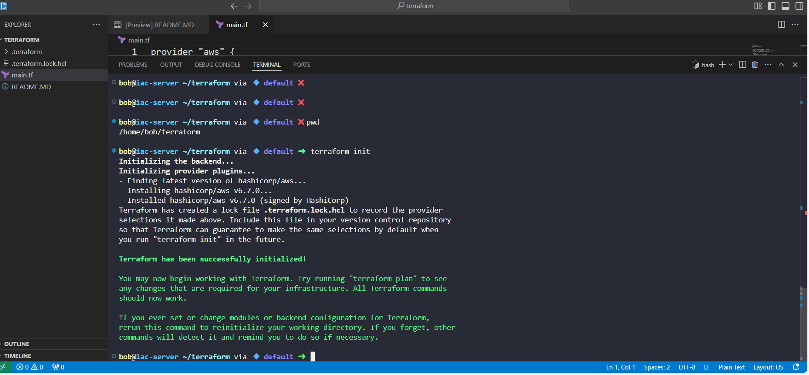
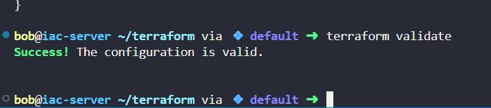
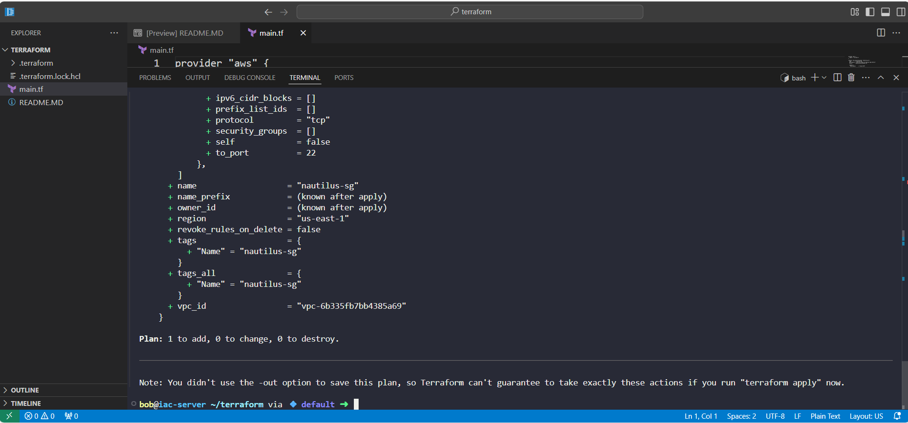
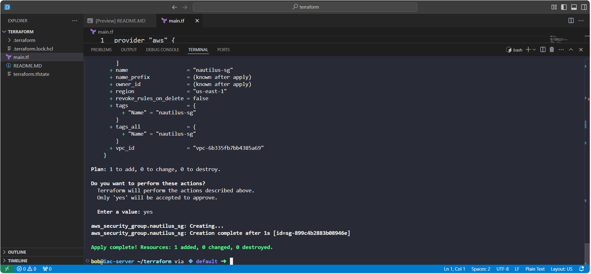
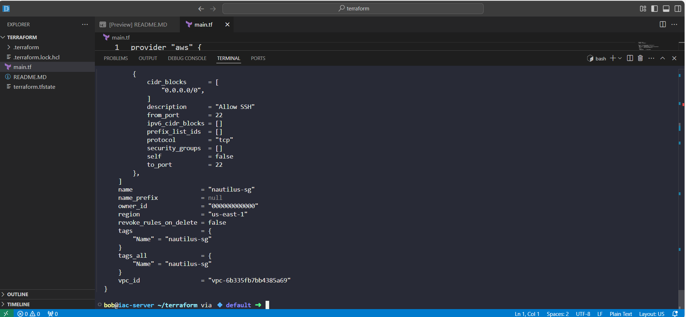
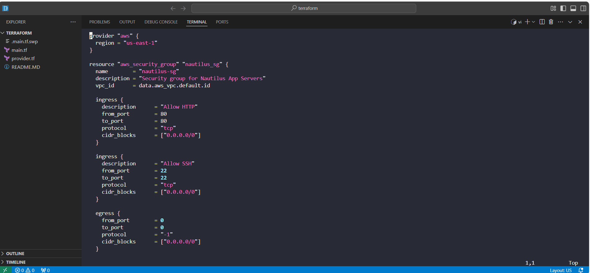
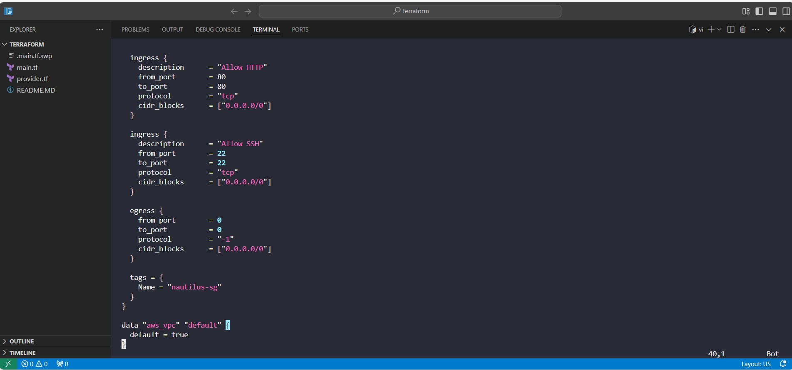

# 🛡️ Terraform AWS Security Group – Nautilus Cloud Migration

As part of the **Nautilus DevOps Team's phased migration to AWS Cloud**, I participated in configuring foundational infrastructure components using **Terraform**. This project demonstrates how to provision a secure, reusable, and cloud-native network layer in AWS using Infrastructure as Code (IaC) principles.

---

## 🚀 Project Objective

Create a security group named `nautilus-sg` using Terraform under the default **VPC** in the `us-east-1` AWS region, with the following **inbound rules**:

- **HTTP** access (port 80) from anywhere (`0.0.0.0/0`)
- **SSH** access (port 22) from anywhere (`0.0.0.0/0`)

---

## 🧠 Business Relevance

The **Nautilus project** is undergoing a staged migration to AWS. Provisioning infrastructure through **Terraform** helps:

- Standardize and automate cloud configuration
- Reduce manual provisioning errors
- Improve scalability and repeatability of deployments
- Enable version-controlled infrastructure changes via Git

This particular security group supports **App Server provisioning**, ensuring they’re **web-accessible (HTTP)** and **admin-accessible (SSH)** for initial configuration and monitoring.

---

## 🔧 Tools & Technologies

- **Terraform v1.8+**
- **AWS Cloud Provider**
- **KodeKloud Lab Environment** (CLI only)
- Terraform executed from: `/home/bob/terraform`

---

## 🛠️ Steps Followed

1. **Initialized Terraform** in the working directory: terraform init

2. **Validated** the configuration to check for syntax and logical errors: terraform validate

3. **Previewed changes to be made in AWS:** terraform plan

4. **Applied the configuration to provision the nautilus-sg security group:** terraform apply

5. **(Optional) Inspected the resource state with:** terraform show

	

### 📌 Key Terraform Configuration (main.tf)

## 📈 Outcome
✅ Successfully provisioned a security group for web and SSH access

✅ Followed Terraform best practices (formatting, validation, plan before apply)

✅ Emulated a real-world cloud migration use case under team structure

✅ Practiced Infrastructure as Code (IaC) under controlled, CLI-only environment

## 🧳 Takeaway
This project shows my ability to:

Work within cloud migration initiatives

Implement secure infrastructure using Terraform

Collaborate with existing DevOps architecture (KodeKloud lab simulating team scenario)

Apply industry best practices in infrastructure provisioning

I’m committed to building production-ready DevOps solutions and continuously improving through hands-on labs and team simulations.

