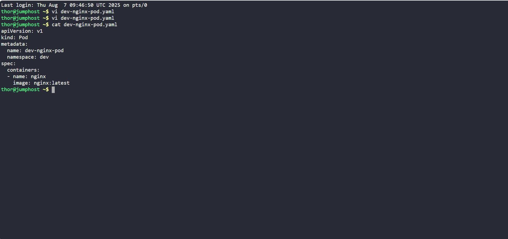
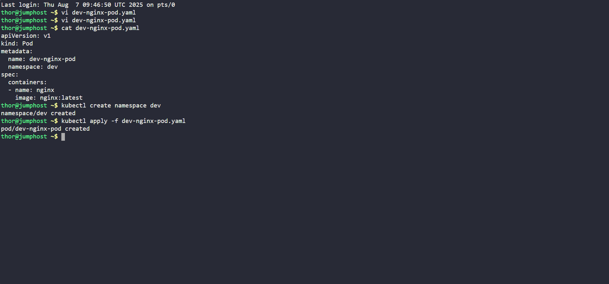
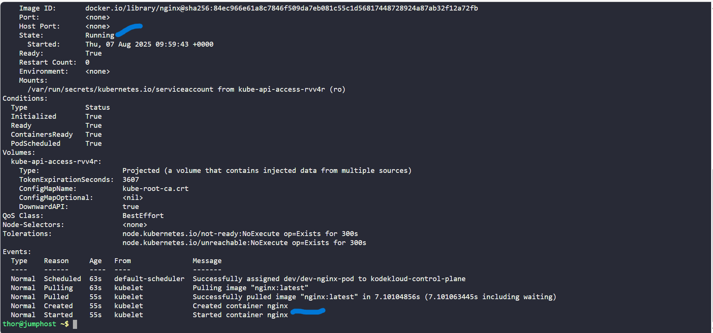

# Kubernetes Pod Deployment using YAML – Day 3 of 100 Days of DevOps

## Project: Namespace & Pod Creation for Nautilus Microservices

This task was completed as part of **Day 3** in the **100 Days of DevOps** challenge on KodeKloud, focusing on deploying containerized applications using Kubernetes in a structured and scalable way.

The **Nautilus DevOps Team** is preparing to migrate its microservices architecture to Kubernetes. As a foundational step, I was tasked with creating a Kubernetes **namespace** and deploying a basic **nginx pod** inside it, adhering to the organization’s DevOps standards and aligning with best practices for future automation.

## Business Context & Value

As organizations scale their infrastructure and adopt containerized microservices, **namespace isolation** and **Infrastructure as Code (IaC)** become crucial for:

- Resource isolation between teams/environments (e.g. dev, staging, prod)
- Automating deployments for repeatability and consistency
- Reducing manual errors and improving auditability
- Preparing the cluster for team-based access and eventual CI/CD pipelines

The Nautilus project reflects real-world infrastructure needs and was designed to enforce these practices early on.

## Project Requirements

The Nautilus team provided the following specifications:

- Create a **namespace** named `dev`
- Deploy a **pod** in that namespace
- Pod should be named `dev-nginx-pod`
- Use the official `nginx` image with the `latest` tag

## Why YAML Instead of CLI?

Kubernetes resources can be created using `kubectl` CLI commands (imperative) or declarative YAML manifests. While CLI is quick for testing, **YAML is preferred in production** for reasons such as:

- Repeatability: YAML can be reused across environments
- Version Control: Easily tracked in Git
- Clarity: Full configuration is visible and editable
- Automation: YAML integrates cleanly into CI/CD pipelines

To demonstrate **IaC best practices**, I chose to define the Pod in a `YAML` file, even though a one-liner CLI command would have worked.

## Steps Performed

### 1. Created a YAML Manifest (dev-nginx-pod.yaml)

### 2. Created the Namespace
kubectl create namespace dev

### 3. Applied the YAML File
kubectl apply -f dev-nginx-pod.yaml

### 4. Verified the Pod Status
kubectl get pods -n dev

### 5. Described the Pod (Optional, for deeper inspection)
kubectl describe pod dev-nginx-pod -n dev

## Outcome
Successfully created the dev namespace and deployed the dev-nginx-pod using a YAML manifest in the Kubernetes cluster. Verified that the pod is in a Running state and using the correct container image (nginx:latest).

## Skills Demonstrated
-Kubernetes CLI (kubectl)

-Namespace creation and resource isolation

-Writing and applying YAML manifests

-Pod lifecycle and image deployment

-Infrastructure as Code (IaC) fundamentals

-Verification and debugging with kubectl describe

## Related
This project is part of the 100 Days of DevOps challenge from KodeKloud, helping engineers build hands-on experience with production-ready tools and techniques.
If you found this helpful or want to collaborate, feel free to reach out on LinkedIn.

