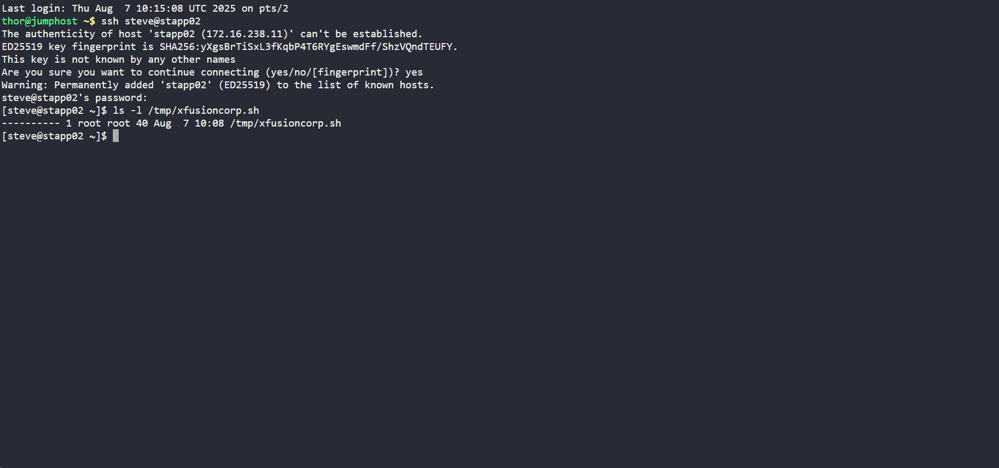
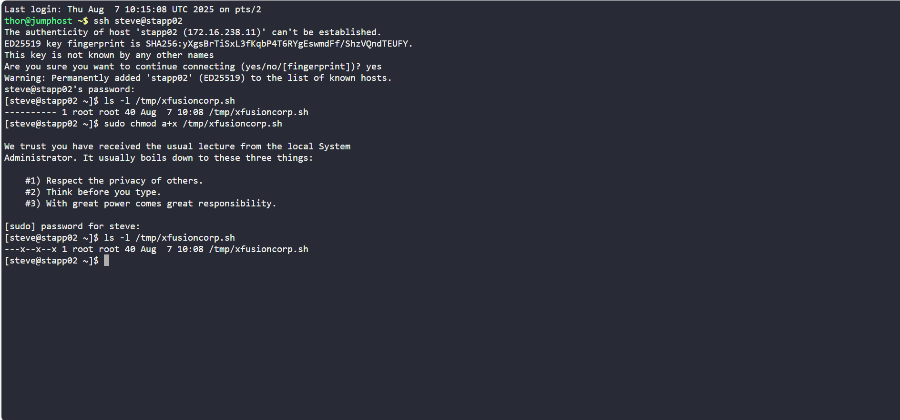
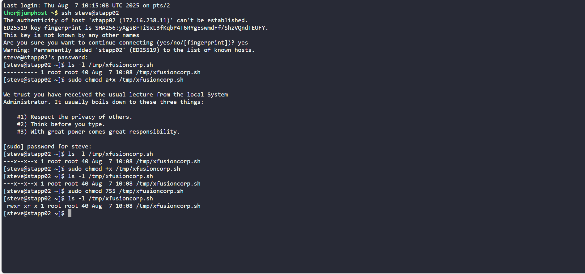

# Day 3 - Linux Permissions & Script Executability | xFusionCorp Backup Script

## Project Overview
As part of the **Nautilus Project** at xFusionCorp Industries, the DevOps team is automating key infrastructure tasks, starting with backups. The sysadmin team developed a new backup script (`xfusioncorp.sh`) and distributed it across various application servers within the **Stratos Datacenter**.

On **App Server 2**, however, the script lacked the necessary executable permissions. My task was to ensure this script is made executable by **all users**, which is critical to allow automated systems and users to run the backup process without encountering permission errors.

## Business Need

In large-scale infrastructure environments like xFusionCorp’s:

- **Backups are non-negotiable** for disaster recovery.
- Scripts must be **accessible and executable** by automation tools, crons, or users with minimal friction.
- Permissions misconfigurations can lead to **critical failures in automation**.

This task simulates a real-world scenario where correct Linux permissions are vital to system reliability.

## Objective

Grant executable permissions to the `/tmp/xfusioncorp.sh` script **on App Server 2**, such that **all users** can execute it.

## Walkthrough

### 1. SSH into App Server 2
ssh steve@stapp02

### 2. Check the current file permissions
ls -l /tmp/xfusioncorp.sh

Initial output:

---------- 1 root root 40 Aug  7 10:08 /tmp/xfusioncorp.sh

The file had no permissions for any user - not even the owner (root) could read or execute it.

### 3. Debugging & Learning Moment
Out of habit from using the KodeKloud labs (where files often have baseline permissions), I ran:

sudo chmod a+x /tmp/xfusioncorp.sh

**Result:**

---x--x--x 1 root root 40 Aug  7 10:08 /tmp/xfusioncorp.sh

At first glance, this looked like progress, but I quickly realized:
-The script was now executable, but not readable.
-Without read permission, the shell can't even interpret the script during execution.
-The command a+x simply added execute bits, but did not grant read access.

This was a valuable reminder: in real-world systems, you can’t assume the file has any existing permissions, and scripts require read + execute to run properly.

**Final Fix**

To fully enable execution by all users:

sudo chmod 755 /tmp/xfusioncorp.sh

Now the permissions are:

-rwxr-xr-x 1 root root 40 Aug  7 10:08 /tmp/xfusioncorp.sh

This means:

rwx for owner (root)

r-x for group

r-x for others

**Mission accomplished.**

### Reflection
This was a deceptively simple task that highlighted the importance of understanding file permission fundamentals in Linux. It reinforced a key DevOps mindset: assume nothing, verify everything.

I’m embracing every misstep as an opportunity to deepen my foundational knowledge, and that’s exactly the kind of iterative thinking DevOps thrives on.
