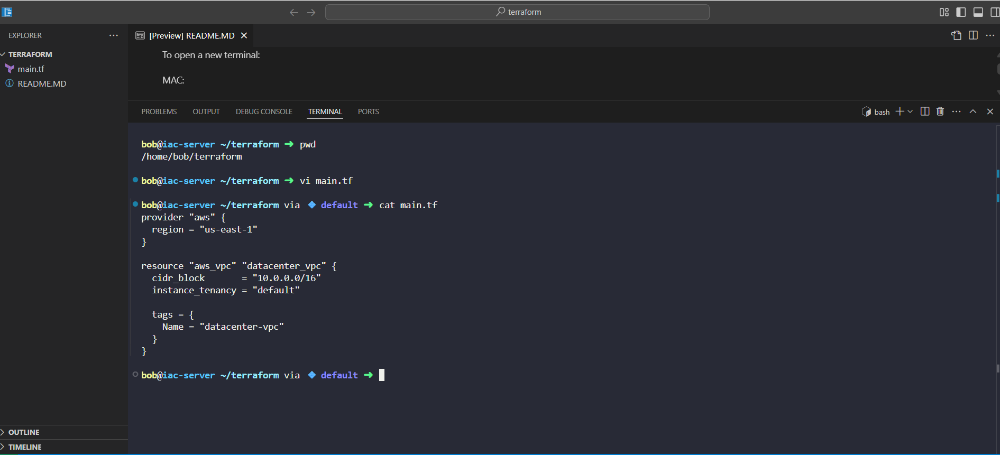
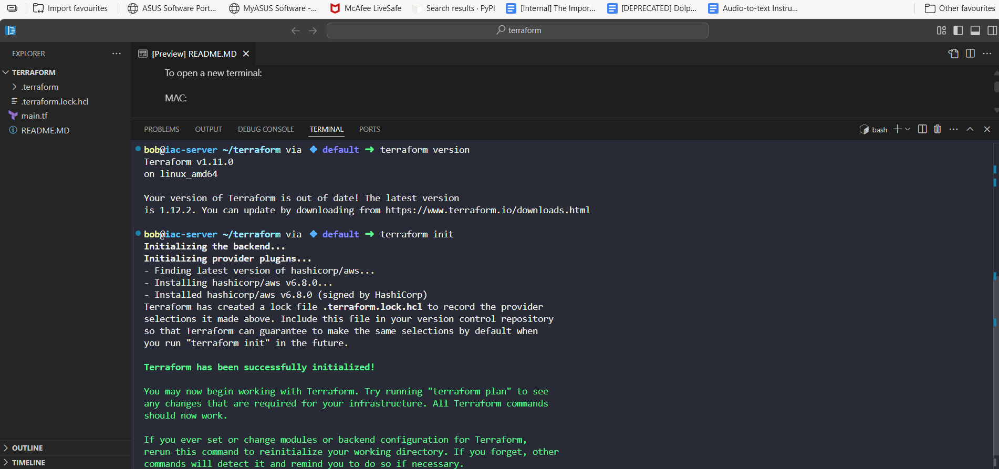
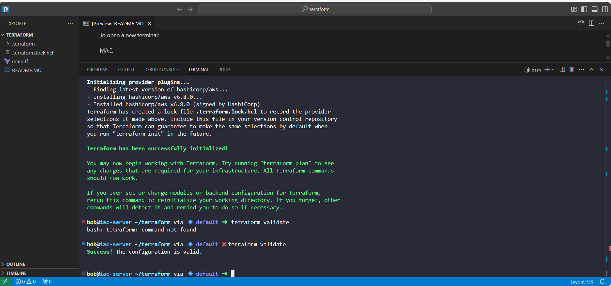
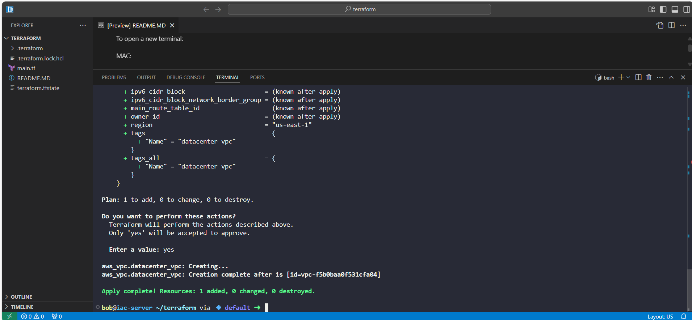

# Day 4 – AWS VPC Provisioning via Terraform

## Business Context

The Nautilus DevOps team is in the early stages of migrating part of their on-premise infrastructure to the AWS cloud.  
Given the scale and criticality of operations, a **phased migration strategy** was chosen over a “big bang” cutover.  

This approach allows:
- Lower operational risk during transition
- Fine-grained control over resources
- Incremental testing and optimization at each stage

**My role** for this phase was to **design and provision a foundational Virtual Private Cloud (VPC)** in AWS using Infrastructure as Code (IaC) with Terraform.  
This VPC will serve as the **network backbone** for future workloads, enabling secure and isolated resource deployment in the `us-east-1` region.

## Objective

Provision an AWS VPC named `datacenter-vpc` in `us-east-1` with an IPv4 CIDR block, using Terraform from the working directory `/home/bob/terraform`.

## Tools & Technologies

- **Terraform** – Infrastructure as Code provisioning
- **AWS** – Cloud platform for VPC deployment
- **VS Code** – Code editing and terminal integration
- **GitHub** – Version control and project showcase

## Implementation Walkthrough

### 1. **Terraform Provider Configuration**
I started by defining the AWS provider in `main.tf` to set the target region:

provider "aws" {

  region = "us-east-1"

}

This ensured all resources would be deployed in the us-east-1 (N. Virginia) region.

### 2. VPC Resource Definition
The core resource of this task was the VPC:

resource "aws_vpc" "datacenter_vpc" {
  
  cidr_block       = "10.0.0.0/16"
  
  instance_tenancy = "default"

  tags = {
  
    Name = "datacenter-vpc"
  
  }

}

cidr_block: Chosen to provide sufficient private IP address space for future subnets

tags: Naming the VPC for easy identification in AWS console

### 3. Terraform Initialization
Initialized the Terraform working directory to download the AWS provider plugin:

terraform init: Confirmed that required plugins were installed successfully.

### 4. Configuration Validation
Validated the Terraform configuration syntax and resource definitions:

terraform validate: Configuration valid — ready for execution.

### 5. **Execution Plan Review**

Before applying changes, I ran:

terraform plan: This provided a detailed preview of the actions Terraform would take — in this case, creating a single aws_vpc resource — allowing verification before provisioning.

### 6. Infrastructure Deployment
Applied the Terraform configuration:

terraform apply: Confirmed with yes when prompted, resulting in the creation of the VPC:

Apply complete! Resources: 1 added, 0 changed, 0 destroyed.

## Business Value Delivered
By provisioning this VPC:

Established a secure and isolated network for future AWS resources

Created a reproducible infrastructure template that can be version-controlled and reused

Reduced manual configuration errors and increased deployment speed through automation

This aligns with Nautilus’s migration strategy, ensuring that each incremental step builds a stable foundation for the next.

## Closing Note
This project demonstrates applying Infrastructure as Code to solve a realistic migration scenario, building cloud infrastructure components in a controlled, testable, and scalable manner.
