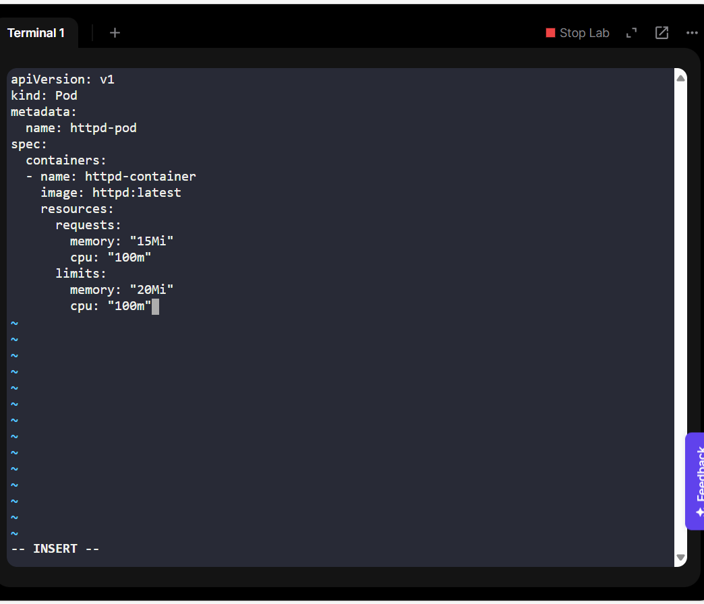
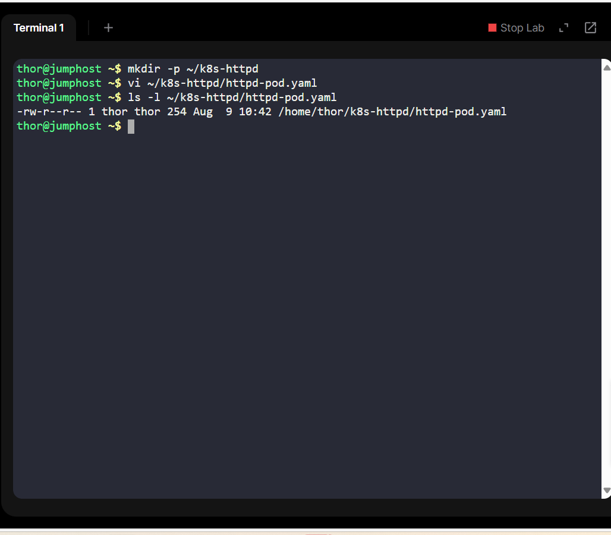
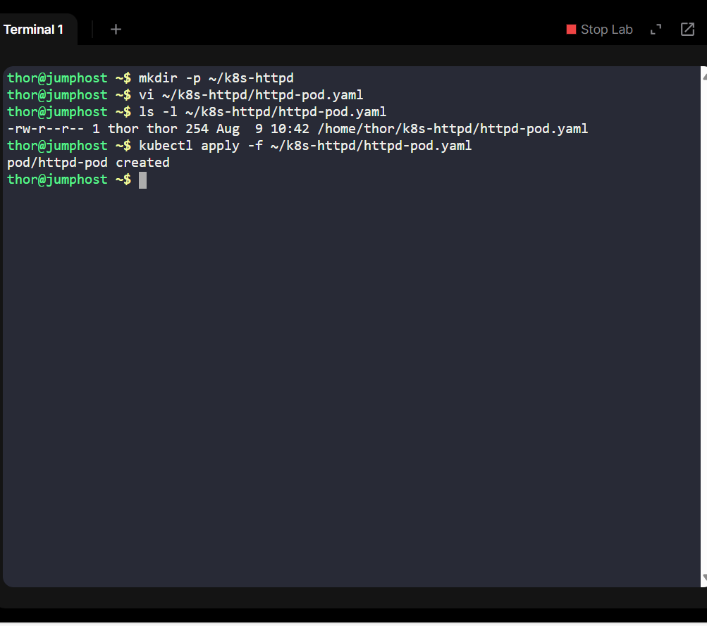
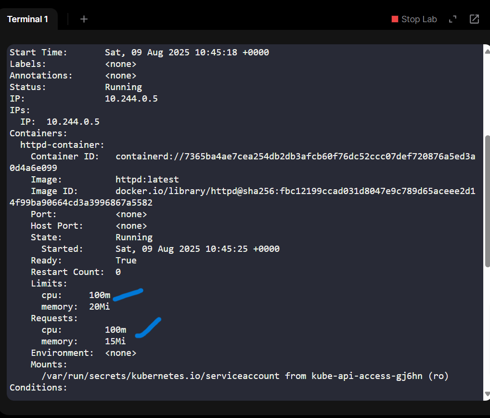

# Optimizing Kubernetes Application Performance with Resource Requests & Limits - Day 5 of 100 Days of DevOps Challenge

## Project Overview
The Nautilus DevOps Team identified performance instability in certain applications hosted on their Kubernetes cluster. Investigation revealed that multiple workloads were competing for CPU and memory resources without constraints, leading to:

Unpredictable performance under high load.

Risk of one misbehaving container starving others of resources.

To address this, I was tasked with implementing Kubernetes resource requests and limits for a test workload (httpd-pod) to validate the configuration before rolling it out cluster-wide.

## Business Context
In container orchestration environments, resource management is a critical part of reliability engineering:

Requests ensure a workload gets the minimum guaranteed CPU/memory to run reliably.

Limits prevent a workload from consuming more than its fair share, protecting cluster stability.

By implementing requests and limits:

-Stability improves - critical workloads get guaranteed resources.

-Cost control - prevents overprovisioning hardware just to handle worst-case scenarios.

-Fair scheduling - Kubernetes can make better placement decisions for workloads.

This pilot project helps Nautilus standardize resource constraints for all future deployments, aligning with SRE best practices.

## Technical Walkthrough
### Step 1: Created the Pod Manifest

I defined the pod in a YAML file named httpd-pod.yaml:

**Why?**:

httpd:latest - latest Apache HTTP server image for demonstration.

Requests: Guarantees 15Mi memory and 0.1 CPU core.

Limits: Caps usage at 20Mi memory and 0.1 CPU core.

### Step 1.5: Verifying YAML File Creation
After creating the httpd-pod.yaml file, I confirmed that it exists in the working directory:

ls -l httpd-pod.yaml

**Why:**

Verifying the file ensures there were no typos in the filename and that the manifest was saved in the correct location before applying it to the cluster.

### Step 2: Apply the Pod Configuration
kubectl apply -f httpd-pod.yaml

### Step 3: Verify Pod Creation
After applying the manifest, to confirm the pod is running, I ran two checks for deeper verification:

- View Pod Details in Wide Output

kubectl get pods -o wide | grep httpd-pod

**Why:**

Filters the output to just the target pod.

Displays node assignment, IP address, and container image in use.

- Inspect Pod Information

kubectl get pod httpd-pod

**Why:**

Quick status check without extra columns.

Confirms the pod name is correct and the status is as expected (Running).

### Step 4: Inspect Resource Configuration
kubectl describe pod httpd-pod

📸 Screenshot 5: Highlighted section of kubectl describe output showing configured requests and limits.
Filename: 05-pod-resource-limits.png

## Outcome
Successfully deployed an Apache HTTP Server pod with strict resource allocation.

Verified that Kubernetes enforces both requests and limits as intended.

This template can now be adapted for production workloads to improve cluster stability.

## Skills Demonstrated
Kubernetes pod creation and YAML manifest authoring.

Resource requests and limits management.

Performance optimization in containerized workloads

Applying SRE principles to workload scheduling.
