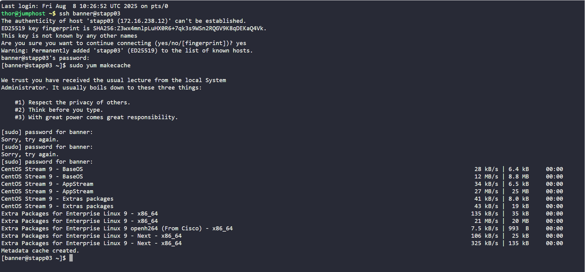
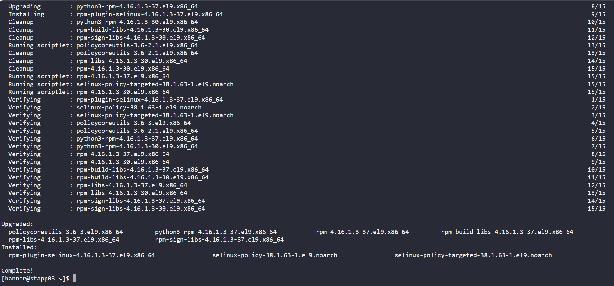
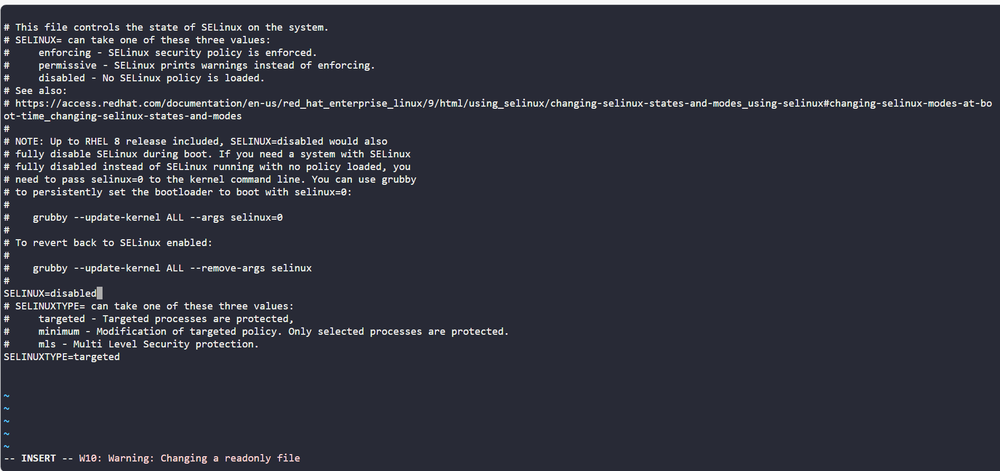
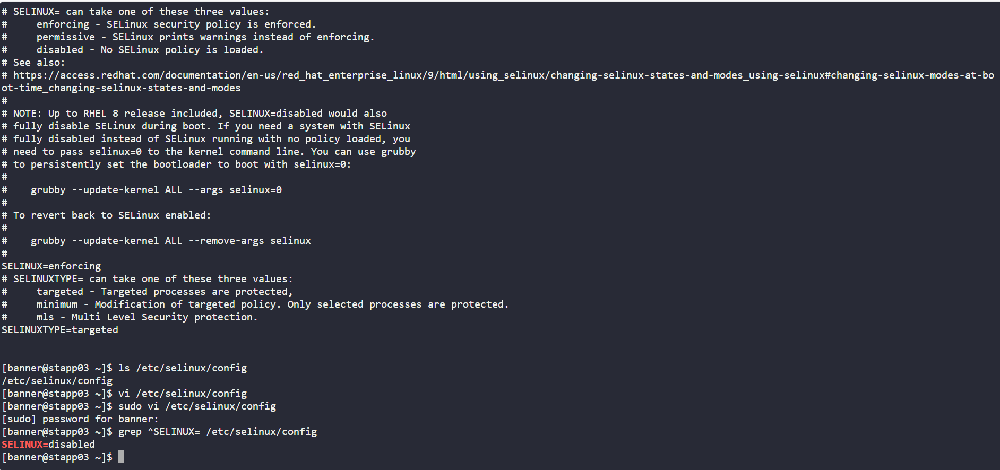

# Enhancing Server Security with SELinux - Day 5 of 100 Days of DevOps

## Project Overview
Following a recent security audit, xFusionCorp Industries began a phased rollout of Security-Enhanced Linux (SELinux) across its Stratos Datacenter. SELinux is a critical security feature that enforces mandatory access control (MAC), significantly reducing the risk of privilege escalation or unauthorized system changes.

For this stage, the focus was on App Server 3, with the objectives to:

-Install the necessary SELinux policy packages.

-Permanently disable SELinux until proper policy tuning could be completed.

-Ensure no immediate disruption, i.e. changes should only take effect after a scheduled reboot.

## Business Context
In high-availability enterprise environments, introducing strong security controls like SELinux without preparation can cause unexpected service disruptions. The chosen approach allows:

-Security alignment with audit findings.

-Operational continuity until policy exceptions are tested and approved.

-Compliance with the company’s change management process by deferring impact until the planned maintenance window.

## Technical Walkthrough
### Step 1: Refreshed the System’s Package Index
sudo yum makecache fast

**Why?:**
Refreshing the package index ensures the system pulls up-to-date metadata before installation, a best practice to avoid pulling outdated dependencies.

**Step 2: Installed Required SELinux Packages**
sudo yum install -y selinux-policy selinux-policy-targeted

**Why:**

selinux-policy: Core SELinux policy infrastructure.

selinux-policy-targeted: Default targeted policy set that focuses on securing key processes.

**Step 3: Permanently Disabled SELinux in Config**
Edited the SELinux configuration file:

sudo vi /etc/selinux/config

Changed:

SELINUX=enforcing

to:

SELINUX=disabled

**Why:**
This changed the persistent SELinux mode, ensuring that on the next reboot, SELinux was disabled, preventing enforcement from impacting application workloads prematurely.

**Step 4: Validated the Configuration**

grep SELINUX= /etc/selinux/config

Output:

SELINUX=disabled

**Why?:**
Verifies that the persistent configuration change was applied correctly without requiring a reboot.

📸 Screenshot Suggestion: Show grep command output.
Filename: 04-selinux-config-validation.png

**Step 5: Avoid Runtime Changes**
Did NOT run setenforce 0 or manually reboot the server.

The instructions explicitly stated: 

-“Disregard the current status of SELinux”

-“Reboot is already scheduled”

This prevents any unnecessary service interruptions before the planned maintenance window.

**Outcome**
SELinux policies are installed and ready for fine-tuning.

Persistent configuration ensures SELinux will be disabled post-reboot.

Work completed without impacting live workloads.

### Next Steps
During the maintenance reboot, there should be confirmation SELinux is disabled (sestatus).

Then a transition SELinux into permissive mode for testing before enforcing policies.

Gradually enforcing policies once compatibility is verified.

### Skills Demonstrated
Linux server hardening.

SELinux configuration management.

Controlled change rollout in production environments.

Balancing security with operational uptime.
