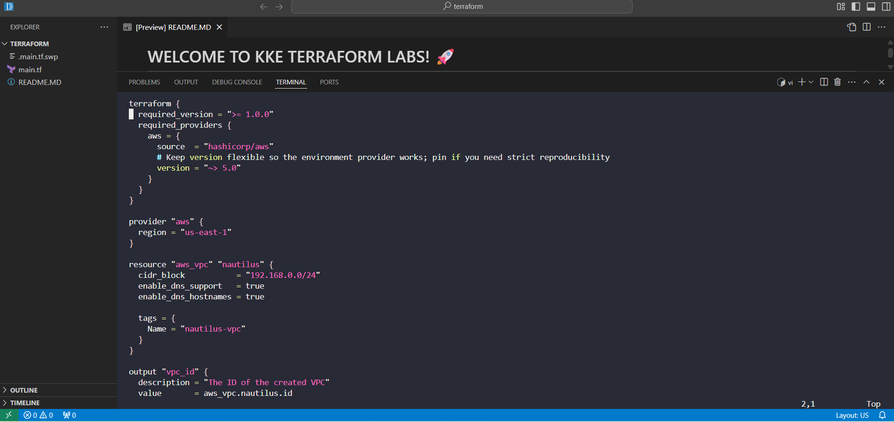
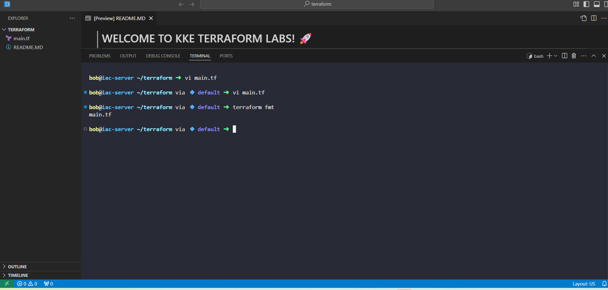
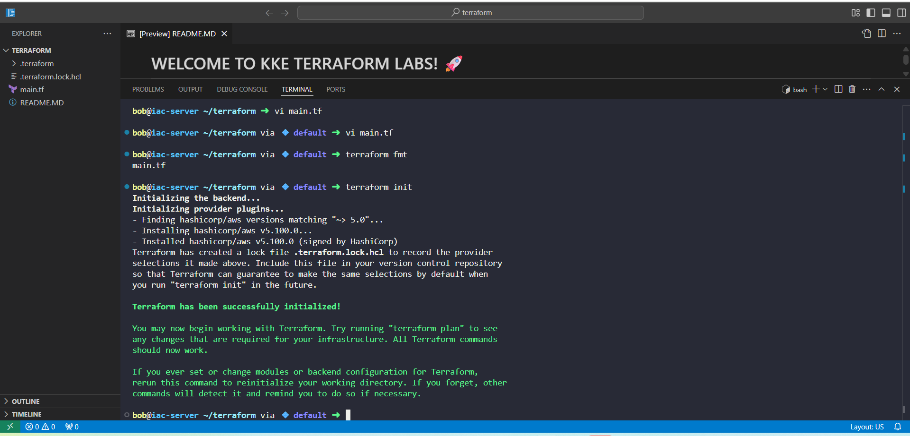
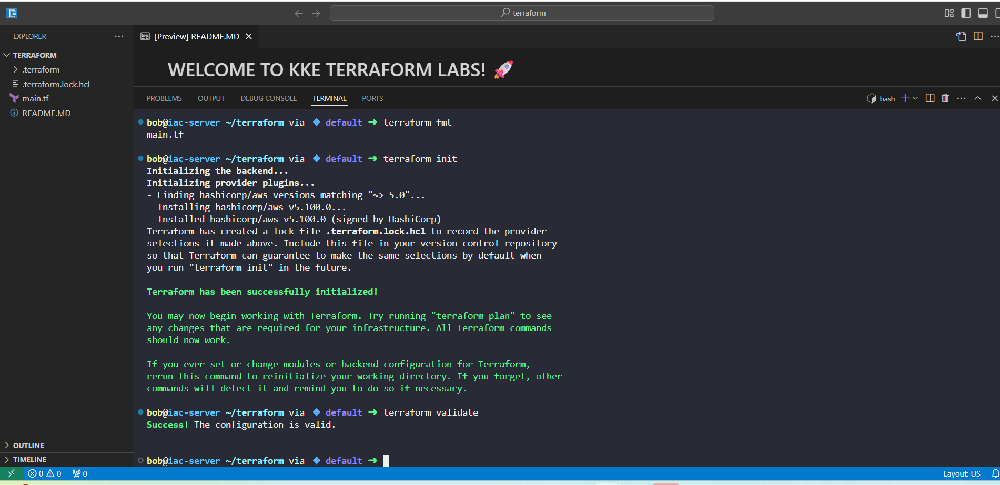
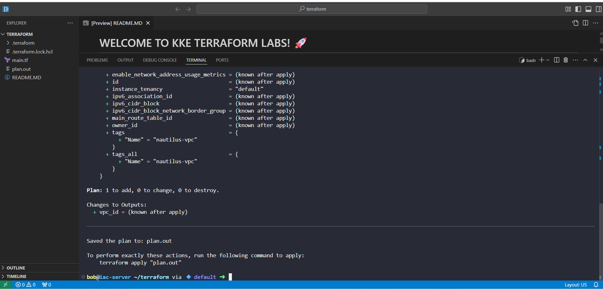
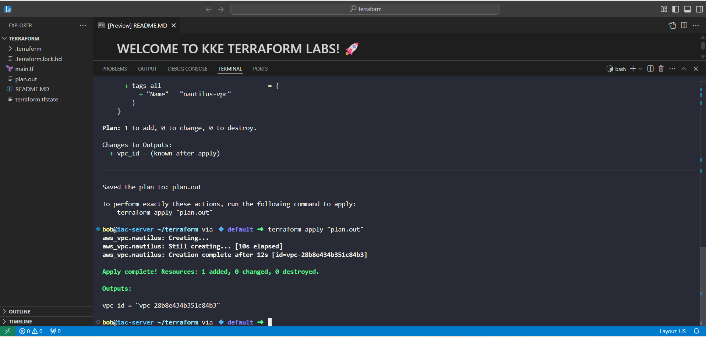
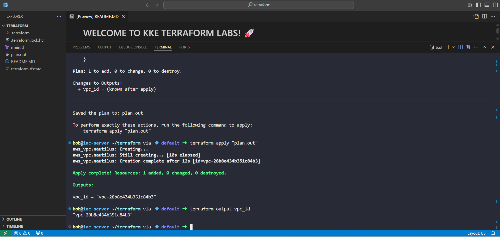

### Day 6 - Nautilus VPC Creation with Terraform

**Part of:** 100 Days of DevOps - KodeKloud

## Project Summary

As part of the Nautilus DevOps team's staged AWS migration strategy, I provisioned a dedicated Virtual Private Cloud (VPC) in the `us-east-1` region using Infrastructure as Code (Terraform). This is a foundational step in building an isolated, secure, and scalable network environment for future workloads.

By creating the VPC via Terraform, we ensure that this critical piece of cloud infrastructure is **repeatable**, **version-controlled**, and **auditable**, aligning with the team's incremental migration plan and compliance requirements.

## Business Context

The Nautilus team is moving away from a monolithic on-prem environment toward a hybrid cloud model. Networking is the backbone of this transition.  

Creating the VPC early allows:

1. **Segmentation of workloads** across different environments.
2. **Scalable networking** for future services like subnets, gateways, and security layers.3.
3. **Faster provisioning** in disaster recovery scenarios.4.
4. **Consistent, documented deployment** that meets security governance.

## What I Built

A single Terraform configuration file (`main.tf`) that:

- Defines the AWS provider targeting `us-east-1`.

- Creates a VPC named `nautilus-vpc` with IPv4 CIDR `192.168.0.0/24`.

- Enables DNS support and hostnames for easier resource resolution.

- Tags the resource for clear identification.

- Outputs the VPC ID for verification and downstream automation.

## Execution Workflow (What I Did)

In the KodeKloud lab environment:

1. **Created** `/home/bob/terraform/main.tf` with the full Terraform configuration.

2. **Formatted** the code for consistency:
terraform fmt

4. **Initialized** the working directory to download the AWS provider:
terraform init

4. **Validated** the configuration syntax and structure:
terraform validate

6. **Planned** the infrastructure changes and saved the plan:
terraform plan -out plan.out

6. **Applied the exact reviewed plan to create the VPC:**
terraform apply "plan.out"

7. **Retrieved the newly created VPC ID:**
terraform output vpc_id

8. **Outcome**:
Terraform Apply: Apply complete! Resources: 1 added, 0 changed, 0 destroyed.

VPC ID: Successfully returned via Terraform output.

## Skills Demonstrated
Infrastructure as Code (IaC) with Terraform.

AWS Networking (VPC fundamentals).

Safe deployment practices (terraform validate and saved plan file).

Documentation of IaC projects for audit and portfolio purposes.

