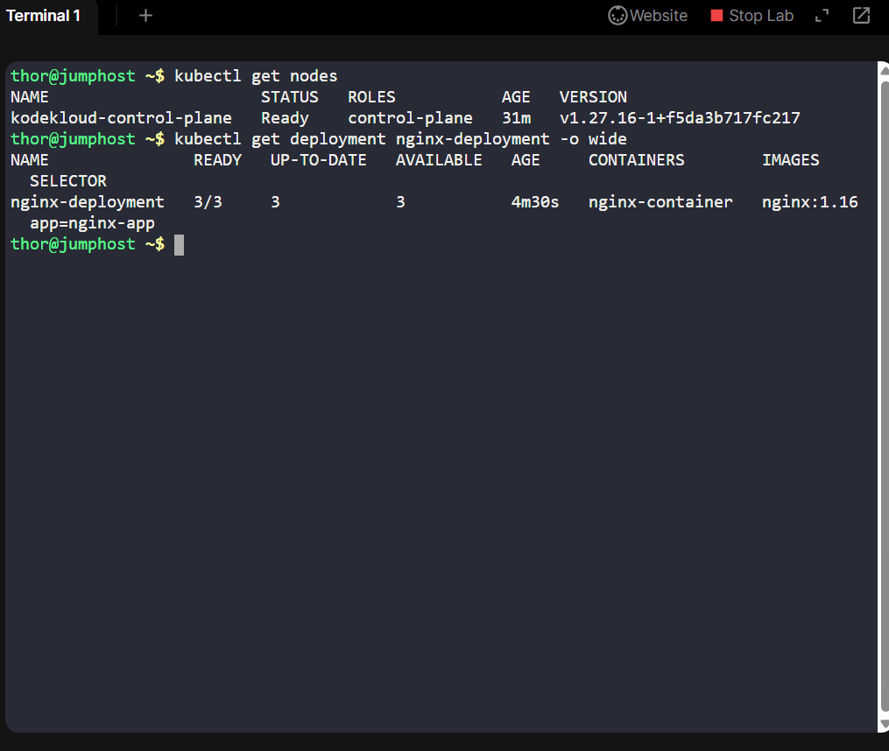
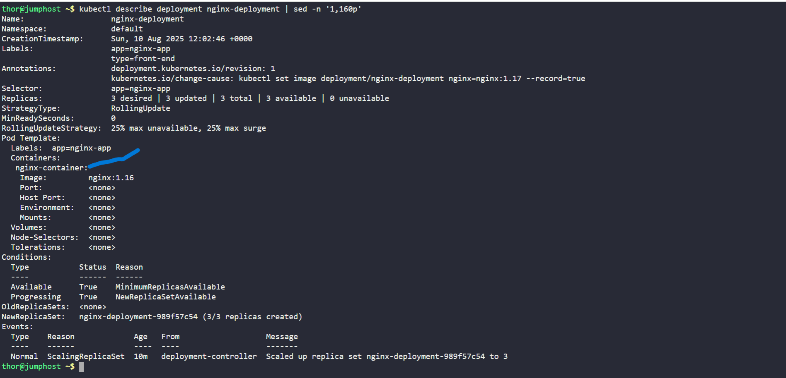
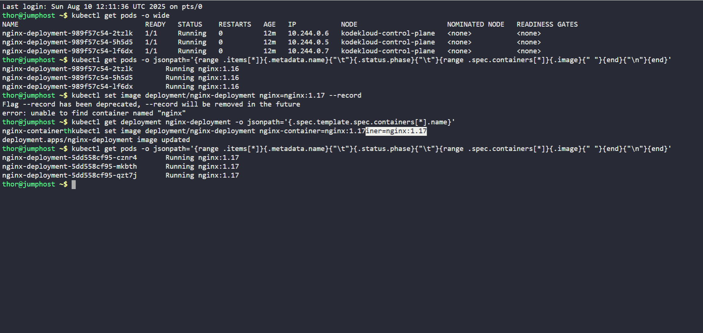

# Day 6: Rolling Update of nginx-deployment to nginx:1.17

## Overview
As part of my ongoing 100 Days of Cloud DevOps challenge on KodeKloud, I worked on performing a rolling update of an existing Kubernetes deployment. The goal was to upgrade the nginx-deployment to use the new container image nginx:1.17, reflecting recent application changes made by the Nautilus development team.

Rolling updates like this are crucial in real-world DevOps workflows to maintain application uptime while safely deploying new features or patches.

### Step 1: Verify Kubernetes Cluster Health
Before making any changes, I confirmed that the Kubernetes cluster was healthy and ready to accept updates by checking node statuses:

kubectl get nodes -o wide

All nodes were in the Ready state, ensuring the cluster was stable for deployments.

### Step 2: Attempt the Rolling Update
I initiated the rolling update with the following command:

kubectl set image deployment/nginx-deployment nginx=nginx:1.17 --record

However, this resulted in an error:

error: unable to find container named "nginx"

This was a key learning moment. The error indicated that the container name specified (nginx) did not match any container in the deployment’s pod spec.

### Step 3: Inspect Deployment Container Names
To identify the exact container name(s), I ran:

kubectl get deployment nginx-deployment -o jsonpath='{.spec.template.spec.containers[*].name}'

This returned:

nginx-container

### Step 4: Correct the Rolling Update Command

Armed with the correct container name, I re-ran the update command:

kubectl set image deployment/nginx-deployment nginx-container=nginx:1.17

### Step 5: Monitor the Rollout Progress

I monitored the rollout status until it successfully completed:

kubectl rollout status deployment/nginx-deployment

### Step 6: Verify Pods Running the New Image
Finally, I verified that all pods were running the updated image and were in the Running state using a JSONPath query:

kubectl get pods -o jsonpath='{range .items[*]}{.metadata.name}{"\t"}{.status.phase}{"\t"}{range .spec.containers[*]}{.image}{" "}{end}{"\n"}{end}'

The output confirmed:

nginx-deployment-xxxxx        Running nginx:1.17

nginx-deployment-yyyyy        Running nginx:1.17

nginx-deployment-zzzzz        Running nginx:1.17

## Reflection

This exercise reinforced the importance of:
•	Validating cluster health before making changes
•	Thoroughly understanding deployment specs (such as container names)
•	Applying careful verification after rollout to confirm success

Handling the container name mismatch was a valuable troubleshooting experience, showcasing real-world problem-solving under live conditions.

This hands-on experience is a key milestone in my 100 Days of Cloud DevOps journey, demonstrating the ability to perform critical Kubernetes operations and troubleshoot deployment challenges effectively.
