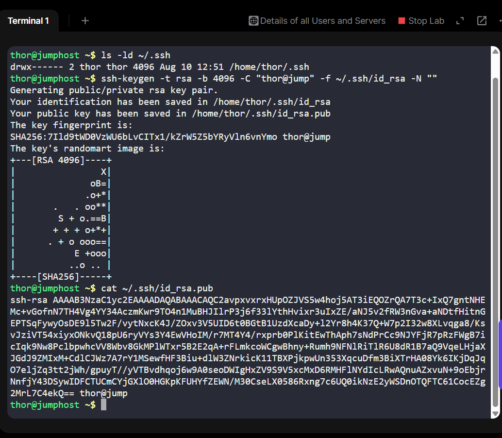
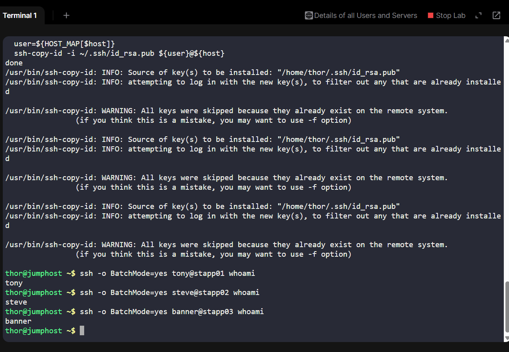
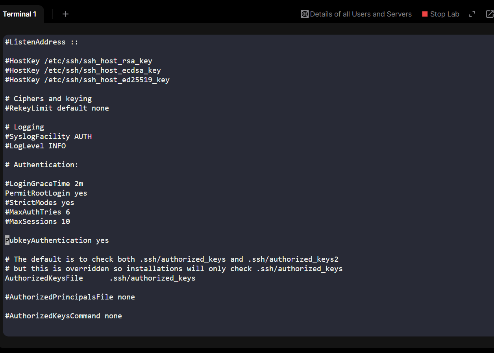
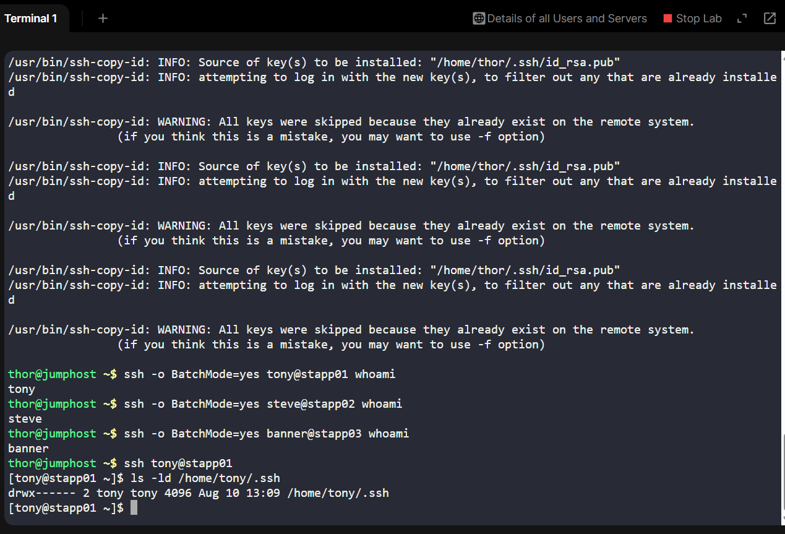
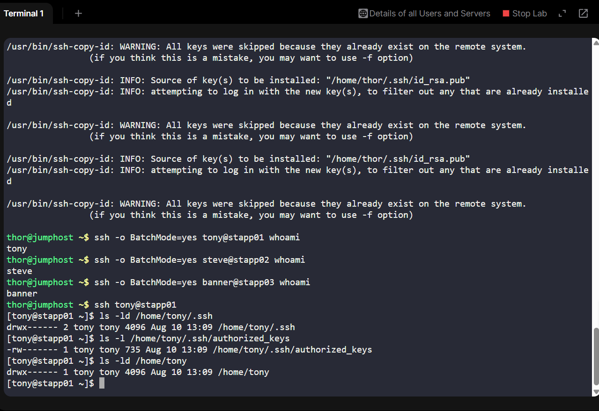

# Day 07 - Password-less SSH Enablement for Nautilus Project

## Business Context

On Day 7 of my **100 Days of DevOps**, I worked on a critical infrastructure task for the Nautilus Project at xFusionCorp Industries. The system admin team had built automation scripts that run periodically from a secured jump host. These scripts must connect to all application servers in the Stratos Datacenter through their designated sudo users. However, for the automation to work seamlessly and without manual intervention, the `thor` user on the jump host needed **password-less SSH access** to all target servers via the appropriate sudo accounts.

The business essence here is simple: uninterrupted, secure automation without storing or transmitting plain-text passwords. This is essential for:

- **Operational efficiency** - scripts run without human prompts.
- **Security compliance** - credentials aren’t embedded in automation code.
- **Access control** - precise mapping between jump host users and app server sudo accounts.
- **Auditability** - traceable actions under correct user identities.

## Deliverables & Outcome

-Configured SSH key-based authentication from `thor` on the jump host to all app servers.

-Ensured correct permissions and ownership to meet OpenSSH security requirements.-

-Verified logins work without a password prompt.

-Documented each step with its operational relevance.

## Server mapping:**

* `stapp01.com` → `tony`
* `stapp02.com` → `steve`
* `stapp03.com` → `banner`

## Walkthrough with Purpose

### 1. Secure `.ssh` Directory *(Run on: Jump host)*
mkdir -p ~/.ssh

chmod 700 ~/.ssh

**Why:** Prevents unauthorized access to private keys by restricting directory permissions.

### 2. Generate SSH Keypair *(Run on: Jump host)*
ssh-keygen -t rsa -b 4096 -C "thor@jump" -f ~/.ssh/id_rsa -N ""

**Why:** Creates a cryptographic identity for `thor` without needing a password for each login.

### 3. Install Public Keys on Target Servers *(Run on: Jump host)*

ssh-copy-id -i ~/.ssh/id_rsa.pub tony@stapp01

ssh-copy-id -i ~/.ssh/id_rsa.pub steve@stapp02

ssh-copy-id -i ~/.ssh/id_rsa.pub banner@stapp03

**Why:** Authorizes `thor`’s key on each target sudo user’s account so future logins bypass password prompts.

### 4. Verify Logins *(Run on: Jump host)*

ssh -o BatchMode=yes tony@stapp01 whoami

**Why:** Ensures automation can run non-interactively.

## Server-side Checks *(Run on: App server)*

**Purpose:** Guarantee that OpenSSH accepts keys and no insecure permissions block authentication.

### a) `.ssh` directory

ls -ld /home/tony/.ssh

chmod 700 /home/tony/.ssh

chown tony:tony /home/tony/.ssh

### b) `authorized_keys`

ls -l /home/tony/.ssh/authorized_keys

chmod 600 /home/tony/.ssh/authorized_keys

chown tony:tony /home/tony/.ssh/authorized_keys

### c) Home directory permissions

ls -ld /home/tony

chmod go-w /home/tony

### d) SSH daemon configuration

sudo grep -i PubkeyAuthentication /etc/ssh/sshd_config

sudo nano /etc/ssh/sshd_config

PubkeyAuthentication yes

sudo systemctl restart sshd

Repeated for `steve` and `banner` on their respective servers.

**Summary:** Successfully implemented secure, password-less SSH for `thor` to access all application servers through mapped sudo users. This work enables secure, automated operations for the Nautilus Project, demonstrating skills in Linux system administration, SSH hardening, and automation enablement.
