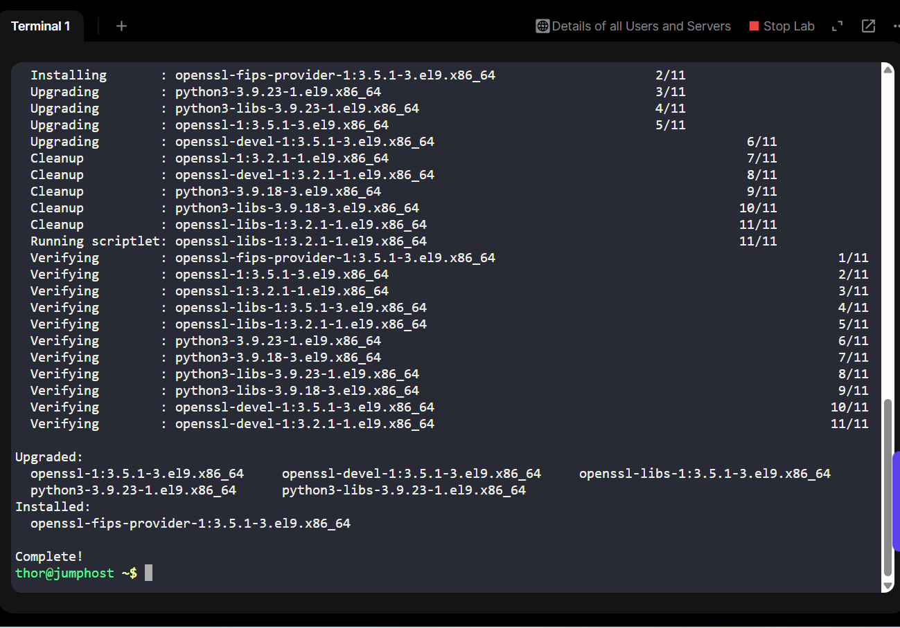
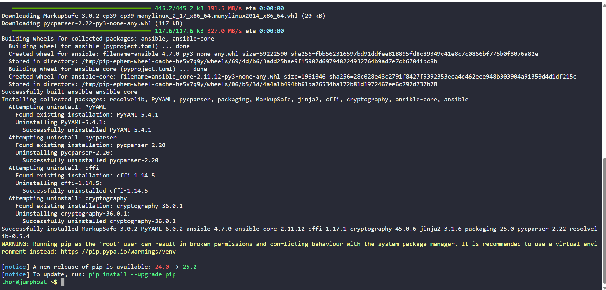
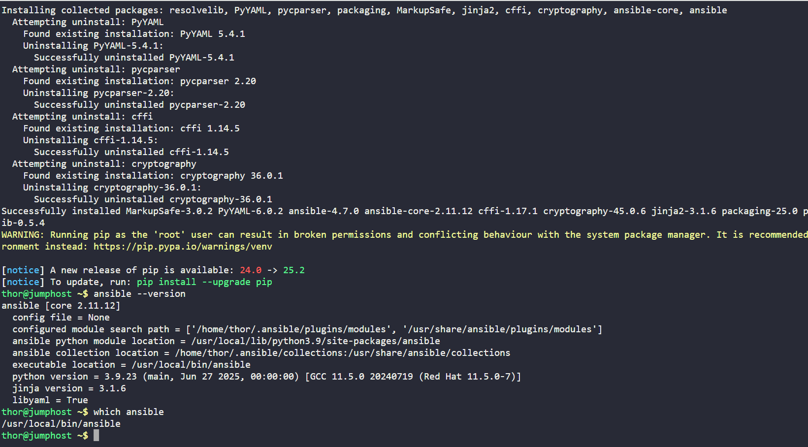

# Day 7 — Installing Ansible 4.9.0 on a Jump Host (100 Days of Cloud/DevOps)

As part of my 100 Days of DevOps Challenge, I’m exploring infrastructure automation tools and cloud-native practices.

Over the past few days, I’ve worked on Linux administration, AWS provisioning, and Kubernetes basics. Today, I stepped into the world of Configuration Management with Ansible.

## Project Background
The Nautilus DevOps team decided to adopt Ansible for automation and configuration management due to its simplicity and agentless nature.

For initial testing, we set up the Jump Host as the Ansible Controller to run playbooks and tasks against target servers.

## Steps Performed
1. Verified Python3 & pip3

python3 --version

pip3 --version

Confirmed both were installed.

2. Installed Ansible 4.9.0

sudo pip3 install ansible==4.9.0

Used sudo to ensure Ansible is installed system-wide.

3. Verified Installation

ansible --version

Confirmed version 4.9.0 installed successfully.

4. Verified Global Installation Path

To ensure that Ansible was installed in a system-wide location accessible to all users, I checked the binary directly from its installation path:

/usr/local/bin/ansible --version

The output confirmed that Ansible 4.9.0 was installed and ready for use.

Since /usr/local/bin is part of the default $PATH for all users on most Linux systems, this ensures global availability without additional configuration.

## Skills Demonstrated
Configuration Management Fundamentals - Installing and preparing Ansible.

Linux Administration - Managing global software installations.

Version Control in IaC Tools - Specifying exact versions for reproducibility.

