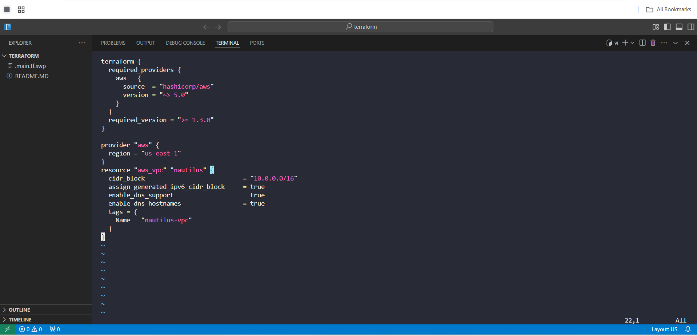
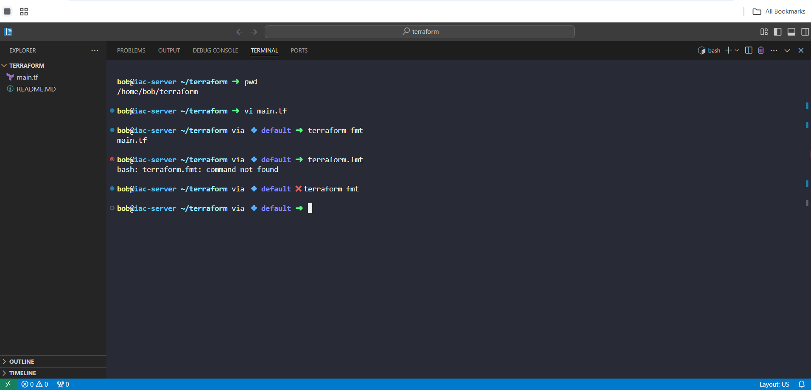
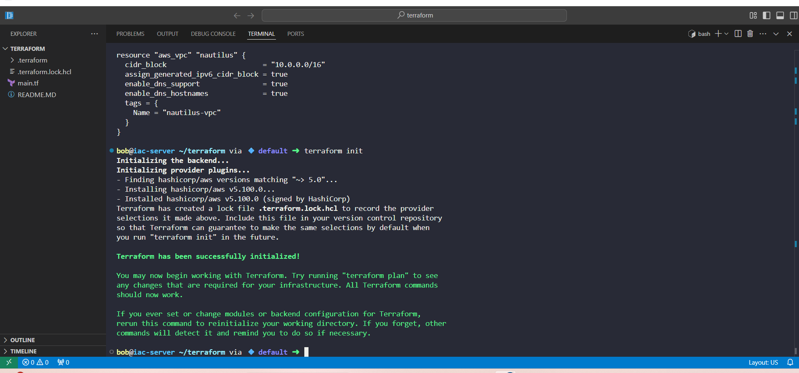
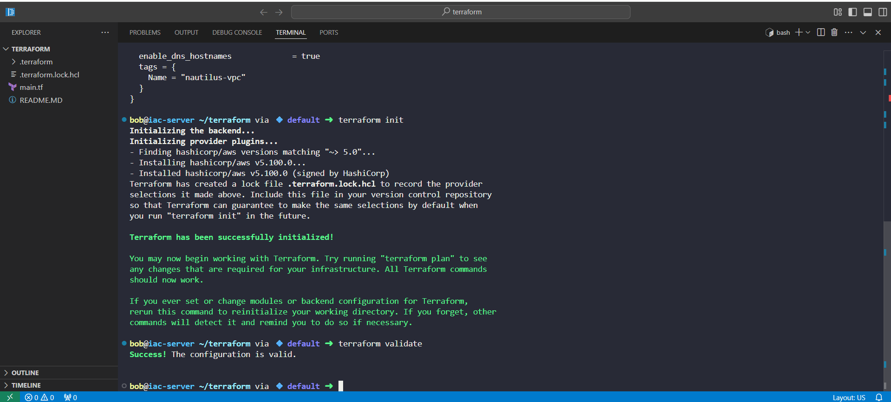
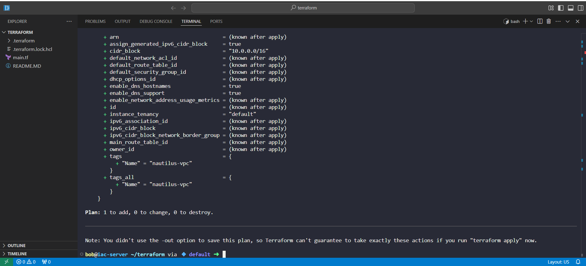
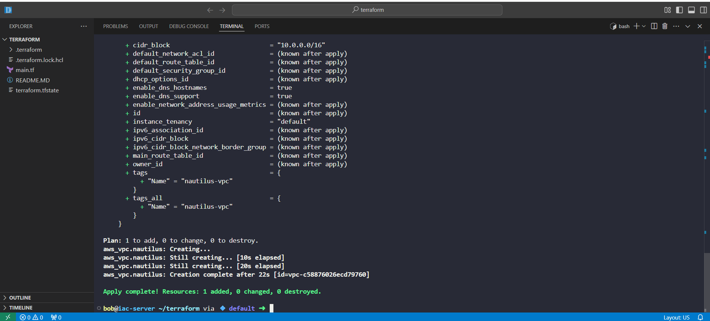

# Day 8 – Creating an IPv6-enabled VPC with Terraform (100 Days of DevOps)

Earlier in my 100 Days of DevOps journey, I provisioned an IPv4-based VPC to establish foundational AWS networking skills. But in real-world business environments, requirements evolve.

For the Nautilus migration project, the networking team mandated IPv6 support to:
•	Enable globally routable addressing.
•	Future-proof the infrastructure.
•	Ensure scalability for upcoming applications.

This project repeats the VPC creation task, but with Amazon-provided IPv6, mirroring how DevOps engineers adapt previous work to meet new technical and business requirements.

## Tools & Technologies
•	Terraform v1.3+
•	AWS VPC
•	VS Code & Integrated Terminal
•	GitHub for version control

## Business Objective
The Nautilus DevOps team is migrating workloads to AWS incrementally.

Creating an IPv6-enabled VPC in the us-east-1 region is the first step, ensuring:
•	Logical isolation for resources.
•	Dual-stack networking with IPv4 & IPv6.
•	DNS support for service discovery.

## Terraform Configuration (main.tf)

## Workflow Steps
1.	Create main.tf with the IPv6-enabled VPC configuration.

2.	Format Terraform code for consistency:

terraform fmt

3.	Initialize Terraform:

terraform init

4.	Validate configuration:

terraform validate

5.	Review execution plan:

terraform plan

6.	Apply changes without manual confirmation:

terraform apply -auto-approve

In production, I would avoid -auto-approve for safety, but here it speeds up lab execution.

## Outcome
•	Built a dual-stack VPC (IPv4 + Amazon-assigned IPv6) in us-east-1.
•	Followed Terraform best practices, including terraform fmt for clean, readable code.
•	Reinforced the concept of adapting previous solutions to meet evolving business needs.
•	Created a scalable networking foundation for future workloads in the migration plan.
