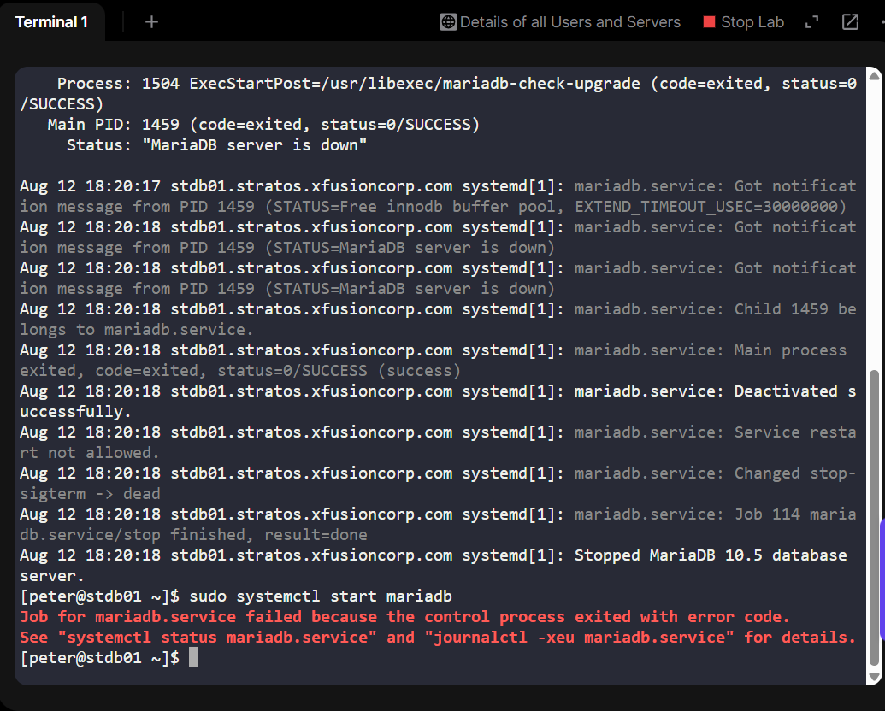
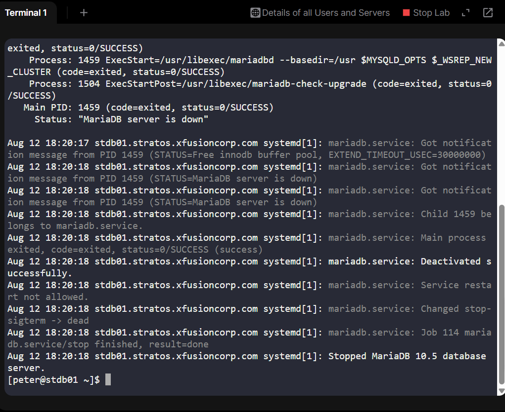
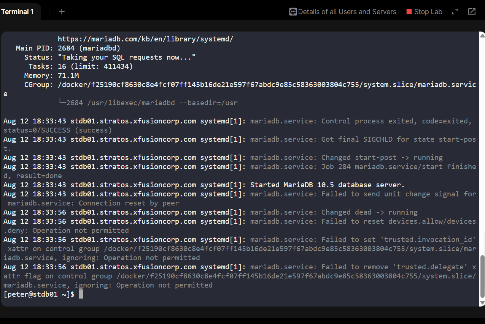

# Day 9 – Restoring MariaDB Service After Permission Failure (100 Days of DevOps)

In my 100 Days of DevOps journey so far, I’ve built cloud infrastructure, automated deployments, and configured services. But Day 8 brought a new kind of challenge, a live production issue for the fictional Nautilus project.

## Scenario:
The Nautilus application in Stratos DC could not connect to its database. After escalation to the DevOps team, we discovered the MariaDB service was down on the database server.

In an enterprise environment, database downtime is critical — it halts transactions, degrades customer experience, and can have severe financial consequences.

This task was to diagnose and restore MariaDB, ensuring the fix addressed not just the symptom, but the root cause.

## Tools & Technologies
•	Linux system administration
•	MariaDB 10.5
•	systemd for service management
•	journalctl for log analysis
•	SSH for remote access

## Business Impact & Essence
For Nautilus, the database is the source of truth for transactions, inventory, and user data.

An outage here means:
•	Lost sales & transactions
•	Customer dissatisfaction
•	Operational paralysis for dependent services

In real enterprises, DB recovery is an urgent task that demands methodical troubleshooting under pressure.

## Step-by-Step Debugging & Resolution
1. SSH Into the Database Server

I connected to the database host:

ssh peter@stdb01

Purpose: Gain terminal access to run diagnostic commands.

2. Check Service Status

sudo systemctl status mariadb

Initial output:

● mariadb.service - MariaDB 10.5 database server

   Loaded: loaded (/usr/lib/systemd/system/mariadb.service; disabled; vendor preset: disabled)
   
   Active: failed (Result: exit-code)

Meaning: The service failed to start, but no detailed cause was shown.

3. Attempt to Start Service

sudo systemctl start mariadb

Response:

Job for mariadb.service failed because the control process exited with error code.

See "systemctl status mariadb.service" and "journalctl -xeu mariadb.service" for details.

Meaning: The service failed immediately; I needed deeper logs.

5. Review Recent Service Logs

sudo journalctl -xeu mariadb.service

Key output: 

pgsql

mariadb.service: Main process exited, status=1/FAILURE

Failed to start MariaDB 10.5 database server.

Meaning: MariaDB exited abnormally, but the cause wasn’t yet clear - next step: check MariaDB’s own error log.

6. Inspect MariaDB Error Log

sudo tail -n 30 /var/log/mariadb/mariadb.log

Critical findings:

[ERROR] InnoDB: Operating system error number 13 in a file operation.

[ERROR] The error means mysqld does not have the access rights to the directory.

[ERROR] Cannot open datafile './ibtmp1'

[ERROR] Unable to create the shared innodb_temporary

[ERROR] Plugin initialization aborted with error Cannot open a file

Meaning: OS error 13 = Permission denied - the mysql user lacked access to /var/lib/mysql, MariaDB’s data directory.

6. Apply the Fix - Restore Permissions

Stop MariaDB to avoid further corruption:

sudo systemctl stop mariadb

Reset ownership to mysql user and group:

sudo chown -R mysql:mysql /var/lib/mysql

Set correct permissions:

sudo chmod -R 755 /var/lib/mysql

7. Restart and Enable MariaDB

Start the service:

sudo systemctl start mariadb

Enable on boot:

sudo systemctl enable mariadb

8. Verify

sudo systemctl status mariadb

Output showed:

Active: active (running)

## Outcome
•	Identified root cause: incorrect file permissions blocking InnoDB initialization.
•	Restored MariaDB service and verified connectivity.
•	Ensured service auto-starts on reboot.
•	Strengthened troubleshooting methodology under production-like conditions.
