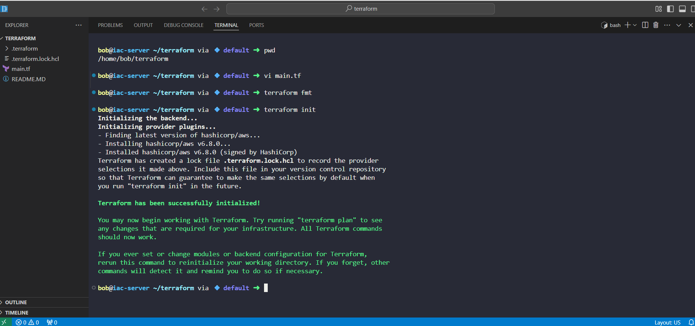
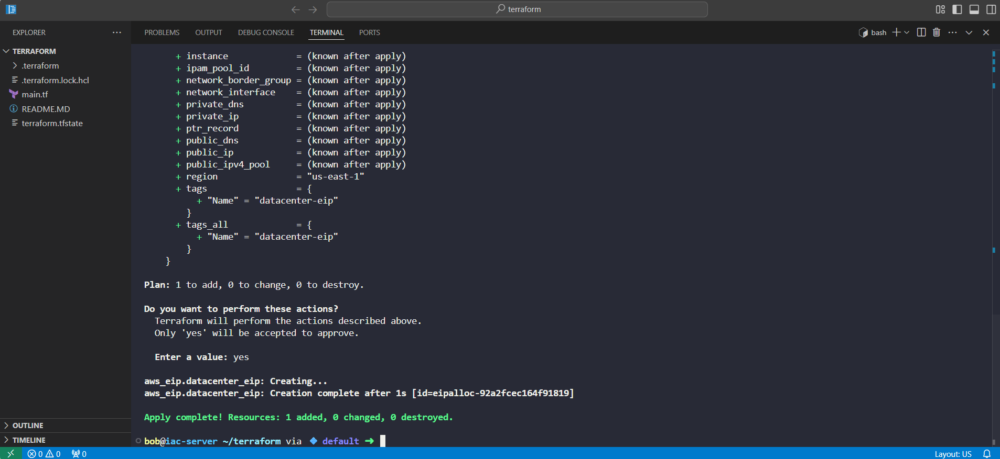

# Day 9 - Allocating an AWS Elastic IP with Terraform (100 Days of Cloud/DevOps)

As part of my 100 Days of DevOps Challenge, I am building real-world, production-ready skills by automating infrastructure with Terraform on AWS.

Today’s focus: Provisioning an AWS Elastic IP as part of a cloud migration initiative.

## Project Background
The Nautilus DevOps team is migrating part of their data center infrastructure to AWS.
Rather than a risky "big bang" migration, they’re taking an incremental, phased approach, creating essential building blocks in AWS first, then gradually moving workloads.

One of these early building blocks is an Elastic IP address, a static public IP in AWS that remains fixed even if the underlying instance changes.

By using Terraform, we can:

Make the allocation process repeatable and version-controlled.

Reduce manual AWS console work.

Keep infrastructure changes auditable.

## Terraform Configuration
main.tf

provider "aws" {
  
  region = "us-east-1"
}

resource "aws_eip" "datacenter_eip" {

  tags = {
  
    Name = "datacenter-eip"
    
  }
  
}

## Steps Performed
1. Navigate to Terraform Project Directory

cd /home/bob/terraform

2. Create and Save main.tf

Added the AWS provider and Elastic IP resource definition.

3. Initialize Terraform

terraform init

Downloads AWS provider plugin.

4. Preview Infrastructure Changes

terraform plan

Verified that Terraform would create 1 Elastic IP.

5. Apply the Configuration

terraform apply

Elastic IP successfully allocated with the name tag datacenter-eip.

## Skills Demonstrated
Infrastructure as Code (IaC) with Terraform.

AWS Networking Fundamentals - Elastic IP management.

Declarative Resource Provisioning — Using .tf files.

Version Control — Committing Terraform code to GitHub.
