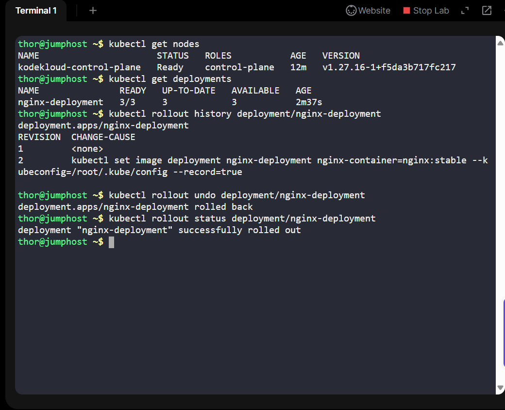
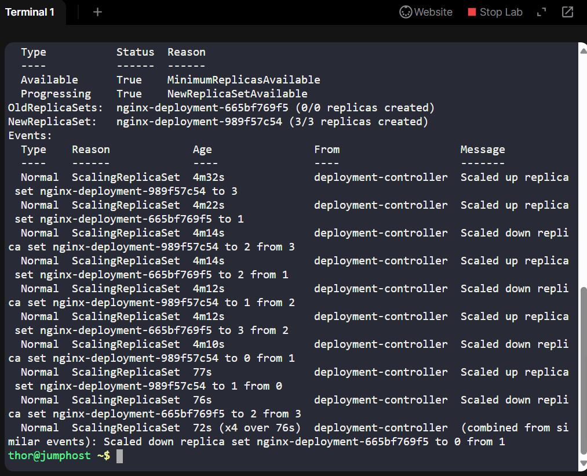
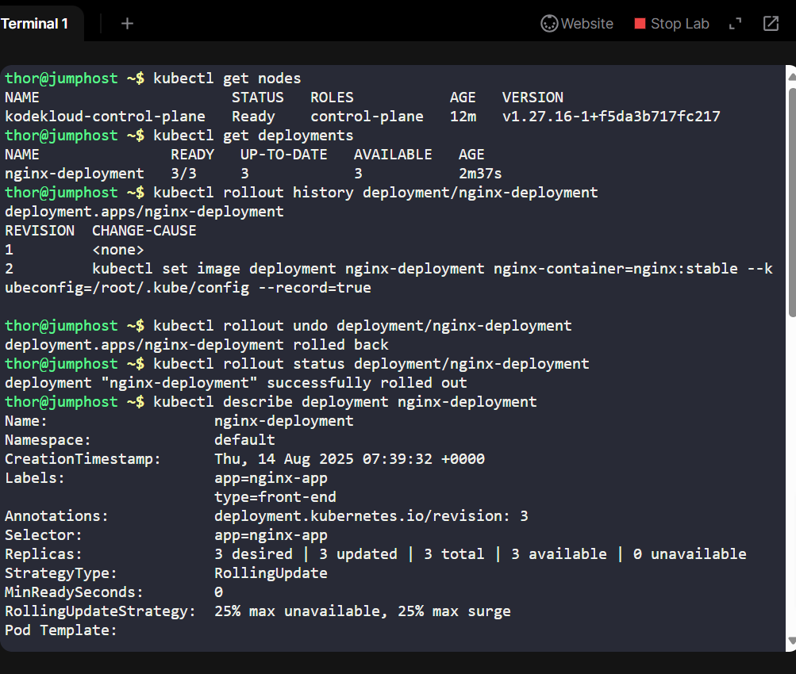

# Day 10 – Kubernetes Deployment Rollback
## Part of my 100 Days of DevOps challenge

On Day 10 of my journey, I took on a real-world scenario from the Nautilus DevOps team:
A new release of an application introduced a bug, and my task was to quickly roll back to the previous stable version using Kubernetes.

## Objective
Revert the nginx-deployment in our Kubernetes cluster to the previous revision, ensuring minimal downtime and restoring service stability.

## Tools & Environment
•	Kubernetes (kubectl preconfigured on jump host)

•	Nginx Deployment

•	Linux Shell (Jump Host)

•	GitHub for Documentation

## Step-by-Step Solution
1.	Check existing deployments
kubectl get deployments

3.	Review rollout history
kubectl rollout history deployment/nginx-deployment

4.	Rollback to the previous revision
kubectl rollout undo deployment/nginx-deployment

5.	Verify rollout status
kubectl rollout status deployment/nginx-deployment

6.	Confirm rollback details
kubectl describe deployment nginx-deployment

## Outcome
•	Restored the application to a stable state without downtime.

•	Learned how to navigate Kubernetes rollout history and perform targeted rollbacks.
•	Strengthened my troubleshooting skills for real production-like incidents.

## Key Takeaways
•	Always check rollout history before rollback to avoid reverting too far.

•	Kubernetes rollouts are designed for fast recovery in CI/CD workflows.
•	Documentation with screenshots helps future troubleshooting and recruiter visibility.
