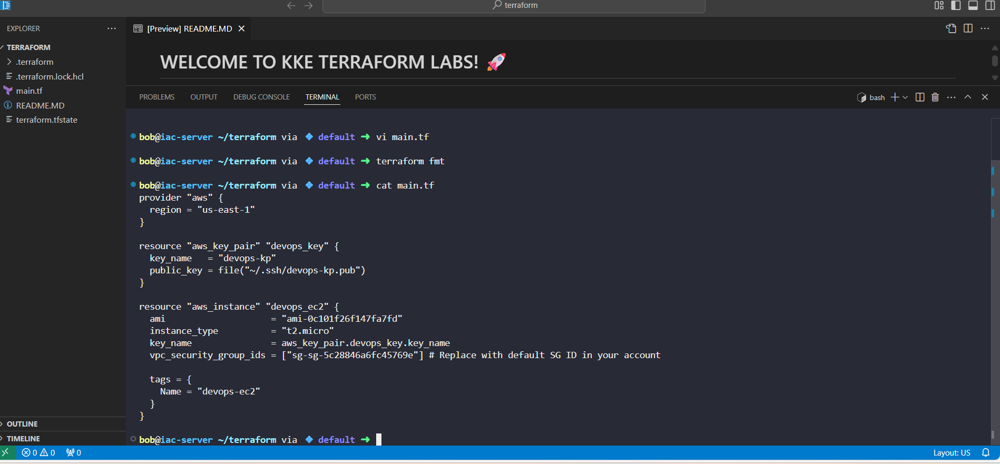
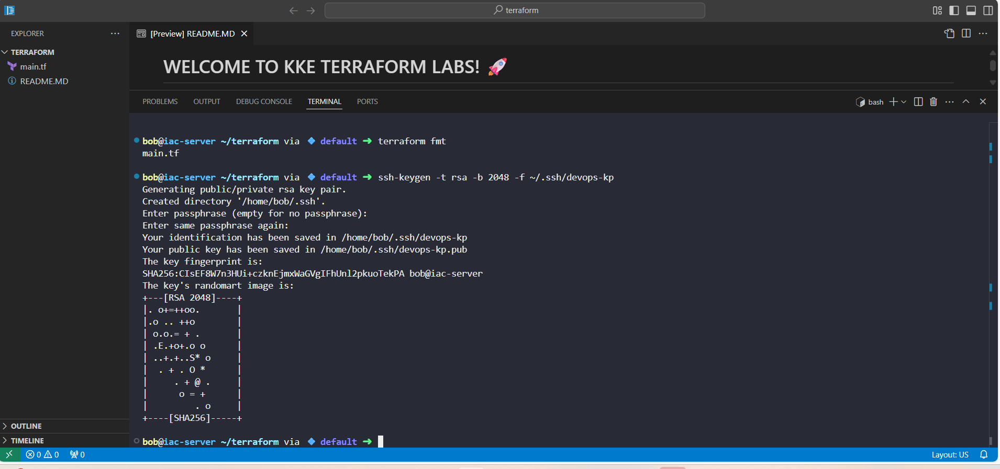
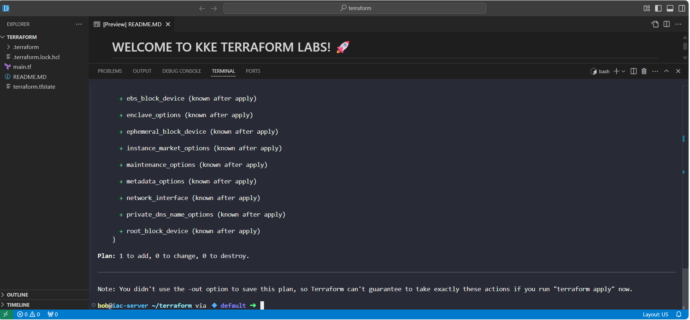
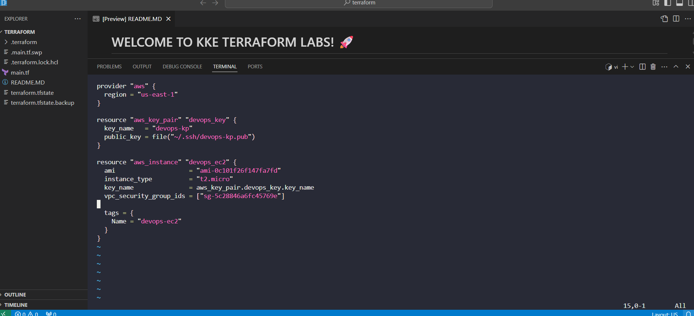
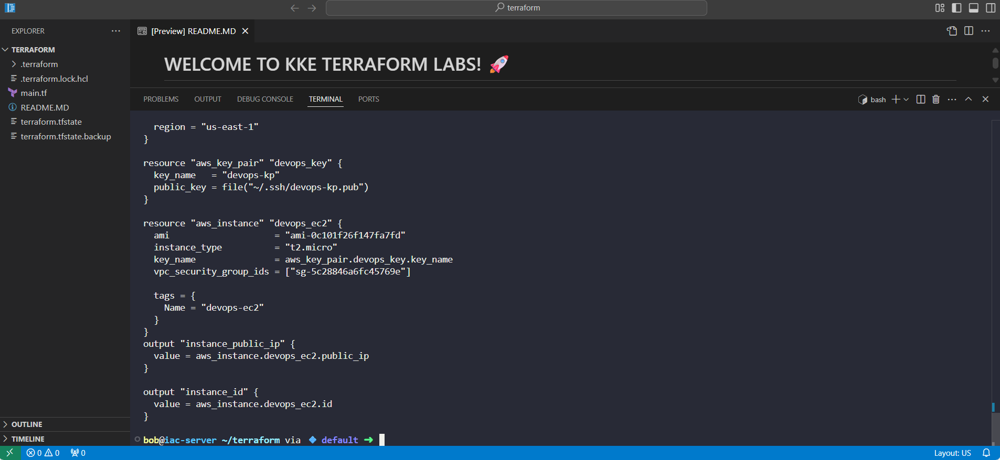
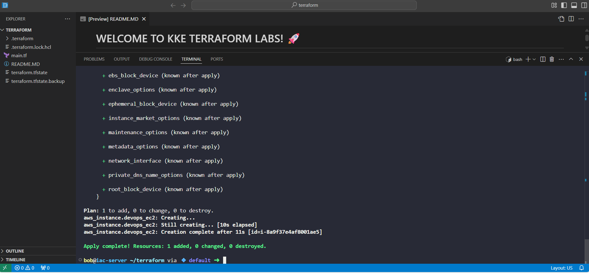
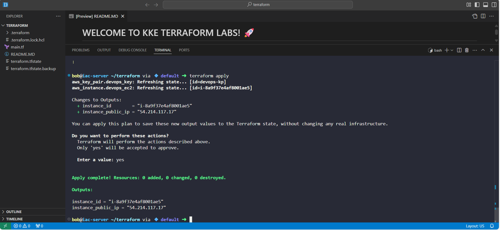

# Day 10: Terraform EC2 Deployment – 100 Days of DevOps
As part of my 100 Days of DevOps journey on KodeKloud, I worked on Day 10, focusing on provisioning AWS infrastructure using Terraform to meet a real business need: enabling incremental cloud migration for the Nautilus application.

## Business Context
The Nautilus DevOps team is migrating part of their on-premises infrastructure to AWS incrementally. This phased approach ensures minimal downtime, better troubleshooting, and easier management of cloud resources. For this task, the goal was to provision an EC2 instance with secure SSH access.

## Step-by-Step Workflow
1. Created a single main.tf for all resources.

2. Generated devops-kp using ssh-keygen if it didn’t exist.

4. Created this resource first due to a minor typo in the first attempt: Created EC2 Instance

5. Verified each step individually; instance creation was done one resource at a time due to earlier syntax errors.

6. Added Terraform Outputs to main.tf

7.	Initialized Terraform: terraform init

8. Validated configuration- terraform validate Apply Terraform

9. Terraform apply: terraform apply -auto-approve

10. Observed successful creation of the key pair and EC2 instance: Checked Outputs

terraform output

instance_id = "i-0abcd1234567890"

instance_public_ip = "54.211.123.45"

## Key Takeaways
•	Practiced incremental resource creation and verification in Terraform.

•	Reinforced the importance of outputs for operational validation.

•	Gained hands-on experience aligning infrastructure provisioning with business goals.

•	Learned how to handle typos and errors gracefully by creating resources one at a time.
