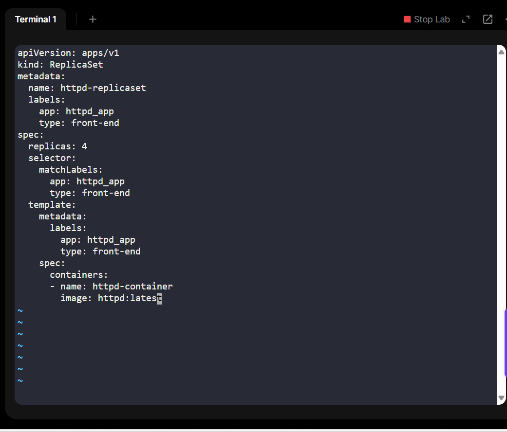
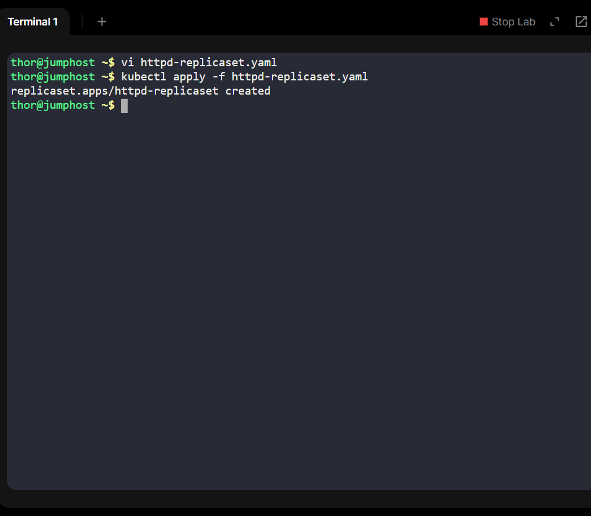
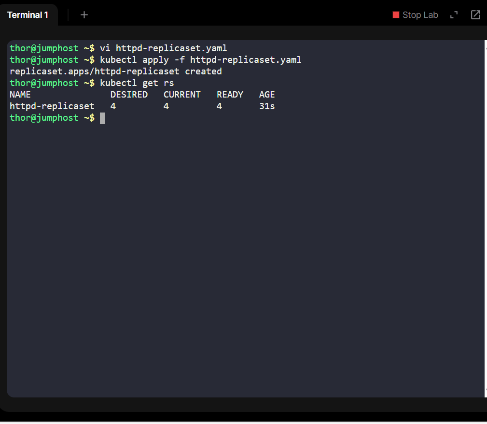
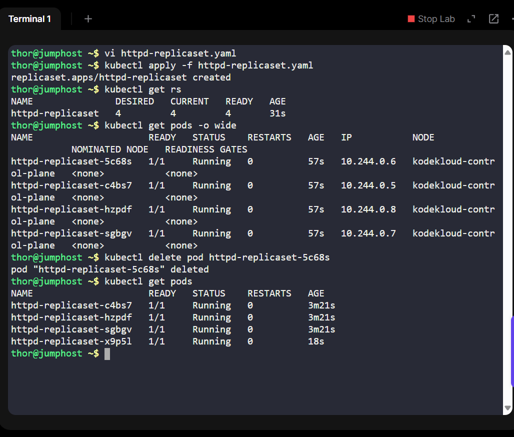

# Day 10 of 100 Days of DevOps — Deploying a ReplicaSet on Kubernetes  

As part of my **100 Days of DevOps** journey, I’m learning Kubernetes by solving real-world migration challenges.  

This project is inspired by a scenario from **KodeKloud’s labs** where the Nautilus DevOps team is preparing to migrate applications to a Kubernetes cluster.  

## Business Need  

When enterprises migrate to Kubernetes, ensuring **high availability, scalability, and resilience** becomes critical.  

A **ReplicaSet** in Kubernetes ensures that the desired number of pods are always running, even if some fail.  

For this project, I deployed an **Apache HTTP server (httpd)** ReplicaSet to demonstrate:  

- Running multiple replicas (4) for load distribution  

- Auto-healing when a pod crashes  

- Standardization with containerized images (`httpd:latest`)  

- Clear labeling for easier service discovery and management  

This mirrors **real-world DevOps work** in cloud migration projects.  

## Project Steps  

1. **Created ReplicaSet YAML**

   
2. Applied configuration

kubectl apply -f httpd-replicaset.yaml

3. Verified ReplicaSet and pods

kubectl get rs

kubectl get pods -o wide

4. Tested self-healing by deleting a pod → Kubernetes created a new one automatically.

## Learnings
Learned how ReplicaSets maintain desired state in Kubernetes.

Gained hands-on practice with labels and selectors for better resource management.

Understood why enterprises rely on ReplicaSets for scalability and fault tolerance during migration.
