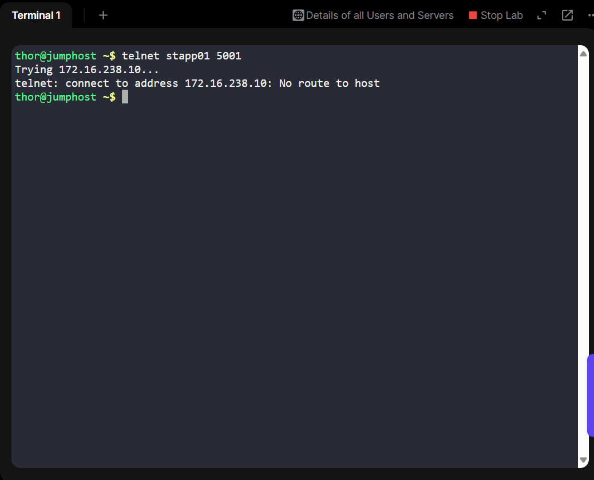
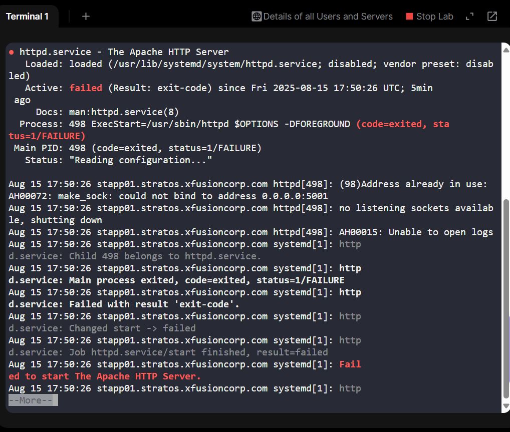
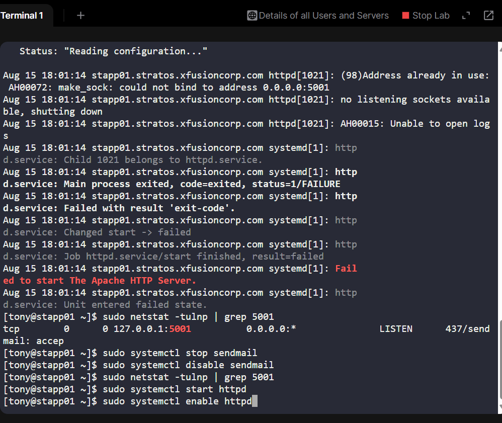
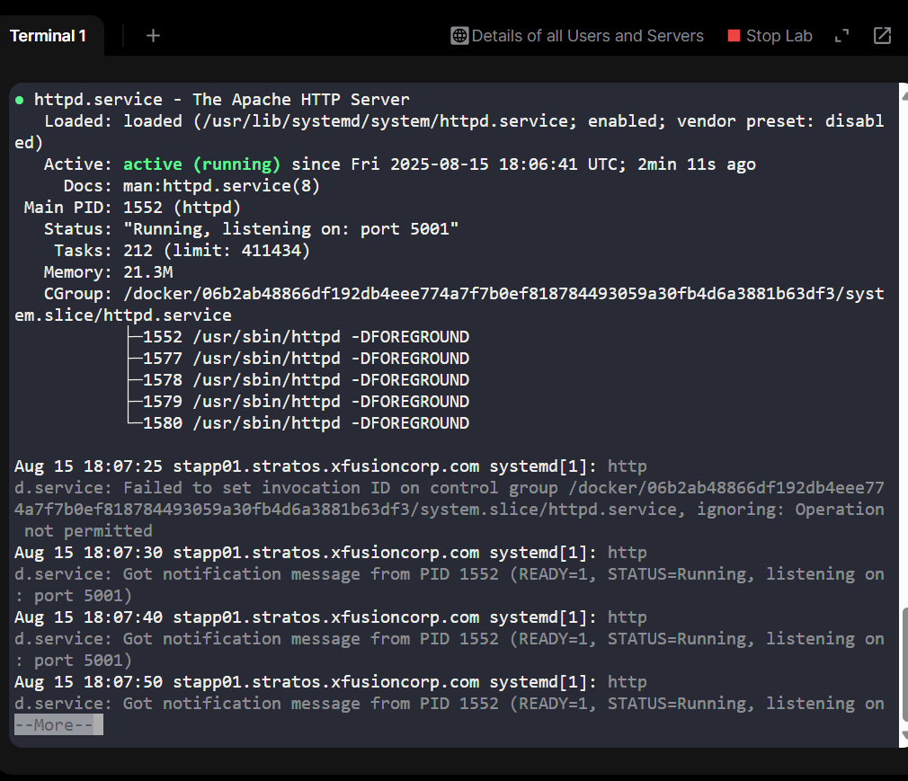
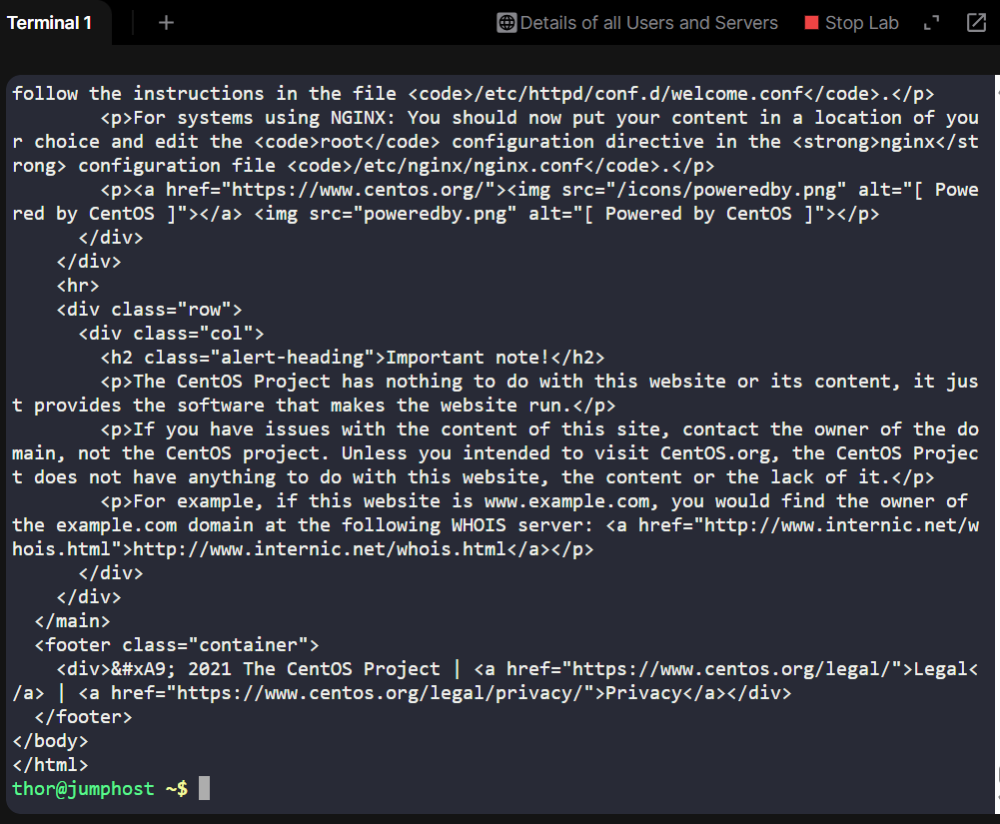
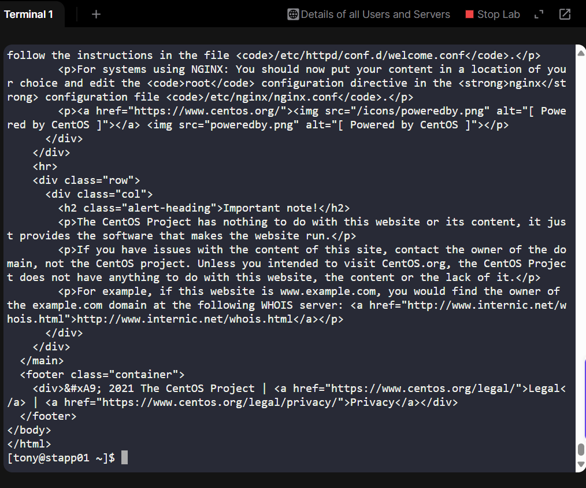

# Day 12 – Restoring Apache Service Availability on Custom Port (5001)

## Project Overview
As part of my 100 Days of DevOps journey on KodeKloud, I tackled a real-world style incident:
Apache on App Server 1 (stapp01) in the Stratos Datacenter had become unreachable on its non-standard port 5001.
My role was to diagnose and restore access from the jump host without compromising security settings, exactly the kind of quick, methodical problem-solving needed in production environments.

## Business Essence
In enterprise systems, when a core service like Apache becomes unreachable:

•	Business Impact: Customers can’t access applications → loss of trust, potential revenue impact.

•	Operational Impact: Teams are blocked from delivering updates or fixing related issues.

•	Security Requirement: Restoring access must not involve “opening everything” in the firewall or bypassing controls.

Goal: Restore Apache on port 5001 quickly while keeping system hardening intact.

## Resolution Steps (Based on Live Troubleshooting)
From Jump Host

### Step 1: Confirmed issue from jump host
telnet stapp01 5001

#### Result: Connection failed → network or service issue confirmed

## Step 2: Attempted to reach via curl from jump host
curl http://stapp01:5001

#### Result: No route to host

From App Server 1 (stapp01)

### Step 3: Checked Apache service status
sudo systemctl status httpd

#### Result: Inactive

### Step 4: Attempted start
sudo systemctl start httpd

#### Result: Failed → port conflict suspected

### Step 5: Inspected why Apache failed
sudo systemctl status httpd.service -l

#### Found: Address already in use: 0.0.0.0:5001

### Step 6: Identified process using 5001
sudo netstat -tulnp | grep 5001

#### Found: sendmail bound to 127.0.0.1:5001

### Step 7 – Freed the port for Apache
sudo systemctl stop sendmail

sudo systemctl disable sendmail

### Step 8: Restarted Apache
sudo systemctl start httpd

sudo systemctl enable httpd

sudo systemctl status httpd

#### Apache now active

### Step 9: Test locally
curl http://localhost:5001

#### Works locally

### Firewall Configuration
### Step 10: Checked firewall rules
sudo iptables -L -n

### Found: Default REJECT for inbound traffic

### Step 11 – Allowed port 5001
sudo iptables -I INPUT -p tcp --dport 5001 -j ACCEPT

sudo service iptables save

### Step 12: Verified rule
sudo iptables -L -n | grep 5001

#### Showed ACCEPT for tcp dpt:5001

Final Verification
### Step 13: Test locally on stapp01
curl http://localhost:5001

#### Apache test page HTML output

### Step 14: Test remotely from jump host
curl http://stapp01:5001

#### Apache test page HTML output → Service fully restored

## Challenges & Troubleshooting Highlights

1.	Port Conflict: Apache wouldn’t start because sendmail was already bound to 5001.

-Resolved by stopping & disabling sendmail to free the port.

2.	Network Firewall Block: Even after Apache was running, jump host access failed.

-Diagnosed iptables rules that rejected all inbound connections except explicitly allowed ports.

-Added targeted rule for 5001, preserving other security restrictions.

3.	Validation at Each Step: Used curl locally and remotely to ensure changes worked end-to-end before closing the incident.

## Skills Demonstrated
•	Linux service & port troubleshooting
•	Network connectivity diagnostics (telnet, curl, netstat)
•	Process conflict resolution
•	Secure firewall adjustments (iptables)
•	Incident handling & structured validation

## Outcome
Apache was restored within minutes to full operational status on port 5001, reachable from the jump host and preserving all existing security measures.

This task mirrored real production firefighting — identifying root cause under pressure, applying targeted fixes, and ensuring the service met both availability and security requirements.
