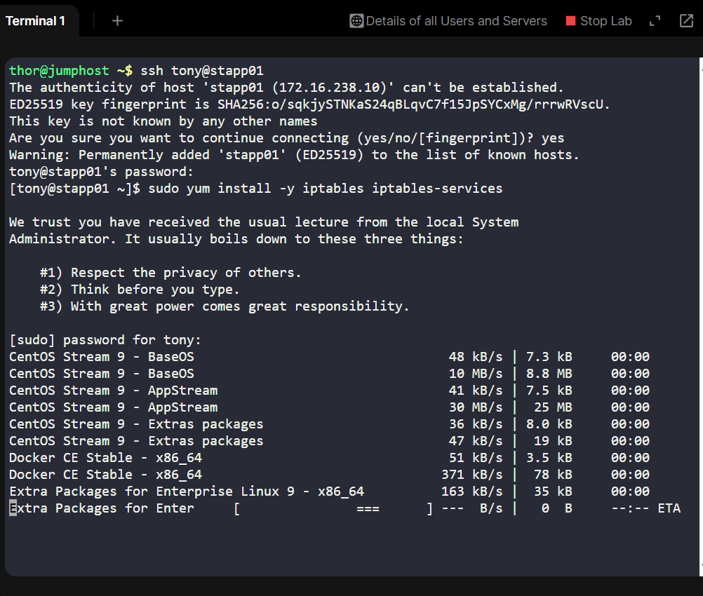
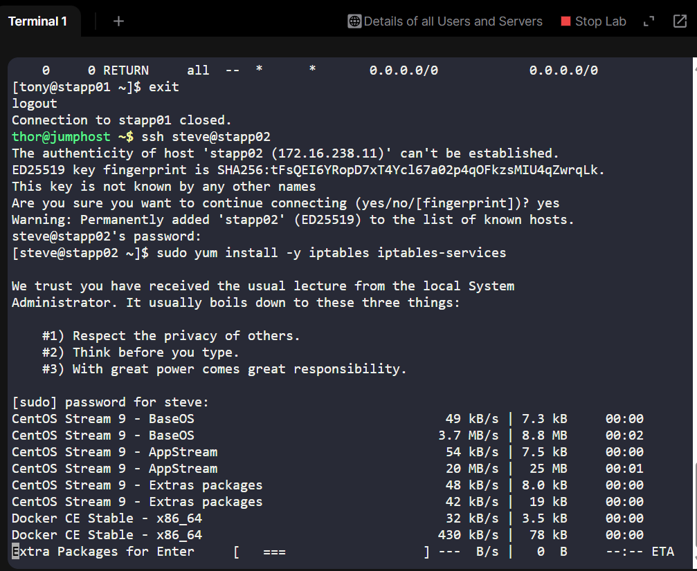
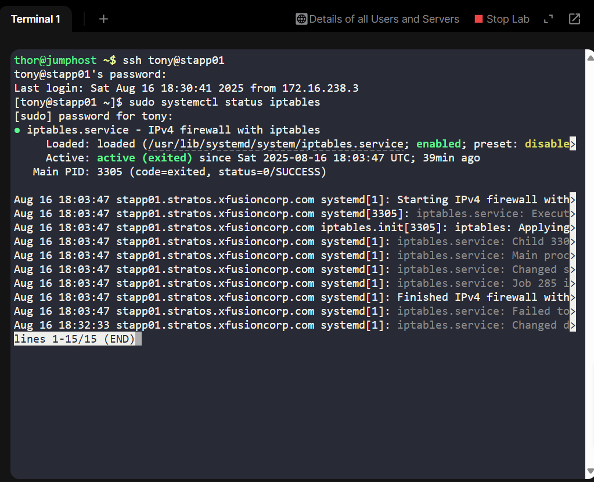
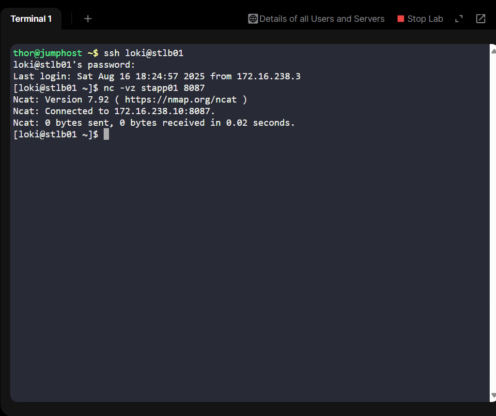

# Day 13: Secure Apache with iptables – 100 Days of DevOps

## Project Overview
As part of my 100 Days of DevOps journey, Day 13 focused on improving security for our web application infrastructure.

One of our websites is running on Nautilus infrastructure in Stratos DC. The security team raised a concern: Apache is listening on port 8087 with no firewall, exposing it to the public internet.

## Business Need:
Unrestricted access to the web server poses a critical security risk, including potential unauthorized access, data breach, or service disruption. By restricting access only to the Load Balancer (LBR) host, we ensure:

•	Only legitimate traffic flows through the LBR

•	Direct access to app servers is blocked

•	Security posture meets compliance standards

## Solution:
Use of iptables to allow traffic from the LBR host (172.16.238.14) and block all others, with rules persistent after reboot.

## Implementation Steps
1. Installed iptables on each app server:

sudo yum install -y iptables iptables-services

sudo systemctl enable iptables

sudo systemctl start iptables

2. Configured firewall rules:
### Allowed LBR IP
sudo iptables -A INPUT -p tcp -s 172.16.238.14 --dport 8087 -j ACCEPT

### Dropped all other traffic to port 8087
sudo iptables -A INPUT -p tcp --dport 8087 -j DROP

3. Persisted rules across reboots

sudo service iptables save

sudo systemctl enable iptables

## Verification Steps
Step 1: Verified rules on app servers

sudo iptables -L -n -v --line-numbers

•	Looked for:

-ACCEPT tcp from 172.16.238.14

-DROP tcp from all others

Step 2: Tested from Load Balancer (allowed)

curl http://stapp01:8087

curl http://stapp02:8087

•	Succeeded

Step 3: Tested from jump host or another app server (blocked)

nc -vz stapp01 8087

nc -vz stapp02 8087

Timed out/refused.

Step 4: Verify persistence across reboots

sudo systemctl status iptables

sudo reboot

### After reboot
sudo iptables -L -n -v

•	Ensured rules remain after reboot

Step 5: Final Verification

•	From LBR: Apache still accessible

•	From jump host: Port 8087 still blocked

## Summary
•	Implemented iptables to secure Apache on port 8087

•	Only the LBR host can access the web servers

•	Rules are persistent after reboot, meeting business security requirements

•	All verification steps documented with screenshots for transparency
