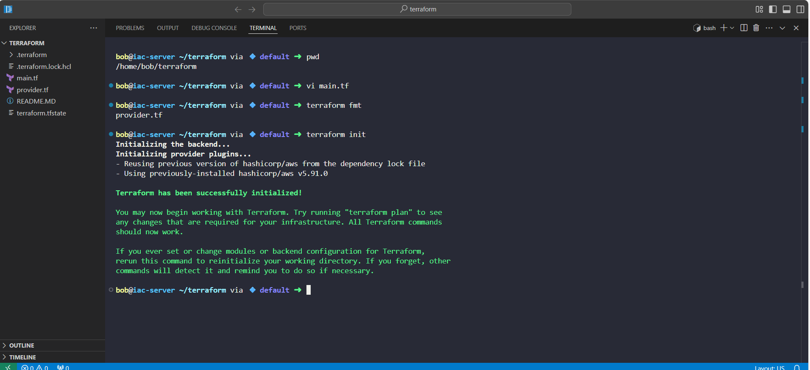
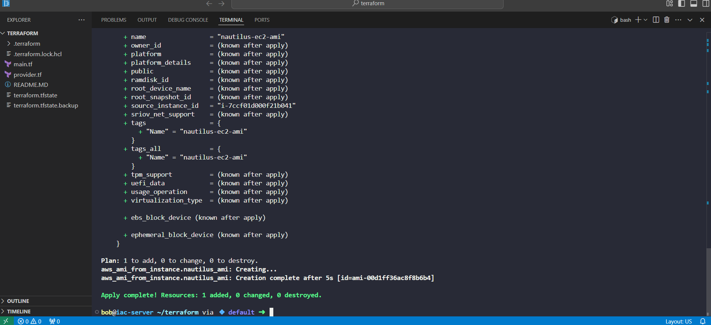
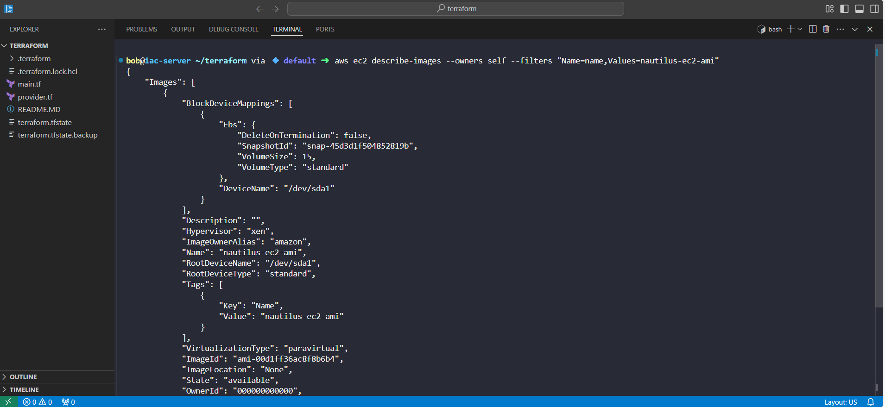

# Day 13 - Creating an AMI with Terraform | 100 Days of DevOps

As part of my **100 Days of DevOps** journey, I am documenting hands-on projects that simulate real-world challenges faced by DevOps teams.  

For **Day 10**, the task focused on **cloud migration strategies** using AWS and Terraform.

## Project Overview
The Nautilus DevOps team is planning to migrate part of their infrastructure to AWS.  

To ensure a smooth migration, they adopted an **incremental approach**, breaking the large migration into smaller, manageable phases.  

One critical step is **creating an Amazon Machine Image (AMI)** from an existing EC2 instance.  

This allows the team to:

- **Standardize environments** by reusing the same server configuration across multiple instances.

- **Improve disaster recovery** with easily restorable machine images.

- **Accelerate scaling** by launching preconfigured instances from the AMI.

## Tools & Technologies
- **AWS EC2**

- **Terraform** (Infrastructure as Code)

- **VS Code**

- **AWS CLI** (for verification)

## Implementation Steps

1. **Provisioned an EC2 instance** using Terraform.  
2. **Extended Terraform configuration** to create an AMI (`nautilus-ec2-ami`) from that instance.
 
3. **Applied changes** with Terraform commands:
   
terraform init

   
terraform validate

terraform plan

terraform apply -auto-approve

4.	Verify the AMI is in available state from AWS Console or CLI.

## Key Learnings & Benefits

•	Learned how to create reusable AMIs with Terraform.

•	Understood the business importance of incremental migration strategies.

•	Gained hands-on experience in Infrastructure as Code (IaC), a skill in high demand for DevOps roles.

## Business Impact
In real-world cloud migrations:

•	AMIs reduce risks by providing consistent golden images.

•	They improve scalability and high availability.

•	They allow DevOps teams to move faster while reducing downtime.

This exercise mirrors the exact challenges faced in enterprise cloud adoption projects.
