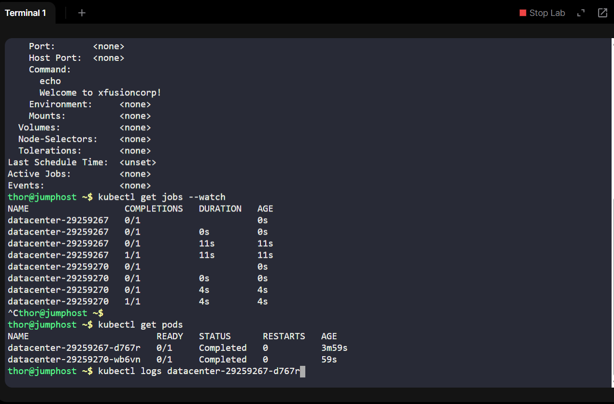

# Day 14 of 100 Days of DevOps: Kubernetes CronJobs
As part of my 100 Days of DevOps journey, I explored one of the most business-critical features of Kubernetes - CronJobs.

## Project Overview
In modern enterprises, recurring jobs such as backups, report generation, and log cleanups need to run reliably on a schedule. Traditionally, system admins used Linux crontab, but in cloud-native environments, Kubernetes CronJobs provide scalability, fault tolerance, and self-healing.

In this project, I created a Kubernetes CronJob named datacenter to demonstrate this functionality.

## Steps Taken
1.	Defined a CronJob manifest (datacenter-cronjob.yaml)

-	Schedule: */3 * * * * (every 3 minutes)

-	Container name: cron-datacenter

-	Image: nginx:latest

-	Command executed: echo Welcome to xfusioncorp!

-	Restart policy: OnFailure

2.	Applied the manifest to the cluster using kubectl apply -f datacenter-cronjob.yaml.

3.	Verified deployment with:

-kubectl get cronjobs

-kubectl describe cronjob datacenter

4.	Observed job creation every 3 minutes using kubectl get jobs.

5.	Checked logs of pods to confirm output:

**Welcome to xfusioncorp!**

## Key Learnings & Business Impact
•	Automation at scale: CronJobs remove the need for manual intervention in recurring tasks.

•	Resilience: If a job fails, Kubernetes can retry based on restart policies.

•	Cloud-native shift: Moving from traditional cron to Kubernetes CronJobs aligns with modern DevOps practices.

•	Recruiter perspective: Demonstrates hands-on skill in Kubernetes workload management and operational automation.
