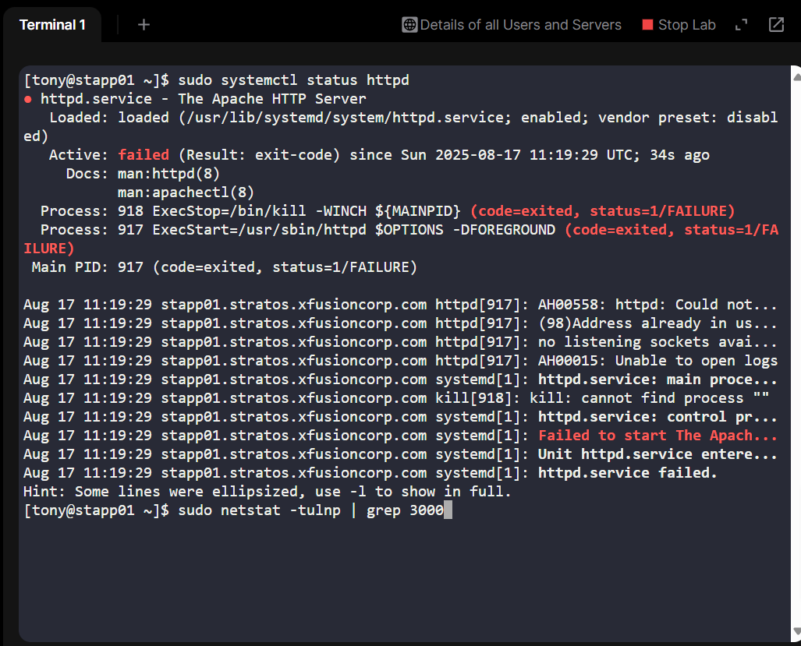
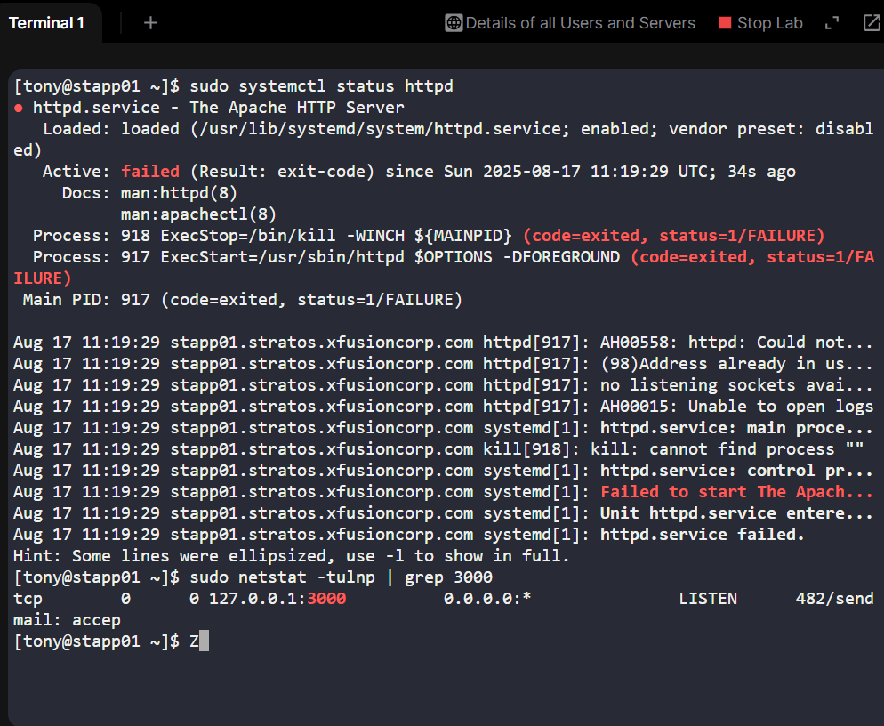
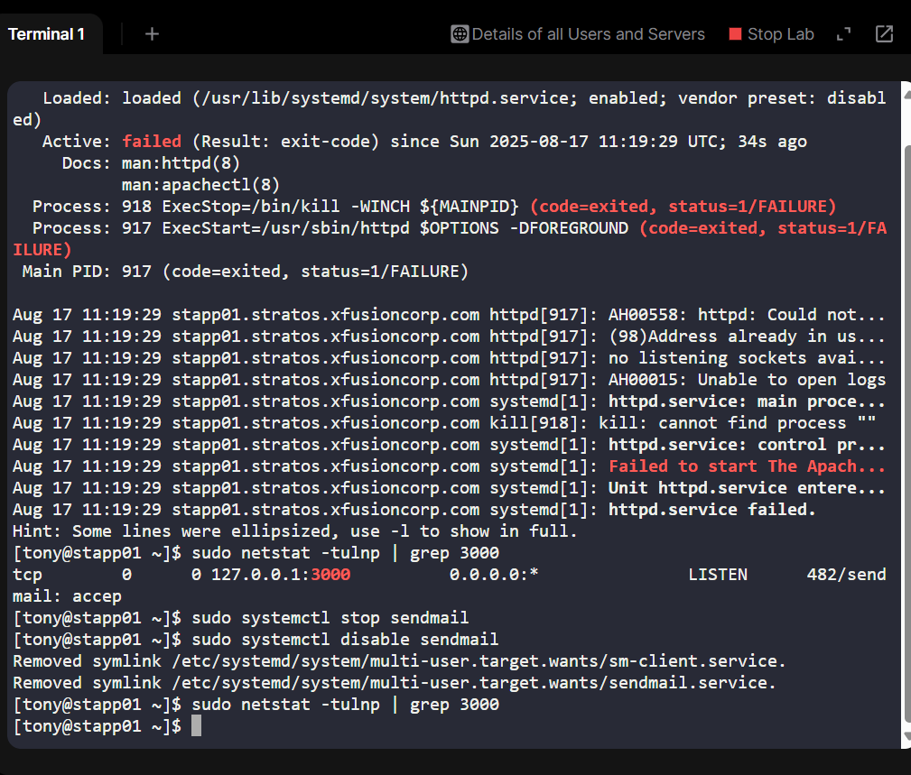
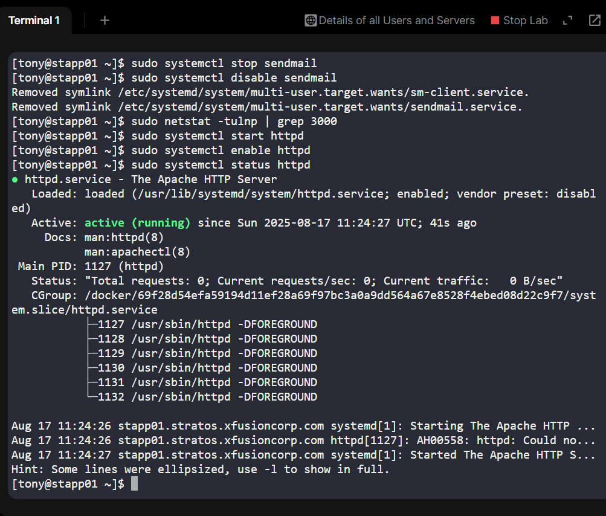

# Day 14 – Fixing Apache Service Outage on Stratos Datacenter

As part of my **100 Days of DevOps** journey, today I worked on a **production-style troubleshooting exercise** at KodeKloud Labs.

## Scenario
The monitoring system at **xFusionCorp Industries** flagged that the **Apache service was down** on one of the app servers (`stapp01`).  

Apache was expected to run on **port 3000**, but it was failing to start.

Business-wise, such outages directly impact **customer-facing applications**, leading to downtime, lost trust, and potential revenue impact. A quick resolution is critical in real-world operations.

## Step-by-Step Troubleshooting

1. **Checked Apache service status**

sudo systemctl status httpd

Found that Apache failed with error:
(98)Address already in use: AH00072: make_sock: could not bind to address 0.0.0.0:3000

2.	**Investigated port usage**

sudo netstat -tulnp | grep 3000

Output:
tcp   0   0 127.0.0.1:3000   0.0.0.0:*   LISTEN   482/sendmail: accep

Port 3000 was already occupied by sendmail (PID 482).

3.	**Stopped the conflicting service**

sudo systemctl stop sendmail

sudo systemctl disable sendmail

Re-checked: sudo netstat -tulnp | grep 3000

Port was now free.

4.	**Restarted Apache**

sudo systemctl start httpd

sudo systemctl enable httpd

5.	**Validated service**

On app server: curl http://localhost:3000

From jump host: curl http://stapp01:3000

Apache responded successfully.

## Key Learning & Business Essence
-Root cause: Port conflict (sendmail occupying 3000).

-Fix: Stop & disable conflicting service, restart Apache.

-Business value:

1. Ensured zero downtime for critical web services.
2. Reinforced the importance of monitoring + root-cause analysis in production.
3. Demonstrated how proactive troubleshooting ensures service reliability for customers.

## Wrap Up
This project simulated a real DevOps on-call issue:

-Service down

-Investigated root cause

-Fixed via port reallocation

- Restored business continuity
