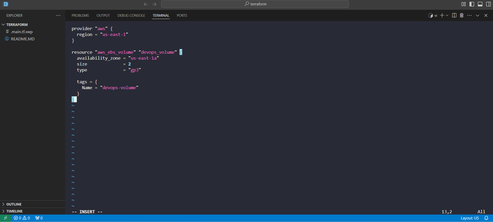
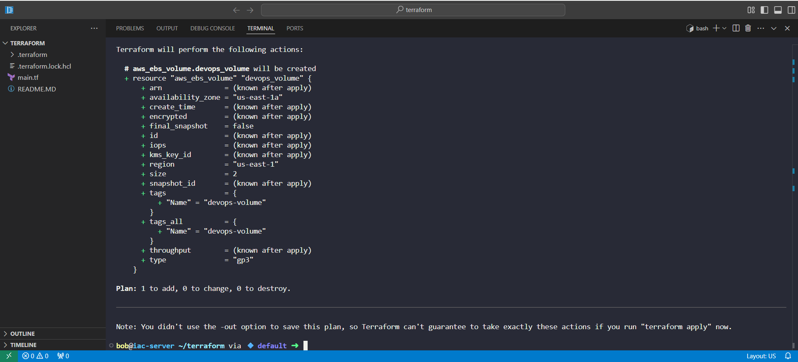
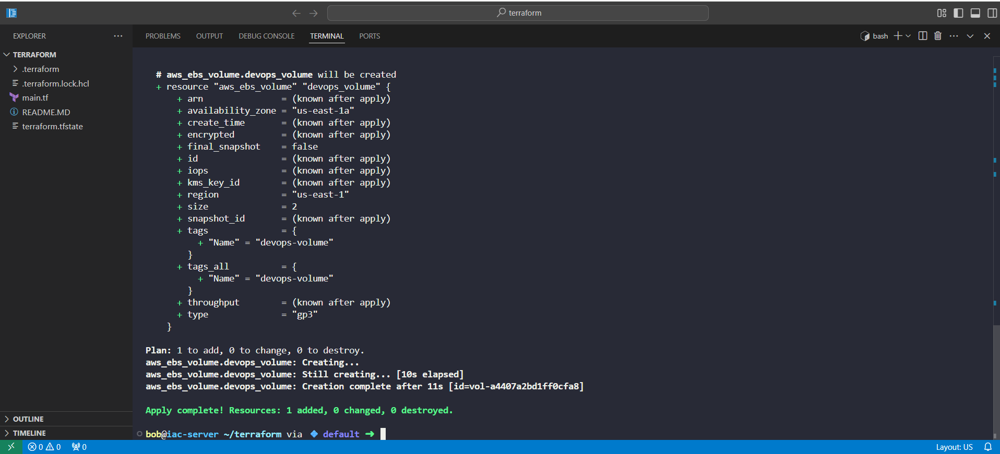
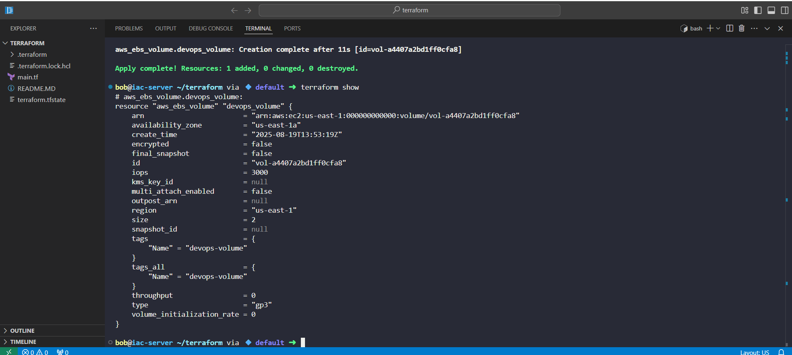

# Day 15 – Provisioning AWS EBS Volume with Terraform

As part of my 100 Days of DevOps journey, today I focused on infrastructure automation using Terraform.

The challenge was to provision an EBS (Elastic Block Store) volume in AWS with the following requirements:

•	Name: devops-volume

•	Type: gp3

•	Size: 2 GiB

•	Region: us-east-1

## Business Context
The Nautilus DevOps team is migrating workloads to AWS. Instead of moving everything at once (which increases risk and downtime), the team is breaking down migration into smaller, incremental steps.

Creating and managing EBS volumes with Terraform is one of these foundational steps. By automating infrastructure provisioning, the business achieves:

• Risk Mitigation: small, controlled deployments reduce migration risk.

•	Agility – easily scale or replicate infrastructure.

•	Cost Efficiency – provision only what is needed, track via IaC.

•	Consistency – avoid manual errors by using repeatable Terraform code.

## Steps Taken
1.	Created Terraform configuration (main.tf) with AWS provider + EBS volume resource.

2.	Initialized Terraform (terraform init) to pull AWS plugins.
3.	Validated & Planned configuration to preview infrastructure changes.

4.	Applied Terraform (terraform apply) to provision the EBS volume.

5.	Verified using: Terraform Show → to inspect the created resource details from state.

## Learnings & Benefits
•	Hands-on Terraform practice: Defined infrastructure as code for reproducibility.

•	Terraform State Awareness: Used terraform show to validate the resource state tracked by Terraform, ensuring infrastructure and state file alignment.

•	AWS familiarity: Gained understanding of EBS volumes and their use cases (persistent block storage for EC2).

•	Business alignment: Showcased how DevOps practices (IaC + automation) directly support cloud migration goals.

•	Demonstrates my ability to combine technical execution with business value.
