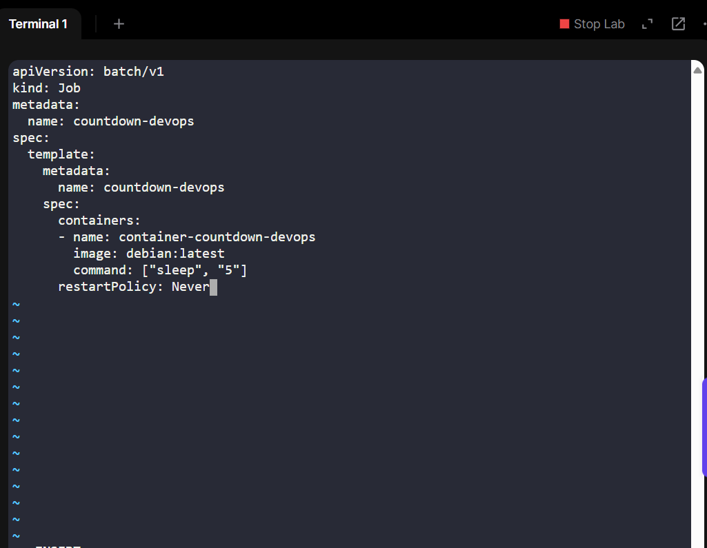
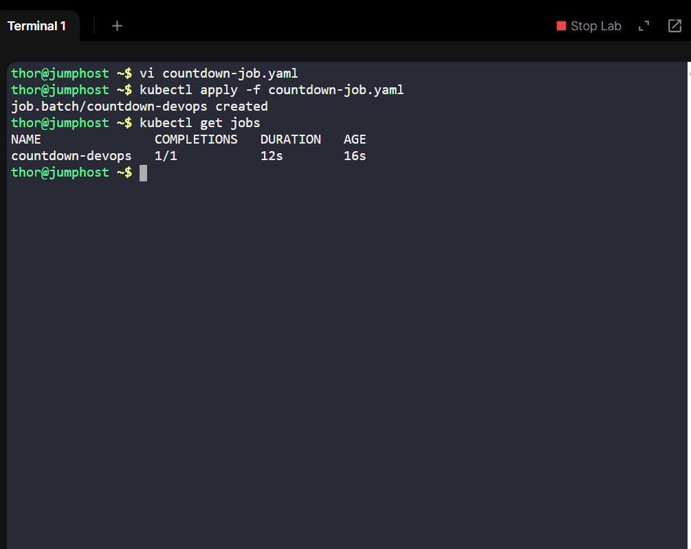

## Project Story
On Day 10, I explored how organizations use Kubernetes Jobs to automate repeatable tasks. Unlike Deployments, which keep applications running indefinitely, Jobs run to completion, making them perfect for tasks like database migrations, backups, or scheduled scripts.

For this exercise, I created a simple job called countdown-devops using a Debian container that sleeps for 5 seconds, simulating a lightweight batch task. This is a foundational skill for larger real-world use cases (data pipelines, CI/CD hooks, ETL processing).

## Business Need & Essence
In business environments, Kubernetes Jobs solve a critical need:
1. Automation: Run batch workloads without human intervention.
2. Reliability: Ensure tasks complete successfully, even if pods fail.
3. Scalability: Multiple jobs can be scheduled across a cluster.
4. Consistency: Same command runs identically every time, across environments.
5. For teams, this means lower operational risk, repeatability, and efficient cloud resource usage.

## Steps to Implement
1. Define the Job YAML

2. Apply the Job

kubectl apply -f countdown-job.yaml

3. Verify the Job

kubectl get jobs

kubectl describe job countdown-devops

4. Verify Pods

kubectl get pods

5. Check Logs

kubectl logs countdown-devops-4wlmn

Since the command is just sleep 5, there is no output in the logs. This is expected and confirms the pod executed successfully.

## Takeaway & Learning Impact
•	Learned how to create one-off workloads in Kubernetes.

•	Understood the difference between Deployments and Jobs.

•	Saw how Jobs map to business processes like reporting, scheduling, and migrations.

This hands-on exercise reinforced how DevOps engineers use Kubernetes to handle not just services, but also batch workloads that power modern enterprises.
