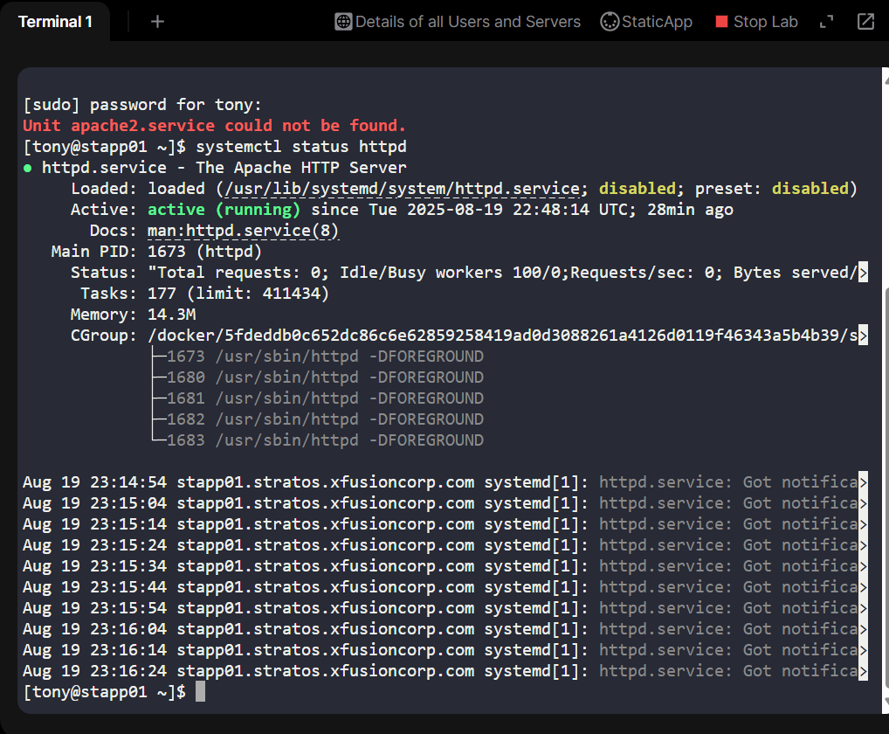
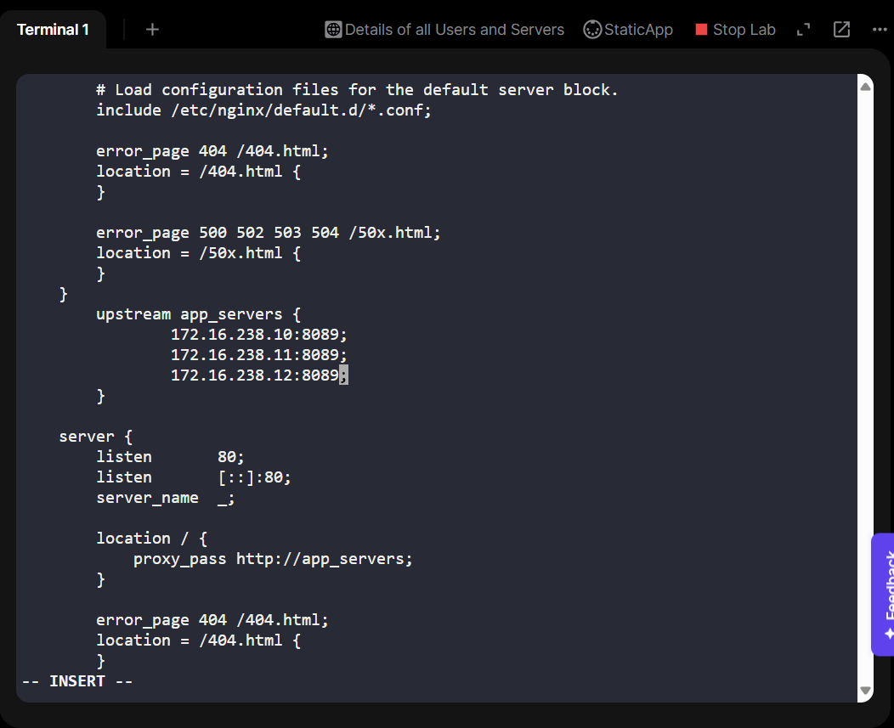
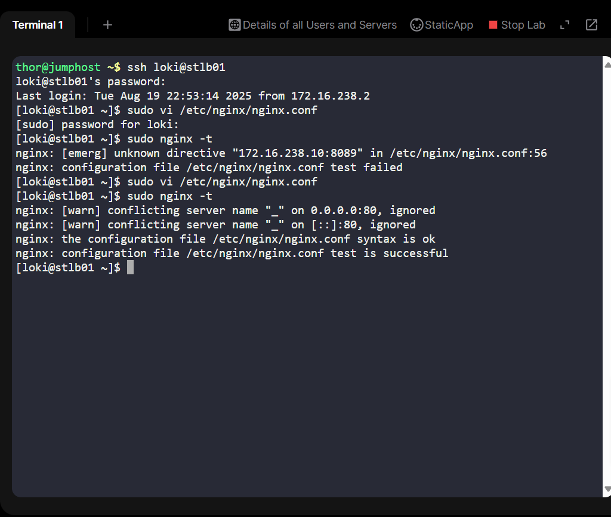
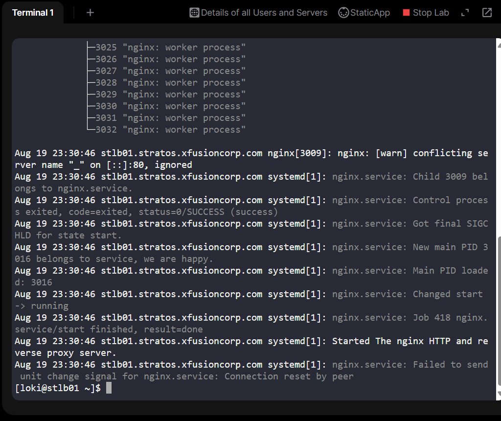
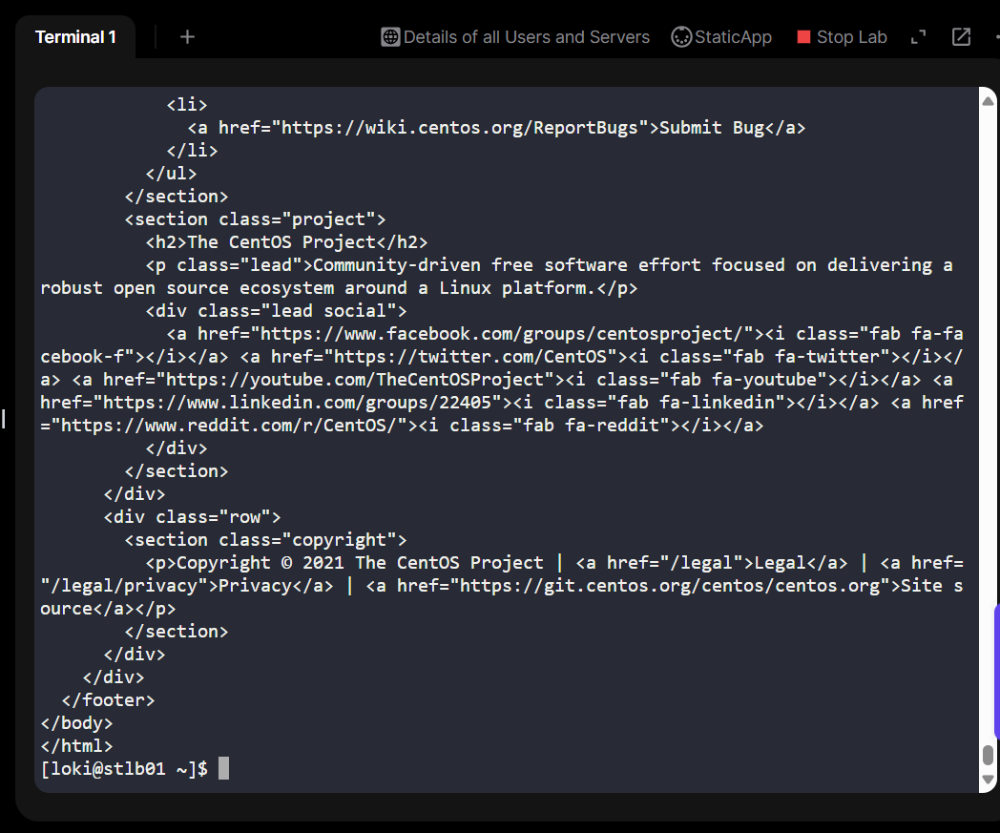
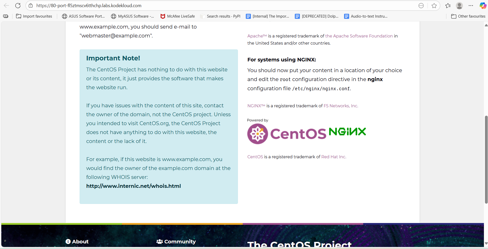

# Day 16 - Configuring an Nginx Load Balancer for High Availability
As part of my 100 Days of DevOps/Cloud journey, today I worked on a high availability challenge inspired by real production scenarios.

##The task 

The Nautilus production support team noticed increasing traffic on one of their business-critical websites, leading to degraded performance. To ensure scalability, resilience, and better customer experience, we completed the final step of migrating the application onto a high availability stack by configuring the Load Balancer (LBR) server using Nginx.

## Business Context
In any growing digital business, website downtime or slowness directly impacts revenue, brand trust, and customer satisfaction. High availability isn’t just a technical buzzword, it’s a business necessity.

By implementing a load balancer, we:

•	Ensure traffic is evenly distributed across multiple servers.

•	Avoid performance bottlenecks on a single machine.

•	Provide fault tolerance — if one server fails, traffic automatically flows to healthy ones.

•	Create a foundation for future scaling as traffic grows.

This project mirrors what happens in real enterprise systems, where an effective load balancer often becomes the difference between smooth customer journeys and outages under load.

## My Implementation
1.	Validated App Servers
-Each App Server (stapp01, stapp02, stapp03) was running Apache (httpd).

-Confirmed Apache was listening on port 3004.

-Verified services were active and serving the application content.

systemctl status httpd showing Apache running.

ss -tulnp | grep 3004 to show Apache listening on 3004.

2.	Installed and Configured Nginx on the LBR Server
-Installed Nginx on the designated Load Balancer server (stlb01).

-Edited /etc/nginx/nginx.conf to replace the default config with a clean reverse proxy setup pointing to all App Servers.

**Key snippet:**
📸 Screenshot suggestion:
nginx -t showing syntax OK.

systemctl status nginx showing the service active and running.

3.	Validated Load Balancer Functionality
-Ran curl http://localhost from the LBR server.

-Successfully received application content:

-Welcome to xFusionCorp Industries!

-Verified that all responses came through the load balancer at port 80, proxying to the App Servers at port 3004.

## Key Learnings
•	Learned how to configure Nginx as a reverse proxy and load balancer in production-like settings.

•	Saw how backend servers can run on non-standard ports (3004 here) while the load balancer presents a standard frontend port (80) for users.

•	Reinforced the principle that high availability = better user experience + business continuity.

## Recruiter-Friendly Takeaway
Today I implemented a real-world high availability setup by configuring an Nginx load balancer to proxy and balance traffic across multiple Apache servers. This project showcased my ability to:

•	Understand and deliver business-critical infrastructure improvements.

•	Apply Linux server management, Nginx configuration, and load balancing concepts in practice.

•	Contribute to scalable and resilient system design, a must-have skill for modern cloud and DevOps engineers.

**With this, the application is now highly available through a properly configured load balancer, ensuring performance and reliability as traffic grows.**
