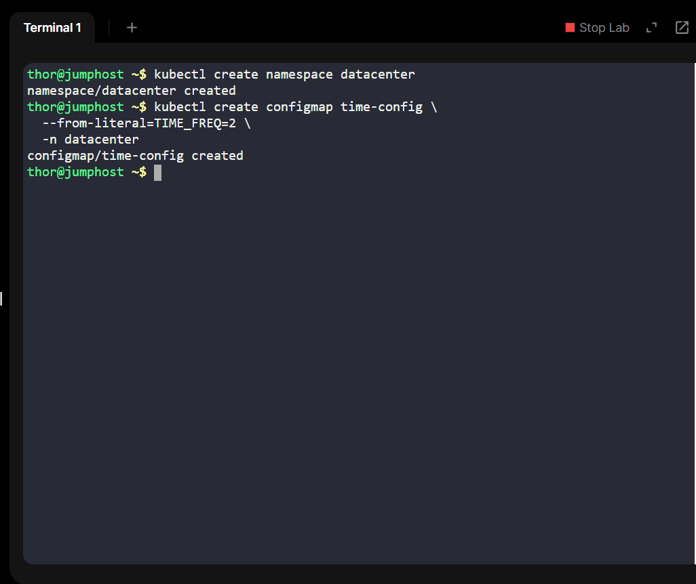
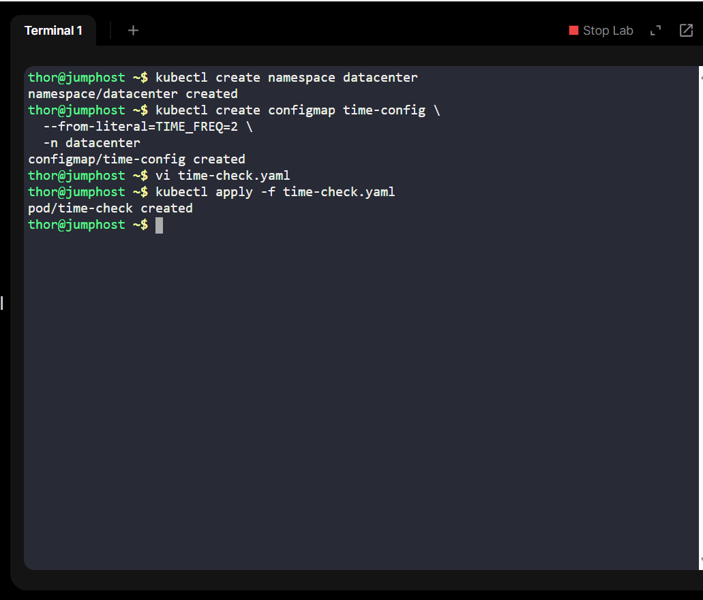
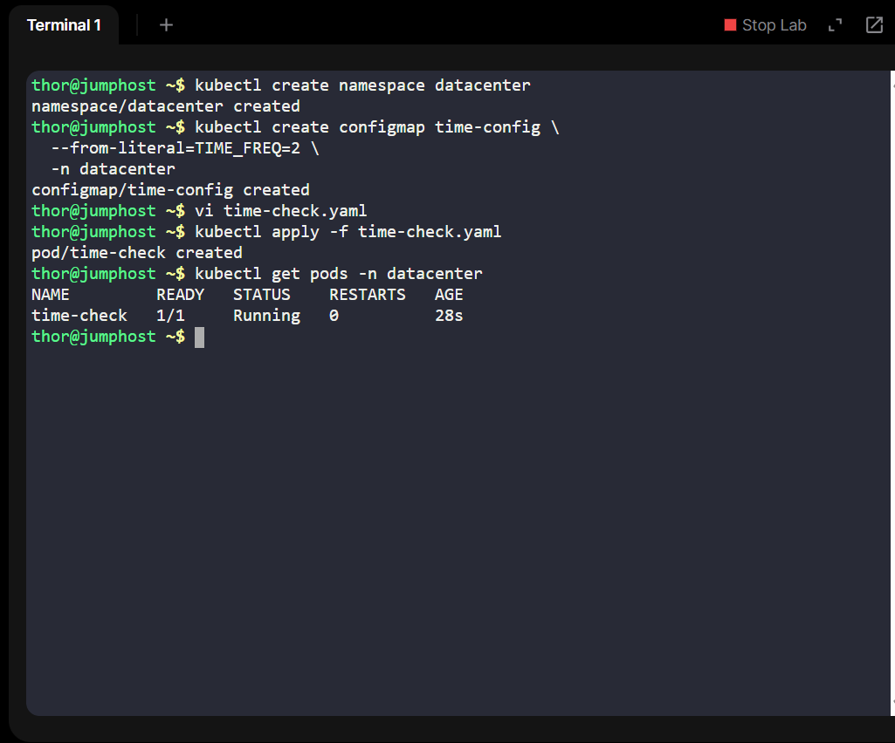
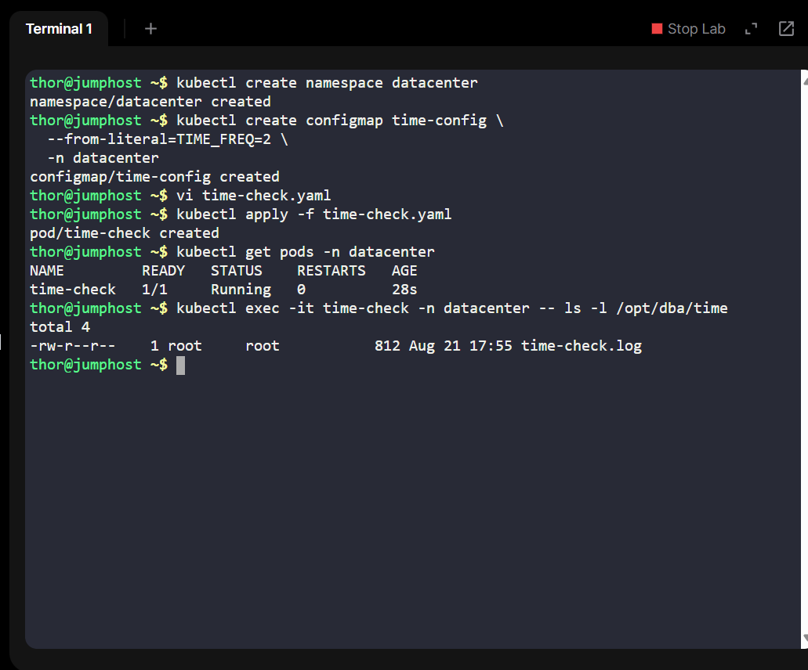

# Day 17 of 100 Days of DevOps - Kubernetes ConfigMaps & Volumes

As part of my **100 Days of DevOps Challenge**, I continued strengthening my Kubernetes skills with a real-world inspired task:  

I creating a **time-check pod** that logs system time into a mounted volume, driven by configuration from a `ConfigMap`.

## Business Context

In enterprise environments, teams often require **lightweight logging mechanisms** for monitoring, auditing, or debugging.  

This project simulates such a scenario for the **Nautilus DevOps team**, where a simple **time-check pod** is deployed in a dedicated namespace for testing logging strategies.  

**Benefits for the business:**
1. Centralized logs written to mounted volumes (can later be persisted to external storage or integrated with log collectors like ELK/EFK).  
2. Dynamic configuration through **ConfigMaps**, allowing parameter changes without rebuilding containers.  
3. Reusable design for testing pods before rolling into production clusters.  

## What I Did

1. **Created a Kubernetes Namespace** (`datacenter`)  
   - Provides logical isolation for resources.  

2. **Built a ConfigMap** (`time-config`)  
   - Stored key `TIME_FREQ=2` to dynamically control how often timestamps are logged.  

3. **Deployed a Pod (`time-check`)**  

   - Container runs `busybox:latest`.  

   - Command: `while true; do date >> /opt/dba/time/time-check.log; sleep $TIME_FREQ; done`  

   - Mounted volume (`log-volume`) at `/opt/dba/time`.  

   - Environment variable `TIME_FREQ` is injected from the ConfigMap.  

5. **Verified logs**  
   - Confirmed timestamps are continuously written to `/opt/dba/time/time-check.log`.

## Project Structure

100-days-of-devops/

## 📸 Screenshots

- `01-create-namespace.png` → Creating namespace  
- `02-create-configmap.png` → ConfigMap creation  
- `03-create-pod.png` → Pod creation  
- `04-pod-status.png` → Pod running successfully  
- `05-check-log-file.png` → Log file exists in volume  
- `06-view-log-output.png` → Continuous time log entries  

## Key Learning

- Hands-on with **ConfigMaps** for dynamic container configuration.  

- Implemented **Volumes (emptyDir)** to store log files.  

- Practiced real-world **logging strategy in Kubernetes**.  

- Reinforced the value of **isolation via namespaces**.  

## Recruiter Note

This project demonstrates practical **Kubernetes DevOps skills**:  

- Writing and applying manifests.  

- Using config-driven container behavior.  

- Handling storage & log persistence in pods.  

It shows my ability to **translate business requirements into working cloud-native solutions** — a key capability in DevOps/SRE roles.
