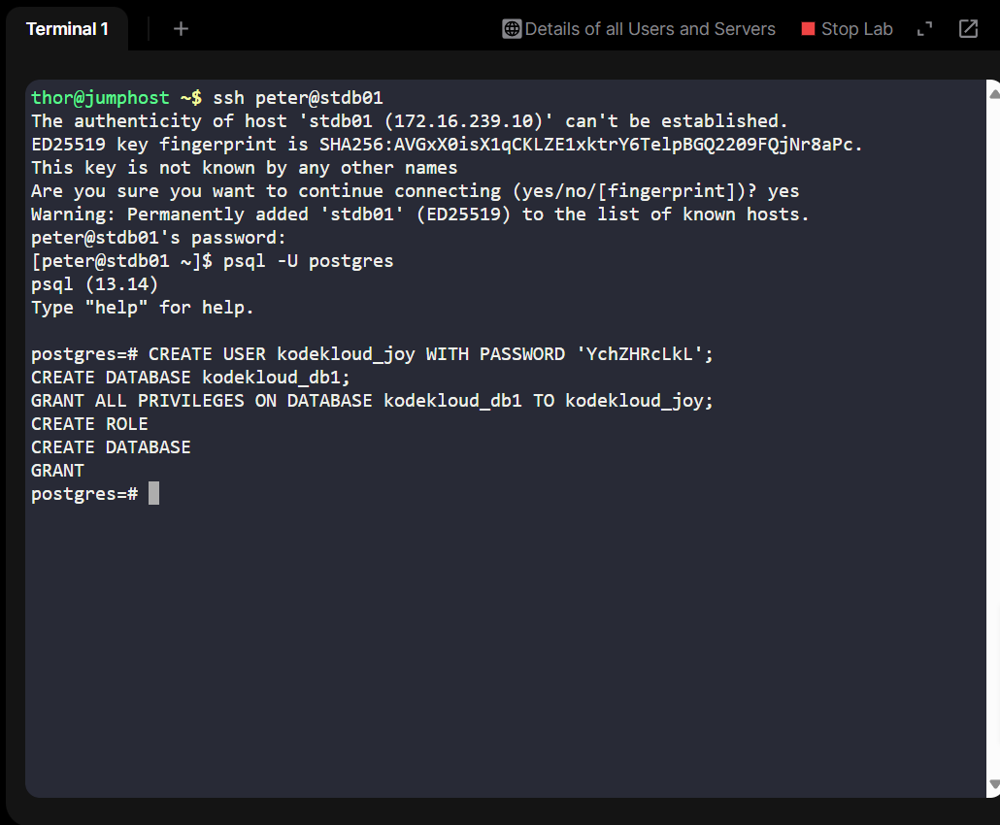
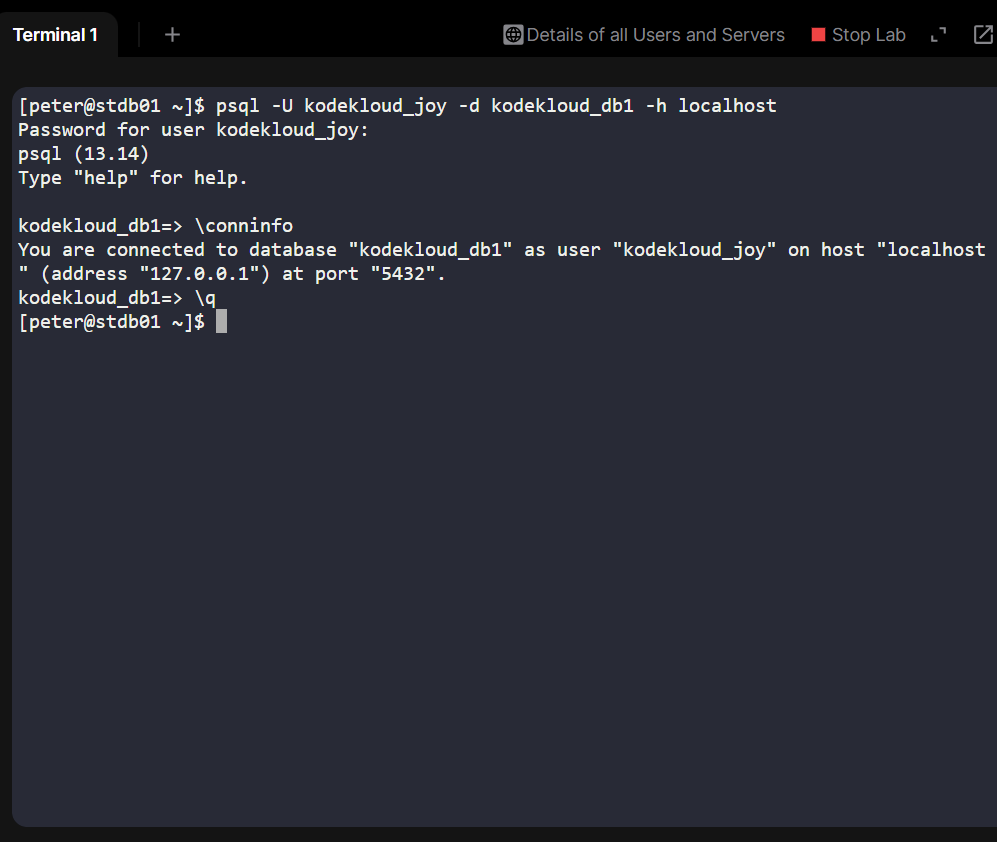

# Day 17 – PostgreSQL Setup for Application Deployment
As part of my 100 Days of DevOps/Cloud Journey, Day 17 focused on preparing infrastructure for application deployment by setting up a PostgreSQL database environment.

# Project Story
The Nautilus development team planned to deploy a new application requiring PostgreSQL. As part of the DevOps/Infra team, my role was to prepare the database server by:
1.	Creating a dedicated database user.
2.	Creating a dedicated database.
3.	Assigning full permissions so the application team can use the database seamlessly.
During this task, I also learned an important real-world lesson: PostgreSQL was not installed on the jump_host, but on a separate database server. I had to SSH into the correct server before running database commands — exactly the kind of situational awareness needed in production environments.

## Business Need & Essence
1. Secure Access Control: Applications should not use the default postgres user. A dedicated database user (kodekloud_joy) was created for isolation and security.
2. Resource Separation: A separate database (kodekloud_db1) ensures application data is logically isolated.
3. Permission Management: Fine-grained privileges prevent unauthorized access while giving developers the freedom to use the database.

This directly supports business continuity, security, and compliance, while enabling developers to move faster.

## Steps to Implement
1. SSH into the Database Server (not jump_host)

ssh peter@stdb01

This ensured being on the correct server where PostgreSQL is installed.

2. Logged into PostgreSQL as Superuser
psql -U postgres

3. Created a Database User
CREATE USER kodekloud_joy WITH PASSWORD 'YchZHRcLkL';

4. Created a Database
CREATE DATABASE kodekloud_db1;

5. Granted Permissions
GRANT ALL PRIVILEGES ON DATABASE kodekloud_db1 TO kodekloud_joy;

6. Verified by Logging in as New User
Exited the current psql shell:
\q

Then connected with the new user:

psql -U kodekloud_joy -d kodekloud_db1 -h localhost

Checked connection details:

\conninfo

**Output:**
You are connected to database "kodekloud_db1" as user "kodekloud_joy" on host "localhost" (address "127.0.0.1") at port "5432".

## Takeaway & Learning Impact
1. Learned to provision PostgreSQL users & databases securely.
2. Understood the role of privilege management in DevOps workflows.
3. Reinforced that database readiness is a critical pre-requisite for application deployment.
4. Learned the importance of working on the correct server — a common real-world DevOps troubleshooting scenario.

This exercise reflects a common real-world task for DevOps engineers, bridging application development and infrastructure setup.
