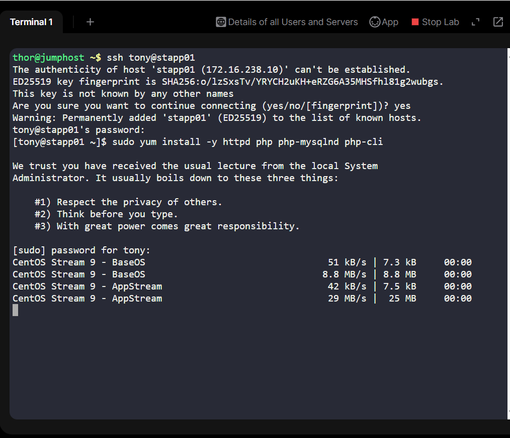
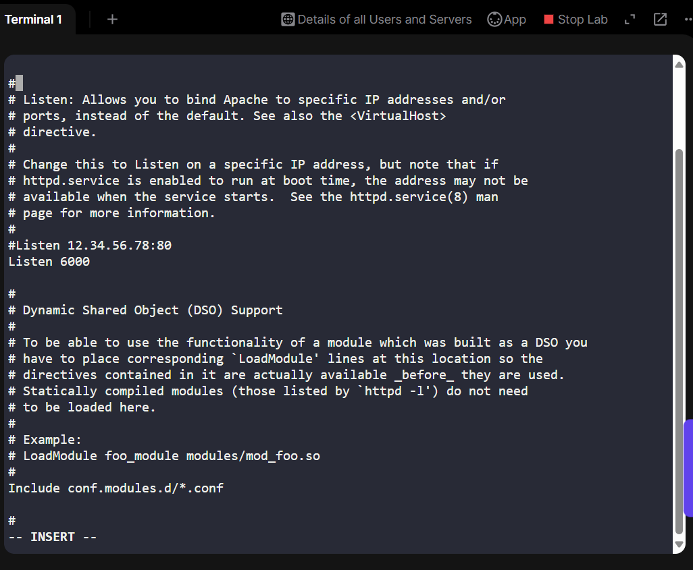
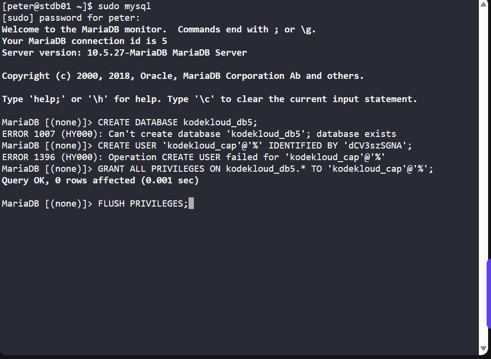
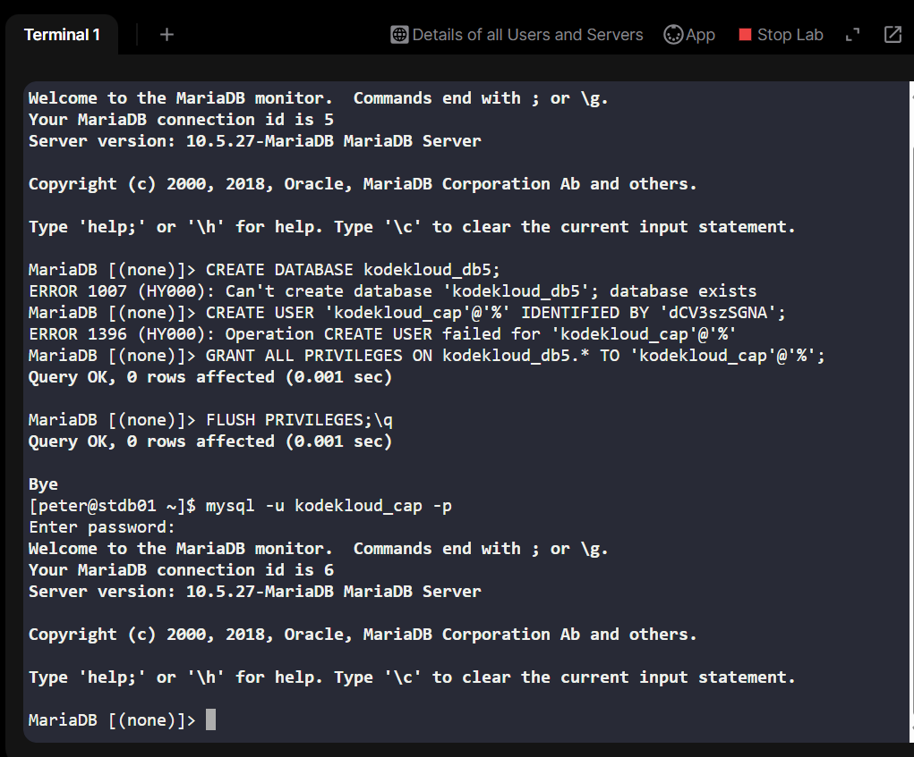

# Day 18: WordPress Deployment on xFusionCorp Cloud Infrastructure

## Project Overview
As part of my 100 Days of DevOps Cloud Journey, Day 18 focused on deploying a WordPress application on a cloud-based infrastructure managed by xFusionCorp. The goal of this task was to simulate a real-world enterprise scenario where multiple App servers and a database server host a web application, demonstrating skills in:

1. Apache HTTP server configuration
2. PHP installation and integration with databases
3. MariaDB database setup and user management
4. Ensuring App-to-DB connectivity across servers

This project mirrors business requirements like maintaining centralized storage, enabling high availability, and allowing multiple App hosts to serve the same application without configuration drift.

## Business Case & Benefits
In modern enterprises, hosting applications in a distributed manner ensures:

1. High Availability: Multiple App servers can serve the same website, reducing downtime risk.
2. Scalability: Shared storage and proper database configuration allow for easy horizontal scaling.
3. Security & Access Control: Specific DB users with limited privileges reduce the attack surface.
4. Operational Efficiency: Clear workflows for server setup, database management, and connectivity testing enhance team collaboration.

By completing this task, I demonstrated the ability to setup, configure, and validate a multi-tier web application environment, a key skill for cloud and DevOps engineers.

## Project Workflow (Step-by-Step)
1. Setup App Hosts

-Server: App Hosts

•	Installed Apache and PHP: sudo yum install -y httpd php php-mysqlnd php-cli

•	Configured Apache to serve on port 6000 (no VirtualHost needed for this task): sudo vi /etc/httpd/conf/httpd.conf

**Change Listen 80 → Listen 6000**

sudo systemctl restart httpd

sudo systemctl enable httpd

Screenshot Suggestion:

2. Setup DB Server

-Server: DB Server

•	Installed and started MariaDB: 

sudo yum install -y mariadb-server

sudo systemctl start mariadb

sudo systemctl enable mariadb

•	Logged in with sudo mysql (not root password) and verified access:

sudo mysql

3. Database & User Management

Server: DB Server

•	Created database kodekloud_db5: CREATE DATABASE kodekloud_db5;

•	Created user kodekloud_cap with full privileges (executed twice during troubleshooting):

CREATE USER 'kodekloud_cap'@'%' IDENTIFIED BY 'dCV3szSGNA';

GRANT ALL PRIVILEGES ON kodekloud_db5.* TO 'kodekloud_cap'@'%';

FLUSH PRIVILEGES;

4. Testing DB Connectivity

Server: DB Server & App Hosts

•	Verified user permissions and ability to create/drop tables:

SELECT CURRENT_USER();

USE kodekloud_db5;

CREATE TABLE t_check (id INT);

DROP TABLE t_check;

•	Confirmed App → DB connectivity via KodeKloud LBR App button.

Message displayed: "App is able to connect to the database using user kodekloud_cap"

## Key Learnings
1. Understanding the flow of multi-tier application deployment.
2. Configuring Apache on a non-standard port (6000).
3. Using MariaDB with proper user privileges and avoiding root usage.
4. Verifying database connectivity from App servers without creating a VirtualHost.
5. Handling minor troubleshooting steps, like executing SQL commands twice and resolving access issues.

## Skills Demonstrated
1. Linux server management (YUM, systemctl)
2. Apache HTTPD configuration
3. PHP integration with MariaDB
4. Database creation, user management, and privilege assignment
5. Application connectivity verification across multiple servers
6. Cloud infrastructure deployment best practices

## Conclusion
This task illustrates a real-world DevOps workflow, bridging application, web server, and database layers. It ensures that multiple App servers can serve a WordPress application reliably while maintaining proper DB access control. Completing this exercise strengthened my practical cloud infrastructure and DevOps skills, making me confident in deploying scalable, secure, and highly available web applications.
