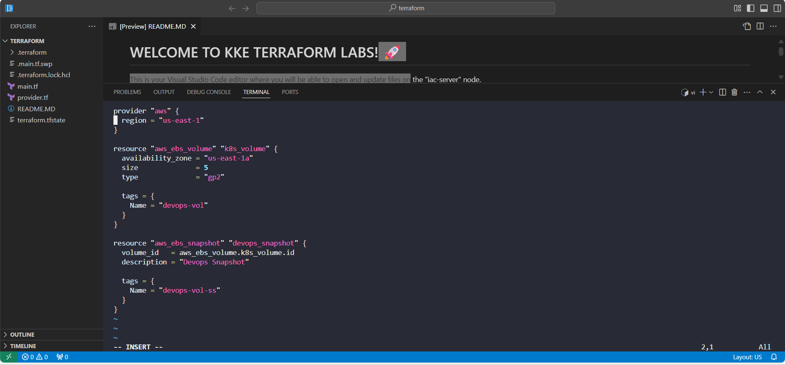
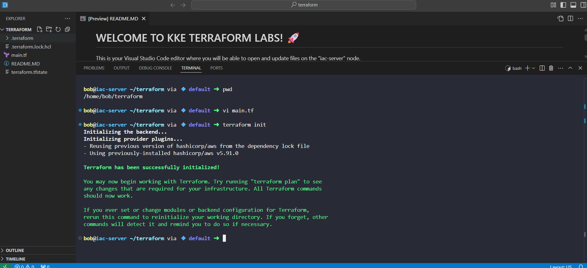
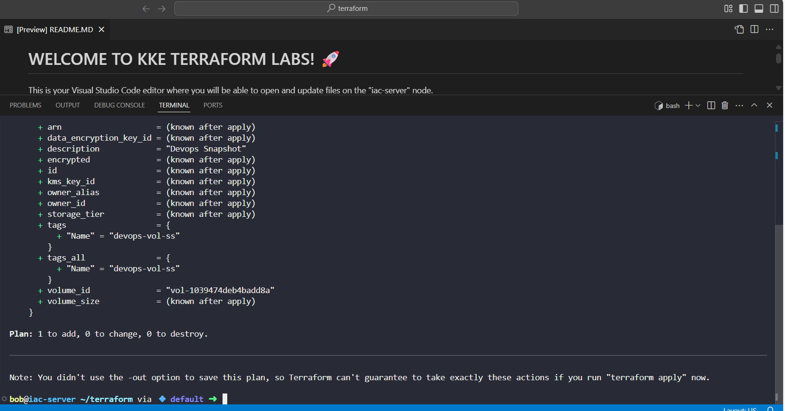
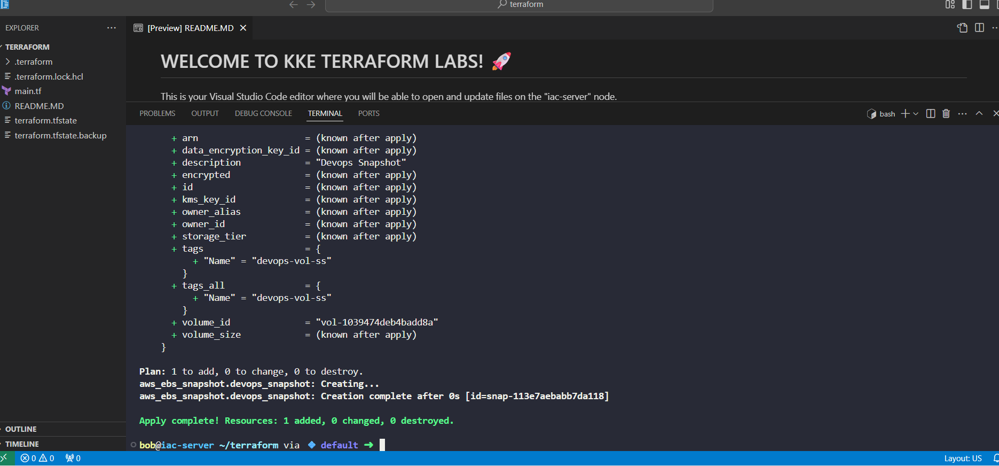
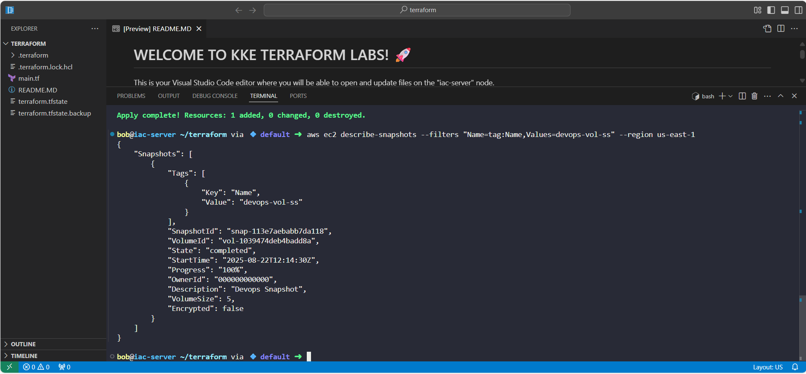

# Day 18: Automating AWS EBS Snapshot with Terraform

## Project Overview
As part of my 100 Days of DevOps journey, Day 18 focused on automating backups for cloud infrastructure using Terraform. The task simulated a real-world enterprise requirement: ensuring critical data volumes are automatically backed up to prevent data loss.

In this exercise, I created a **snapshot** of an existing EBS volume (devops-vol) in the us-east-1 region.

## Business Case & Benefits
1. Data Protection: Backups prevent accidental data loss.
2. Disaster Recovery: Snapshots enable fast recovery of critical infrastructure.
3. Automation & Consistency: Using Terraform ensures repeatable, error-free infrastructure management.
4. Governance: Naming and tagging snapshots supports auditing and compliance.

This project mirrors enterprise needs to maintain reliable cloud infrastructure while automating operational tasks.

## Terraform Workflow & Steps
1. Navigated to Terraform Directory

cd /home/bob/terraform

2️. Terraform Configuration (main.tf)

3️. Initialized Terraform

terraform init

4️. Previewed Terraform Plan

terraform plan

•	Ensured Terraform will create aws_ebs_snapshot.devops_snapshot.

5️. Applied Terraform Configuration
terraform apply -auto-approve

•	Terraform automatically creates the snapshot.

6️. Verified Snapshot Status

aws ec2 describe-snapshots --filters "Name=tag:Name,Values=devops-vol-ss"  --region us-east-1

## Key Learnings
1. Automating cloud backups ensures data consistency and reliability.
2. Terraform simplifies infrastructure as code and enables repeatable deployments.
3. Understanding AWS EBS volumes and snapshots is critical for disaster recovery.
4. Verified snapshot creation and completion to ensure operational readiness.

## Skills Demonstrated
1. Terraform: resource creation and management
2. AWS EBS: volume and snapshot handling
3. Cloud automation and disaster recovery best practices
4. Infrastructure as code (IaC) workflow
5. Verification of cloud resources using CLI

## Conclusion
This project addresses a critical business need: automated and reliable backups of cloud infrastructure. By using Terraform to create snapshots, I ensured a repeatable, auditable, and disaster-resilient workflow.
