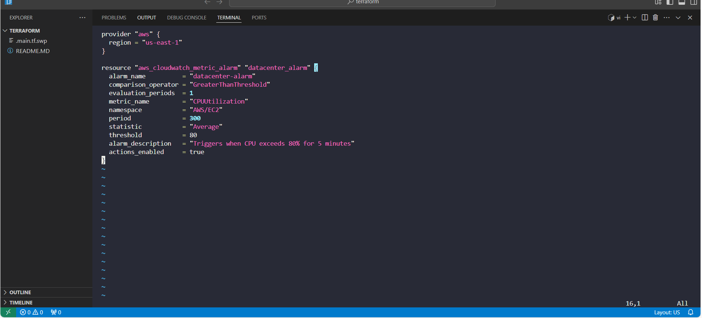
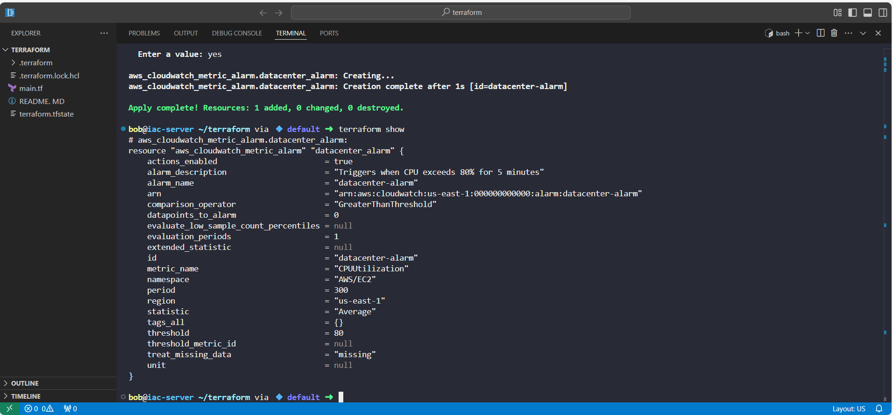

# Day 19 - Monitoring with AWS CloudWatch + Terraform

As part of my 100 Days of DevOps journey, I worked on setting up monitoring using AWS CloudWatch and automated the configuration with Terraform.

This project focused on creating a CloudWatch alarm that would monitor CPU utilization and alert when usage exceeded 80% over a 5-minute period.

## Project Goal
The Nautilus DevOps team needed proactive monitoring of their compute resources. The business requirement was clear:

1. Detect when CPU utilization exceeds 80%.
2. Ensure alerts are triggered if this persists for at least 5 minutes.
3. Provision the alarm entirely with Terraform to enforce Infrastructure as Code (IaC) practices.

## Tools & Technologies
•	Terraform - Infrastructure as Code (IaC)

•	AWS CloudWatch - Metrics, monitoring, and alerting

•	VS Code + Integrated Terminal - Development environment

### Terraform Configuration (main.tf)
Since the KodeKloud lab did not provide an EC2 instance ID, I implemented the alarm without the dimensions block.

This created a generic CloudWatch alarm that demonstrates the full workflow and satisfies the lab requirement.

## Business Context
In real production environments, alarms like this would be tied directly to an EC2 instance using the dimensions block.

That way, CloudWatch knows exactly which resource to monitor.

However, even in this lab context, the project highlights:
- Observability: Ensuring systems are monitored proactively.
- Automation: Using Terraform to define and deploy monitoring as code.
- Scalability: Easily extend this code to monitor multiple instances.

## Outcome
•	Successfully created an AWS CloudWatch alarm with Terraform.

•	Validated configuration with terraform validate, terraform plan, and terraform apply.

•	Demonstrated how IaC makes monitoring repeatable, consistent, and scalable.

•	Highlighted the difference between a lab/demo implementation and a production-ready approach.
