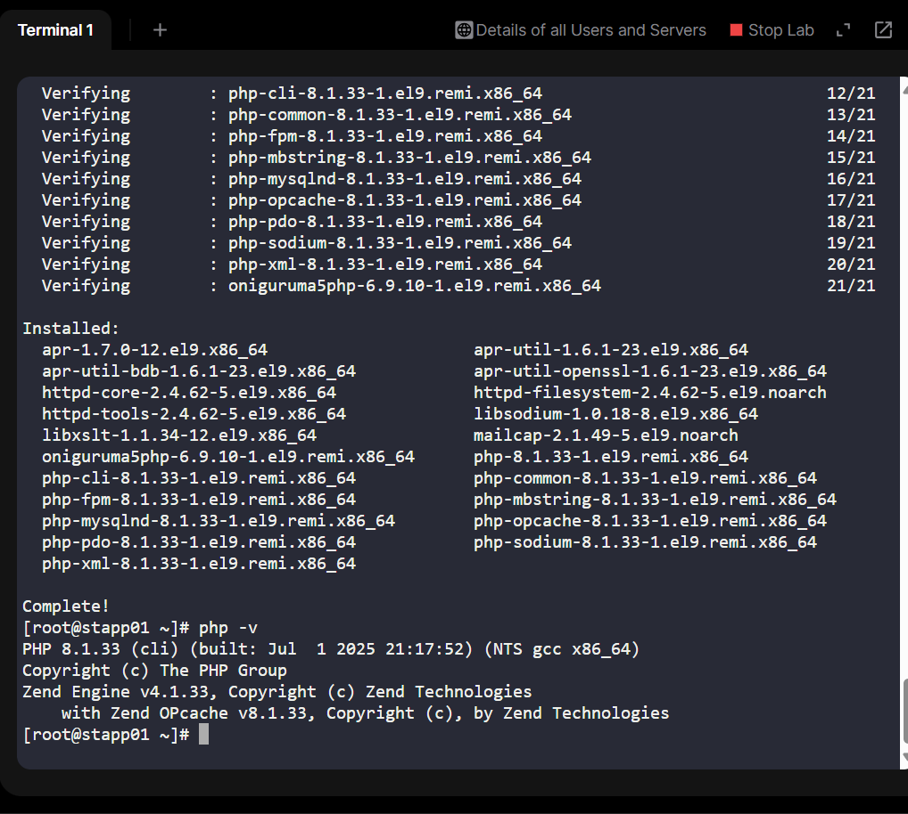
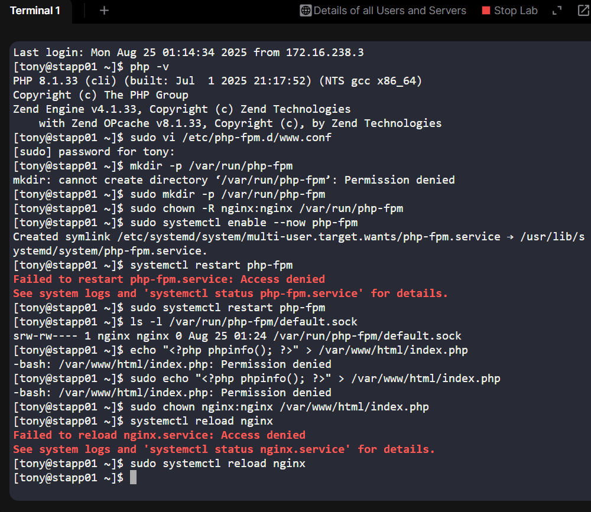

# Day 20 of 100 Days of DevOps - Deploying a PHP-FPM 8.1 App with Nginx on Custom Port
As part of my 100 Days of DevOps journey (see GitHub repo and LinkedIn), today I focused on deploying a PHP-based application on CentOS 9 servers using Nginx and PHP-FPM 8.1.
This was more than just installing packages, it was about aligning infrastructure setup with business requirements, ensuring scalability, security, and application reliability.

## Business Context
The Nautilus application development team needed to launch a new PHP-based web application.

From a business standpoint, the requirements were clear:

1.	Custom Port Binding (8092 instead of 80): avoid conflicts with existing services and allow better routing/firewall rules.
2.	Correct PHP Runtime (8.1): developers had tested on PHP 8.1, so running on another version would cause failures.
3.	Socket-based Communication (PHP-FPM socket): faster and more secure than TCP for local Nginx ↔ PHP communication.
4.	Unified Document Root **/var/www/html**: standard path for easier deployments and CI/CD pipelines.

## Workflow & Commands
1️. Installed & Configured Nginx

**Update system**

sudo dnf update -y

**Install Nginx**

sudo dnf install -y nginx

**Start & enable service**

sudo systemctl enable --now nginx

**Update Nginx config to listen on 8092 and use /var/www/html as document root:**

**Reload Nginx:**

sudo systemctl reload nginx

2️. Installed PHP-FPM 8.1

# Enabled PHP 8.1 module

sudo dnf module reset php -y

sudo dnf module enable php:8.1 -y

# Installed PHP and PHP-FPM

sudo dnf install -y php php-fpm

Configure PHP-FPM socket:

sudo mkdir -p /var/run/php-fpm

sudo vi /etc/php-fpm.d/www.conf

Ensured these settings:

listen = /var/run/php-fpm/default.sock

listen.owner = nginx

listen.group = nginx

listen.mode = 0660

Restart PHP-FPM:

sudo systemctl enable --now php-fpm

sudo systemctl restart php-fpm

3️. Deploy Test PHP File
echo "<?php phpinfo(); ?>" | sudo tee /var/www/html/index.php
Or use the provided lab welcome file:
echo "<?php echo 'Welcome to xFusionCorp Industries!'; ?>" | sudo tee /var/www/html/index.php

4. Test the Setup

From the jump host: curl http://stapp01:8092/index.php

Expected output: Welcome to xFusionCorp Industries!

## Business Value Delivered
•	Developer Alignment: Infrastructure matched dev team’s runtime (PHP 8.1) → fewer bugs at deployment.

•	Security & Flexibility: Running on custom port avoids conflicts, supports traffic shaping.

•	Performance: Unix socket communication ensures lower latency & higher throughput.

•	Operational Excellence: Documented, tested workflow supports repeatable deployments across app servers.

## Key Learning (Day 20 Reflection)
This task deepened my understanding of:

•	Binding services to non-standard ports.

•	Why version control in runtime environments is critical for stability.

•	The role of PHP-FPM sockets in modern Nginx/PHP architectures.

•	Thinking like a DevOps engineer bridging business & technical needs.
