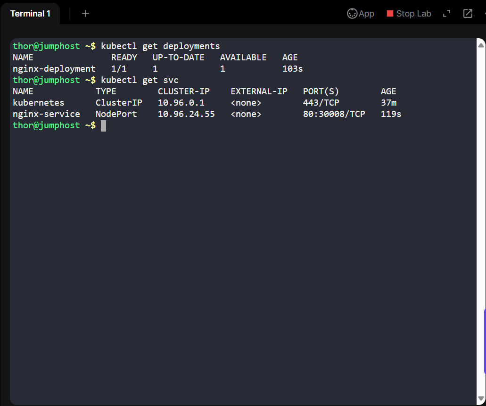
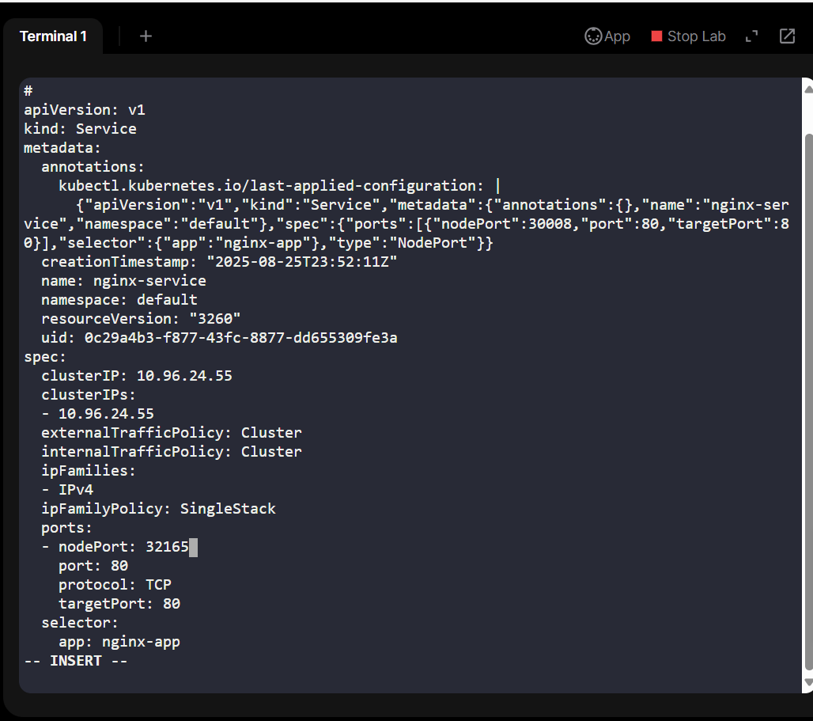
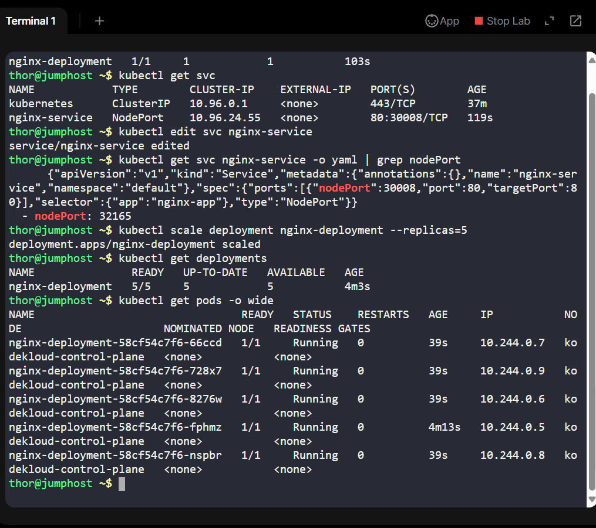
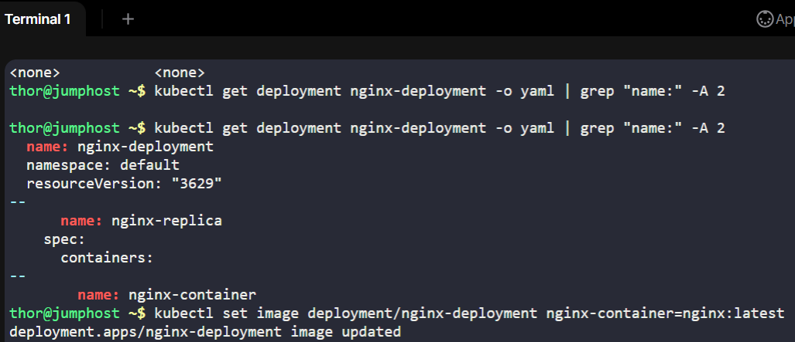
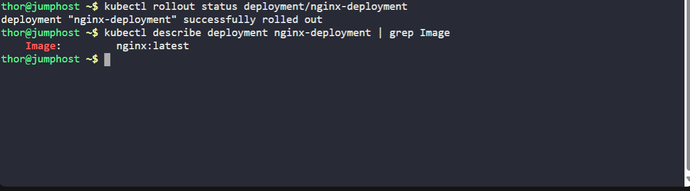

## Day 21 of 100 Days of DevOps: Updating an Application on Kubernetes

# Project Overview
Today’s task was focused on application lifecycle management in Kubernetes, specifically updating an existing deployment and service without deleting them. This exercise mirrors real-world DevOps scenarios where updates must be rolled out carefully to ensure zero downtime, scalability, and service continuity.

The application in question was an nginx deployment managed by Kubernetes, with traffic exposed via a NodePort service. The business need here was to introduce new features from the development team, while scaling to handle increased traffic and ensuring users continue to have uninterrupted access.

## Business Needs and Essence of the Project
1. Reliability: Ensuring the service remains accessible while updates are applied.
2. Scalability: Moving from 1 replica → 5 replicas prepares the application for higher load.
3. Modernization: Updating to the latest nginx image ensures security patches and new features are available.
4. Maintainability: Rather than recreating deployments and services, applying live updates follows best practices in GitOps and DevOps workflows.

This directly translates to improved customer experience, better uptime, and reduced operational overhead.

## Steps Performed
All steps were performed on the jump_host, where kubectl was already configured to access the Kubernetes cluster.

1. Checked Existing Resources

kubectl get deployments

kubectl get svc

Outcome: Confirmed nginx-deployment (replicas=1, image=nginx:1.18) and nginx-service (nodePort=30008).

2. Modified the Service NodePort

kubectl edit svc nginx-service

•	Changed:

nodePort: 30008 → nodePort: 32165

Verification:

kubectl get svc nginx-service -o yaml | grep nodePort

3. Scaled Deployment Replicas

kubectl scale deployment nginx-deployment --replicas=5

Verification:

kubectl get deployments

kubectl get pods -o wide

4. Checked Container Name Before Updating Image

Initially, I ran:

kubectl set image deployment/nginx-deployment nginx=nginx:latest

This failed with:

error: unable to find container named "nginx"

So I inspected the deployment:

kubectl describe deployment nginx-deployment | grep -i "container name"

Result: The container name was container-nginx, not nginx.

5. Updated Image Version

With the correct container name:

kubectl set image deployment/nginx-deployment container-nginx=nginx:latest

Verification:

kubectl rollout status deployment/nginx-deployment

kubectl describe deployment nginx-deployment | grep -i image

Result: Image successfully updated to nginx:latest.

6. Final Validation

kubectl get deployments

kubectl get svc

kubectl get pods -o wide

Outcome:

•	Deployment updated to nginx:latest

•	Replicas = 5

•	Service nodePort updated to 32165

## Benefits of This Task
1. Demonstrated application of Kubernetes update strategy (real-world use case for production).
2. Showcased zero-downtime deployment practices by scaling and rolling updates.
3. Improved business readiness for future traffic spikes.
4. Reinforced the DevOps mindset of continuous improvement and iteration.

This project illustrates how even small configuration updates in Kubernetes can have significant business value, ensuring services remain scalable, modern, and reliable.

## Recruiter Angle

This project highlights hands-on Kubernetes administration skills:

1. Managing services and deployments live in a cluster
2. Applying updates without downtime
3. Scaling workloads to meet business demand
4. Handling real-world debugging (discovering the container name mismatch)
5. Following structured DevOps best practices

This is the type of day-to-day operational excellence that enables organizations to move fast and stay reliable in cloud-native environments.
