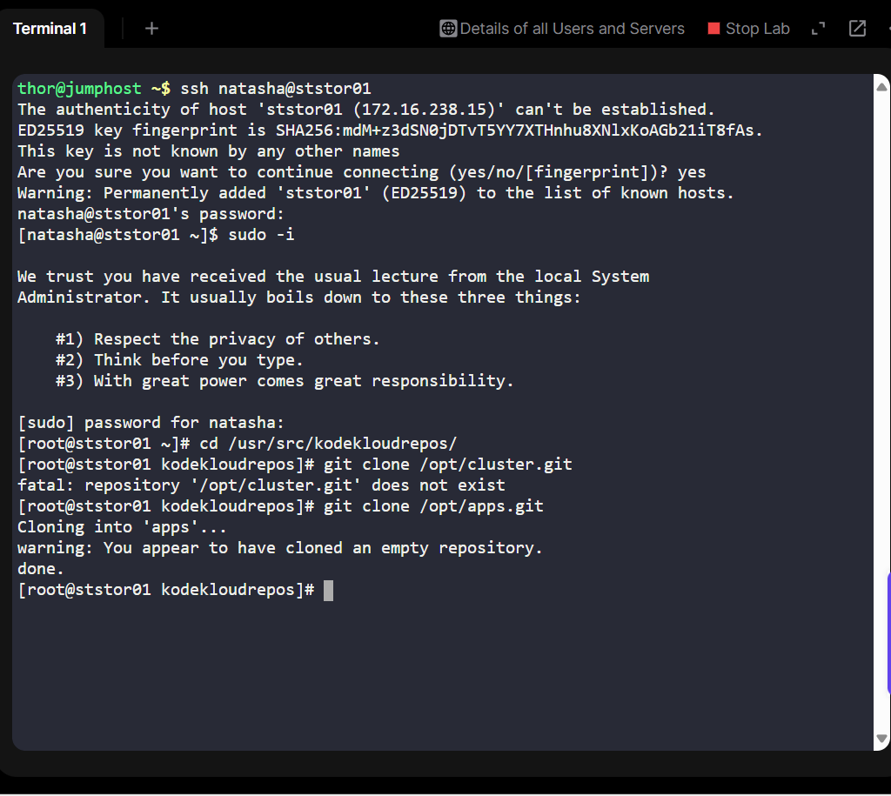

# Day 22 of 100 Days of DevOps - Cloning Git Repositories on Storage Servers

For the past 21 days, I have been building up my DevOps skillset by mastering Linux, Git, CI/CD concepts, automation, and infrastructure fundamentals. Each day has been about hands-on labs that mirror real-world business needs, while documenting my journey in public.

On Day 22, I faced a challenge that looks simple at first glance, cloning a Git repository, but carried a lot of subtle technical and business lessons around permissions, ownership, and how central repositories are managed in production environments.

## Business Context - Why This Task Matters
In enterprise environments, bare Git repositories (like /opt/media.git in this lab) act as the central source of truth for application code. Teams don’t commit directly on these; instead, they clone them into working directories where they can build, test, and deploy.

This lab simulates a Storage Server in a data center, where the Nautilus application team needed a working copy of an existing repository so they could start development and CI/CD pipelines.

The business drivers were:
- Enable development & deployment workflows without touching the origin repo.

- Ensure permissions and ownership are correct, so developers can safely work with the clone.

- Prevent repo corruption by making sure the parent directory is not accidentally turned into a Git repo (a common mistake that breaks automation and validation scripts).

## Step-by-Step Solution (Working Approach)
Here’s the exact working solution that satisfied the lab requirements:

# Step 1: Confirm the source repository exists and is readable

ls -ld /opt/apps.git

# Step 2: Move into the target directory (important: don’t clone directly into the parent)

cd /usr/src/kodekloudrepos

# Step 3: Clone the repository (creates a new subfolder: media/)

git clone /opt/apps.git

# Step 5: Verify the clone

ls -a /usr/src/kodekloudrepos/apps

git -C /usr/src/kodekloudrepos/apps remote -v

ls -ld /usr/src/kodekloudrepos/apps

## Expected Results

A new folder /usr/src/kodekloudrepos/media is created.

Inside it, .git/ exists, meaning it is a proper Git repo.

Running git remote -v shows the origin correctly set to /opt/media.git.

Ownership of the folder matches the application user (natasha in this case).

**Key Note**: Running git clone /opt/media.git /usr/src/kodekloudrepos directly would turn the parent folder into a Git repo itself, which fails validation and does not meet the business requirement.

## Lessons Learned

1. Permissions matter: even if cloning is correct, the repo must be writable by the right user.
2. Subfolder vs parent repo: understanding how Git handles target directories is crucial in automation workflows.
3. Empty repos are valid: A warning like You appear to have cloned an empty repository. doesn’t mean failure — many enterprise repos are initialized before first commit.

## Real-World Applications
This exercise directly maps to how DevOps engineers manage Git in production:

•	Setting up deployment servers that need a copy of the app repo.

•	Cloning repos into CI/CD build agents that package and test code.

•	Ensuring least privilege & safe permissions so developers don’t break central repos.

•	Building muscle memory for idempotent scripts where mistakes like cloning into the wrong folder could break automation pipelines.

## Career Relevance
For recruiters and hiring managers: this task highlights my ability to:

•	Manage Git repositories in enterprise Linux environments.

•	Troubleshoot permission and ownership issues.

•	Think not just technically, but in terms of business continuity and team workflows.

•	Apply discipline in step-by-step problem solving — critical for DevOps and SRE roles.

## Summary

Day 22 reminded me that in DevOps, the “simple” tasks often carry the deepest lessons. By cloning /opt/media.git into /usr/src/kodekloudrepos/media correctly, I ensured the Nautilus team had a clean, usable copy of their repo without disrupting the origin.

This is how DevOps bridges the gap: technical precision → business value.
