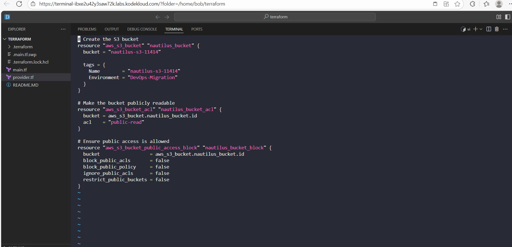
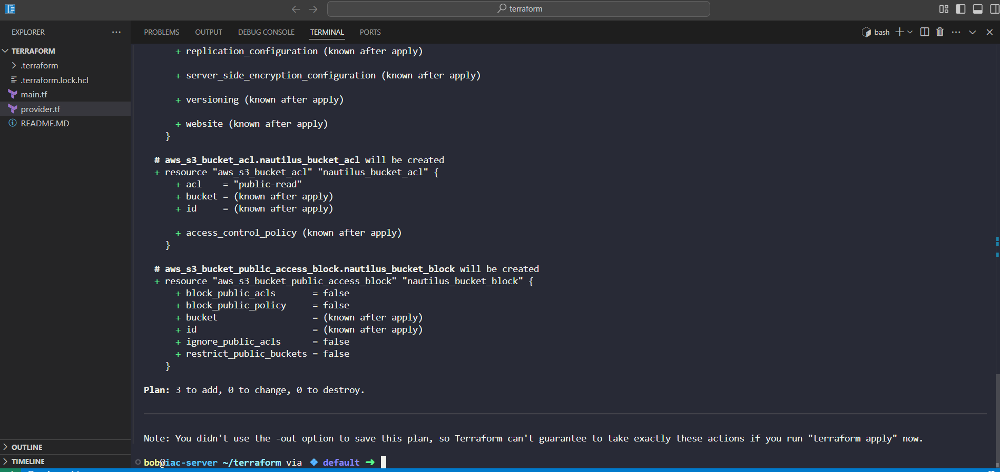
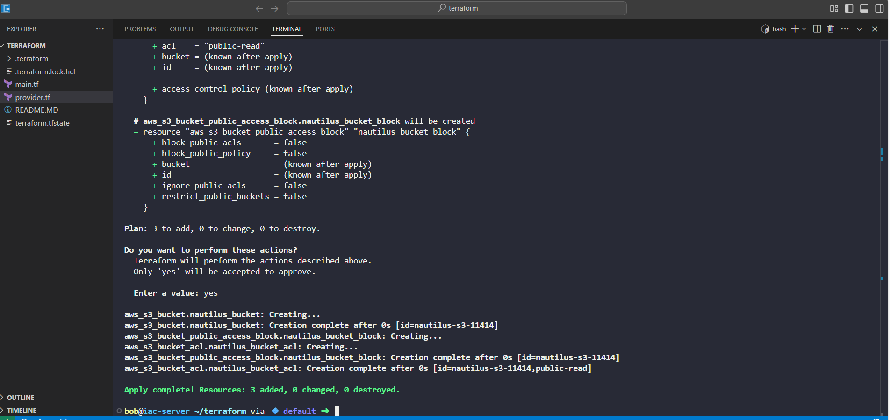
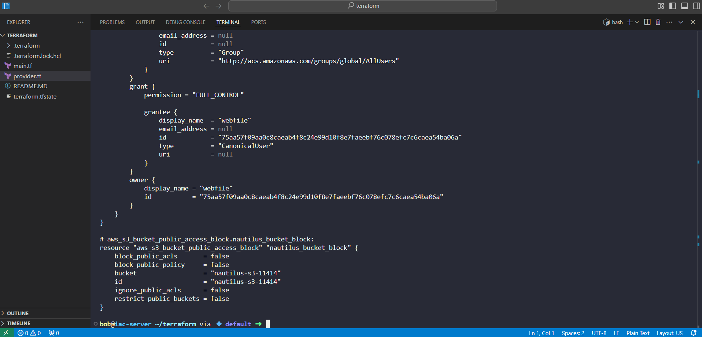
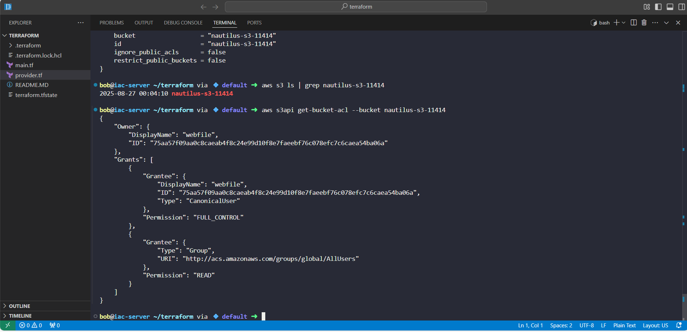

## Day 22 – Creating a Public S3 Bucket with Terraform
As part of my AWS + Terraform learning journey, I worked on creating a public S3 bucket named nautilus-s3-11414. The goal of this lab was to define everything in Terraform (main.tf), deploy it, and then verify using the AWS CLI.

This task mimics what a DevOps engineer would do during a data migration to AWS - provisioning secure, correctly configured storage buckets with Infrastructure as Code.

## Terraform configuration (using aws_s3_bucket, aws_s3_bucket_acl, and aws_s3_bucket_public_access_block resources):

## Terraform Workflow
1. Initialize Terraform

terraform init

2️2. Validate Configuration

terraform validate

•	Ensures no syntax errors.

3️. Plan the Changes

terraform plan

•	Previewed creation of the new bucket.

4️. Apply Configuration

terraform apply

•	Confirmed with yes.

•	Bucket nautilus-s3-11414 created successfully in us-east-1.

5️. Show the State

terraform show

•	Inspected Terraform state to confirm bucket properties.

**AWS CLI Verification**
After Terraform created the bucket, I switched to AWS CLI to verify.

6. List Buckets
aws s3 ls | grep nautilus-s3-11414

•	Bucket appeared in the list.

7️. Check Bucket ACL
aws s3api get-bucket-acl --bucket nautilus-s3-11414

•	Saw the ACL details, confirming public-read.

•	Stopped the lab here (next steps would have been checking policy status, uploading a file, and testing public access).

## Key Learnings

•	Terraform + AWS: Learned how to provision AWS S3 buckets in a repeatable, codified way.

•	Deprecations in Terraform: Adjusted to the new best practices (aws_s3_bucket_acl instead of inline ACLs).

•	Verification process: Used both terraform show and aws cli commands to confirm infrastructure state.
