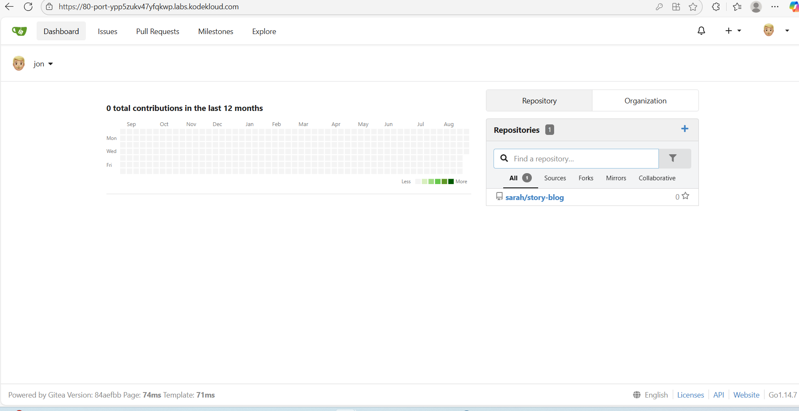
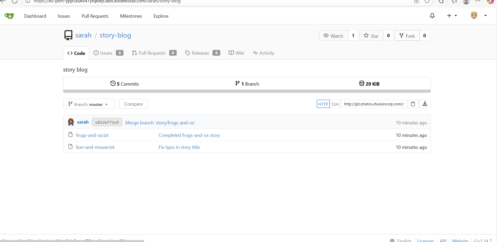
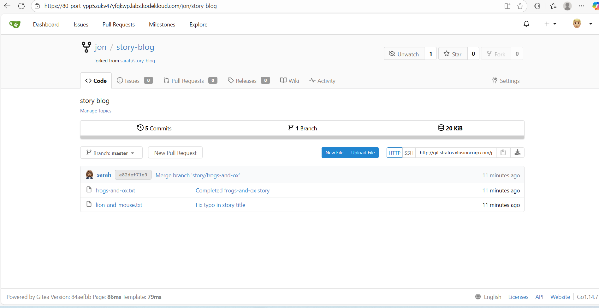
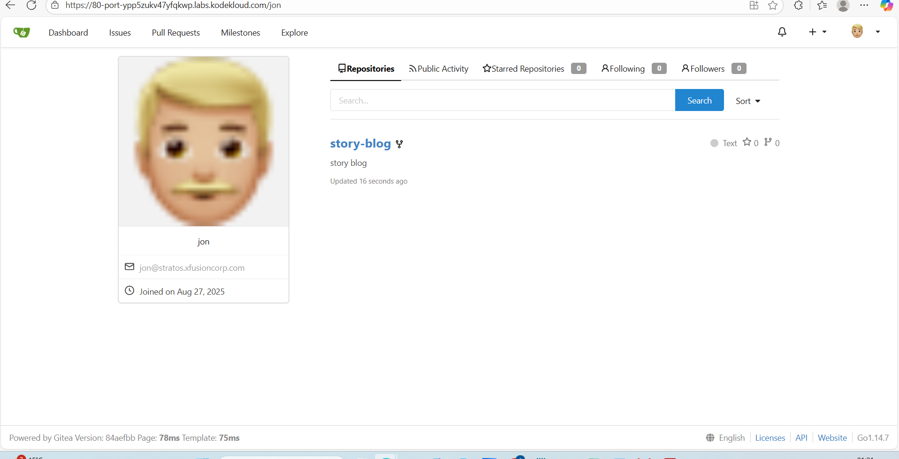

# Day 23 - Forking a Git Repository in Gitea (KodeKloud Lab)
## Scenario:
The Nautilus project uses a Gitea Git server for collaboration. A new developer, Jon, needs to start working on a project. To contribute safely without affecting the main repository, he must fork an existing repository.

This lab demonstrates how to navigate a Git web UI, fork a repository, and set up proper remotes — essential skills for DevOps engineers working in collaborative, team-based environments.

## Lab Environment & Credentials
•	Platform: KodeKloud Lab

•	Gitea access: Click the Gitea UI button in the lab top bar

•	Login Credentials:

o	Username: jon

o	Password: Jon_pass123

**Business Value: Forking ensures that new contributors can work independently, preserving the integrity of the main project while allowing collaborative development.**

## Step-by-Step Implementation
1️. Open Gitea UI

•	Click the Gitea UI button at the top of the lab page.

•	Screenshot suggestion: Gitea UI button highlighted

•	PNG label: day23_01_gitea_ui.png

2️. Log in as Jon

•	Username: jon

•	Password: Jon_pass123

•	Confirm successful login by viewing the Jon dashboard/avatar.

3. Locate the repository

•	Go to Explore → Repositories

•	Search for sarah/story-blog

•	Click to open the repository page.

4️. Fork the repository

•	Click the Fork button (usually top-right).

•	In the dialog, select jon as the destination/owner.

•	Confirm the fork.

**Business Benefit: Forking enables isolated development, preventing accidental changes to the main repo.**

5️. Verify the fork

•	The forked repository should now be under jon/story-blog.

•	Confirm the repository URL and contents.

## Key Learnings
• Navigated Gitea UI and performed repository forking.

•	Set up origin and upstream remotes.

•	Practiced safe contribution workflows to avoid impacting main code.

## Business & DevOps Relevance
•	Business Needs: Enables new team members to contribute safely without disrupting production code.

•	DevOps Impact:

1. Supports collaborative development.

2. Ensures traceable, auditable code changes.

3. Prepares developers for CI/CD pipelines and code reviews.
