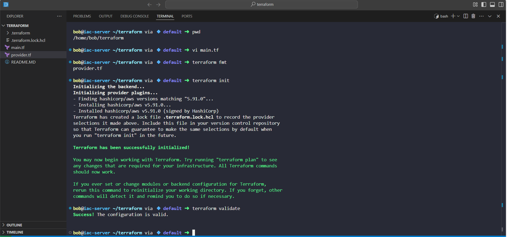
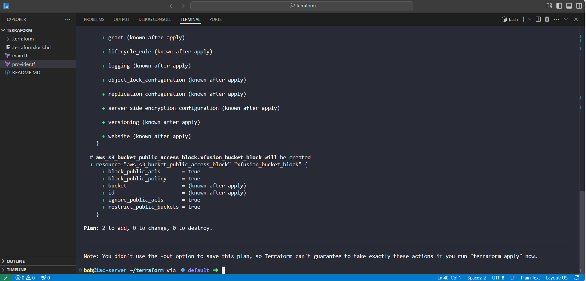
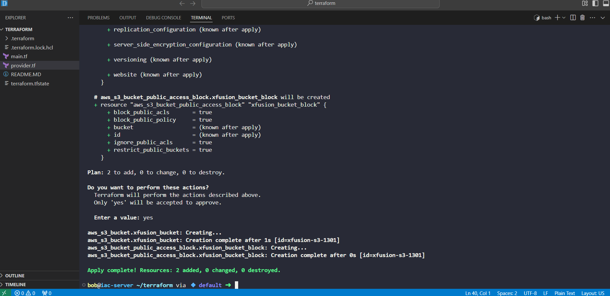
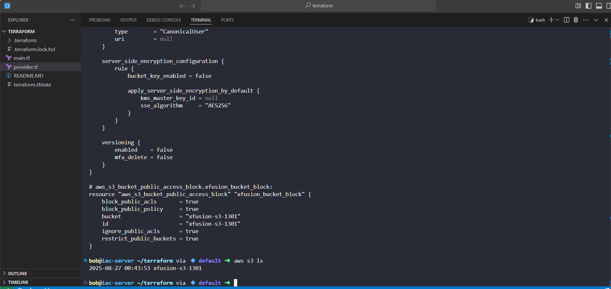

## Day 23 – Creating a Private S3 Bucket with Terraform

Following Day 23, where I created a public S3 bucket for open-access data, the Nautilus DevOps team now requires a private S3 bucket as part of their data migration initiative. Private buckets are critical for sensitive or internal data, ensuring that only authorized users or systems can access the content.

This task demonstrates the use of Terraform to provision AWS infrastructure in a repeatable, auditable, and secure manner.

## Lab Environment
•	Terraform Working Directory: /home/bob/terraform

•	Files:

o	provider.tf → AWS provider with endpoints

o	main.tf → Private S3 bucket resources

•	AWS Region: us-east-1

**Business Benefit:**

Using Terraform to create private buckets ensures security compliance, avoids accidental public exposure, and supports the ongoing cloud migration strategy.

## Step-by-Step Implementation
1. Configure Provider

•	Created provider.tf with AWS provider and localstack endpoints (lab environment).

•	Essence: Allows Terraform to interact with AWS services in a controlled environment.

2. Create Private Bucket Resources

•	In main.tf, defined:

o	aws_s3_bucket → Bucket xfusion-s3-1301

o	aws_s3_bucket_public_access_block → Blocks all public access

•	Business Benefit: Prevents accidental public exposure of sensitive data.

3. Initialize Terraform

terraform init

•	Downloads provider plugins and prepares workspace.

•	Benefit: Ensures repeatable infrastructure provisioning.

4. Validate Configuration

terraform validate

•	Checks syntax and configuration.

•	Business Value: Reduces risk of misconfiguration and downtime.

6️. Plan Changes

terraform plan

•	Previewed the creation of the private bucket.

•	Essence: Safe, predictable deployment planning.

6. Apply Configuration

terraform apply

•	Confirmed with yes.

•	Bucket xfusion-s3-1301 created successfully.

•	Business Benefit: Infrastructure is provisioned as code, fast, and reproducible.

7. Verify Resources

**Terraform show**

terraform show

•	Confirmed bucket exists in state.

•	Screenshot: day23_06_show.png

**AWS CLI - List Buckets**

aws s3 ls

•	Bucket xfusion-s3-1301 is visible.

**AWS CLI – Check Public Access Block**

aws s3api get-bucket-public-access-block --bucket xfusion-s3-1301

•	All flags (BlockPublicAcls, BlockPublicPolicy, etc.) are true.

•	Business Value: Ensures compliance and security for sensitive data.

## Key Learnings
•	Created a private S3 bucket using Terraform.

•	Practiced infrastructure as code for secure, repeatable deployments.

•	Learned importance of blocking public access for sensitive business data.

•	Reinforced Terraform workflow: init → validate → plan → apply → verify.

## Business & DevOps Relevance
•	Business Needs:

o	Secure storage for internal data.

o	Compliant with governance policies.

o	Supports ongoing cloud migration and consolidation strategy.

•	DevOps Impact:

o	Infrastructure is codified and repeatable.

o	Reduces risk of human error.

o	Supports auditability and compliance.
