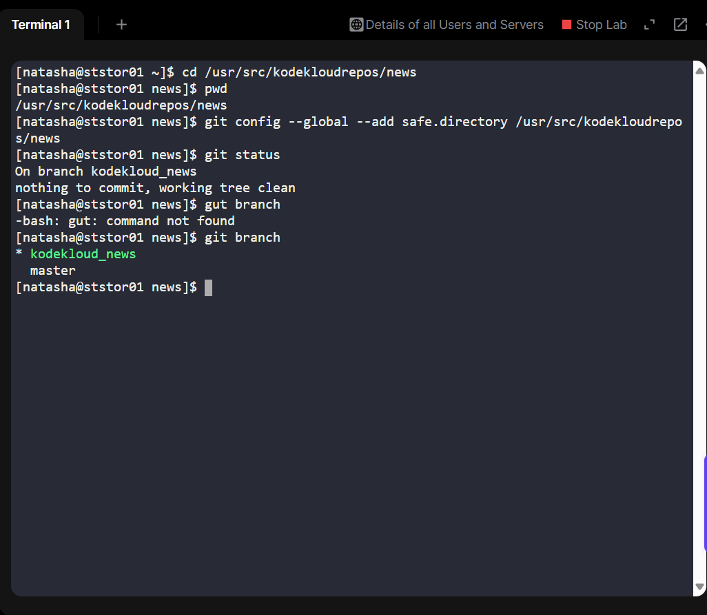
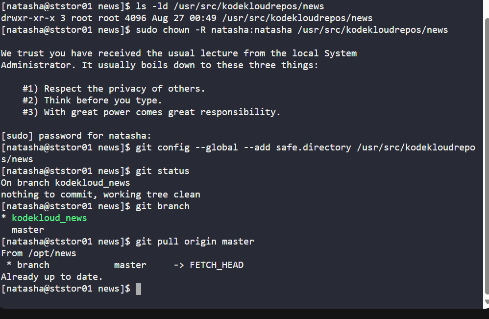

# Day 24 – Creating a Feature Branch (xfusioncorp_news) in Git

## Scenario:
The Nautilus development team wanted to implement new features in the news project repository without affecting the stable production code. Following best DevOps practices, a new branch named xfusioncorp_news was created from master on the Storage server. This ensures that new features are developed in isolation and can be reviewed or merged later.

### Lab Environment
•	Server: Storage server (ststor01)

•	Repository: /usr/src/kodekloudrepos/news

•	Base Branch: master

•	New Branch: xfusioncorp_news

## Business Benefit:
•	Isolated development reduces risk of breaking production code.

•	Enables proper code review and testing workflow.

•	Aligns with DevOps principles: version control, collaboration, and CI/CD readiness.

## Step-by-Step Implementation
1. SSH into Storage Server

ssh natasha@ststor01

-Connect to the lab environment; Ensures access to the server where code resides.

2️. Navigate to Repository

cd /usr/src/kodekloudrepos/news

pwd

- Confirms the working directory; Always working in the correct repo to avoid mistakes.

3️. Fix Git Permission Issues

**Mark directory as safe**

git config --global --add safe.directory /usr/src/kodekloudrepos/news

**Fix ownership if required**

sudo chown -R natasha:natasha /usr/src/kodekloudrepos/news

- Solves errors like “dubious ownership” or “permission denied”; Benefit: Avoids workflow interruptions due to permissions.

4️. Verify Current Branch

git branch

git status
- Ensures being on master before creating a new branch.

5. Update Master Branch

git pull origin master

-Ensures master is up-to-date; Reduces risk of conflicts when creating a new branch.

6️. Create New Branch

git checkout -b xfusioncorp_news master

- Creates and switches to xfusioncorp_news; Isolates new feature work from production.

7️. Verify New Branch

git branch

-Output should show * xfusioncorp_news; Confirms branch creation and readiness for development.

8. Optional: Push Branch to Remote

git push origin xfusioncorp_news

- Ensures branch exists on the remote for collaboration.

## Key Learnings
- Learned proper branching workflow in Git.

- Handled permission and ownership issues in a multi-user environment.

- Reinforced safe collaboration practices in DevOps projects.

- Prepares for CI/CD pipelines and feature isolation.

## Business & DevOps Relevance
•	Business Needs:

1. Maintain code integrity while developing new features.
2. Supports multiple developers working on the same project.
3. Aligns with agile development and release management.

• DevOps Impact:

1. Enables safe, auditable, and collaborative development.
2. Supports feature-driven workflow without breaking mainline code.
3. Prepares repository for CI/CD integration.
