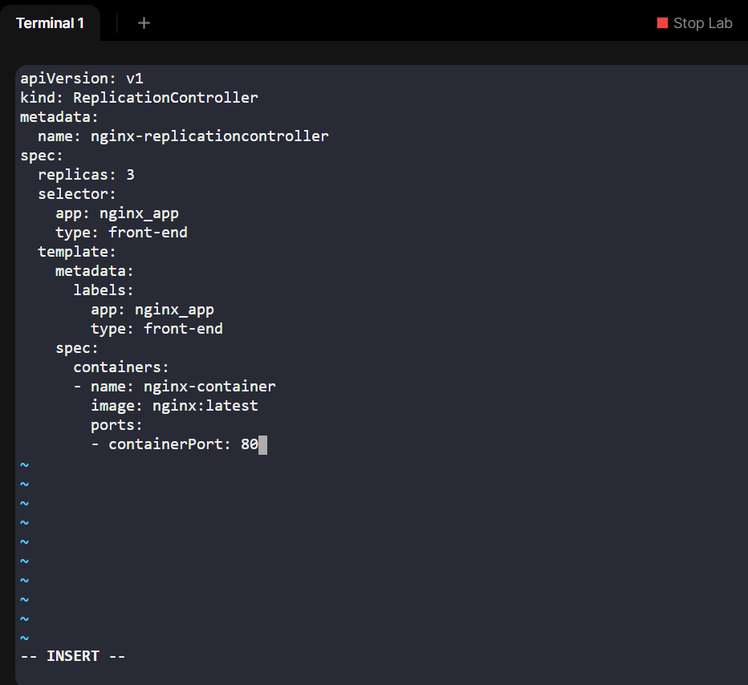
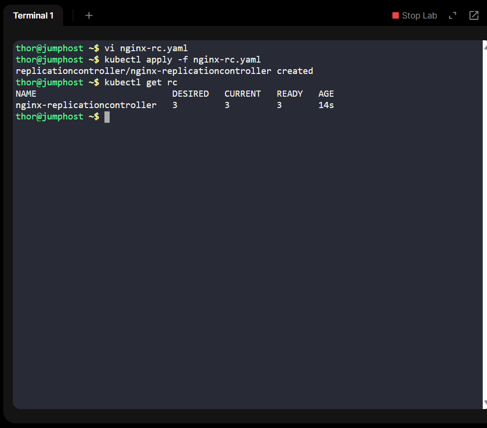
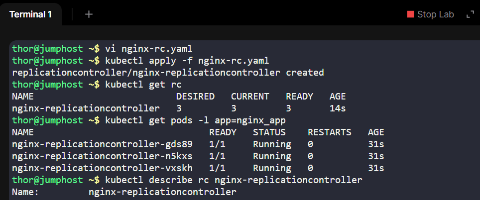
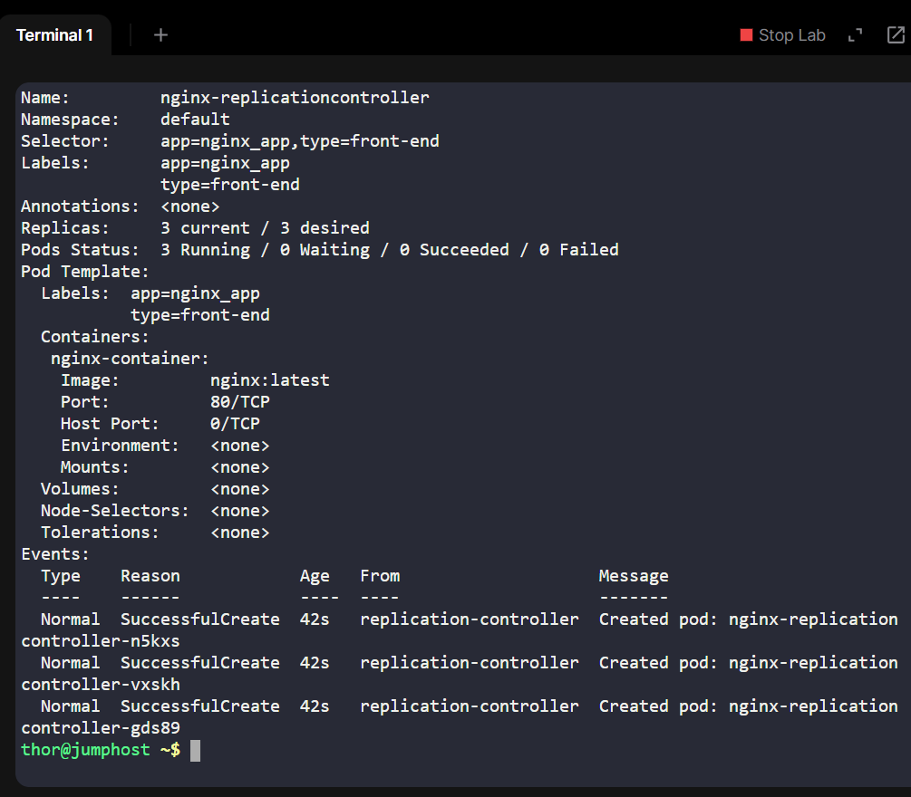

# Day 24: Implementing a Kubernetes ReplicationController for High Availability

## Overview
On Day 24 of my 100 Days of DevOps challenge, I focused on enhancing application availability by implementing a Kubernetes ReplicationController. This task aimed to ensure that a specified number of pod replicas are always running, even in the event of failures, thereby promoting high availability and resilience in the application infrastructure.

## Task Objectives
•	Create a ReplicationController named nginx-replicationcontroller using the nginx:latest image.

•	Set the replica count to 3, ensuring three pods are always running.

•	Assign labels: app=nginx_app and type=front-end to the pods.

•	Name the container within the pod as nginx-container.

•	Verify that all pods are in the Running state post-deployment.

## Steps Undertaken
1.	YAML Configuration: Developed a YAML file (nginx-rc.yaml) defining the ReplicationController specifications, including the desired replica count, labels, and container details.

2.	Deployment: Applied the configuration using kubectl apply -f nginx-rc.yaml to create the ReplicationController in the Kubernetes cluster.
3.	Verification:

-Checked the status of the ReplicationController with kubectl get rc.

-Listed the pods with kubectl get pods -l app=nginx_app to ensure all were running.

-Described the ReplicationController for detailed insights using kubectl describe rc nginx-replicationcontroller.

## Business and DevOps Relevance
Implementing a ReplicationController addresses several critical aspects:

1. High Availability: Ensures that the application remains available even if individual pods fail, by maintaining the desired number of replicas.
2. Scalability: Facilitates horizontal scaling by adjusting the replica count as needed to handle varying loads.
3. Self-Healing: Automatically replaces failed pods, minimizing downtime and manual intervention.
4. Infrastructure as Code: Promotes best practices by defining infrastructure through code, enabling version control and reproducibility.

This task aligns with industry standards for deploying resilient and scalable applications in Kubernetes environments.

## Conclusion
Day 24's task reinforced the importance of maintaining application availability and resilience in a cloud-native environment. By implementing a ReplicationController, I gained practical experience in Kubernetes resource management, which is essential for modern DevOps practices.
