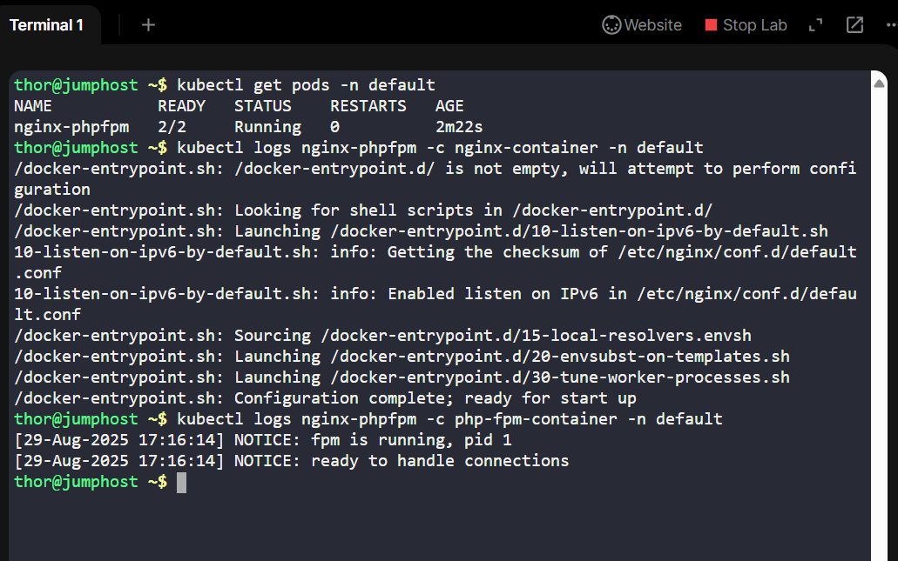
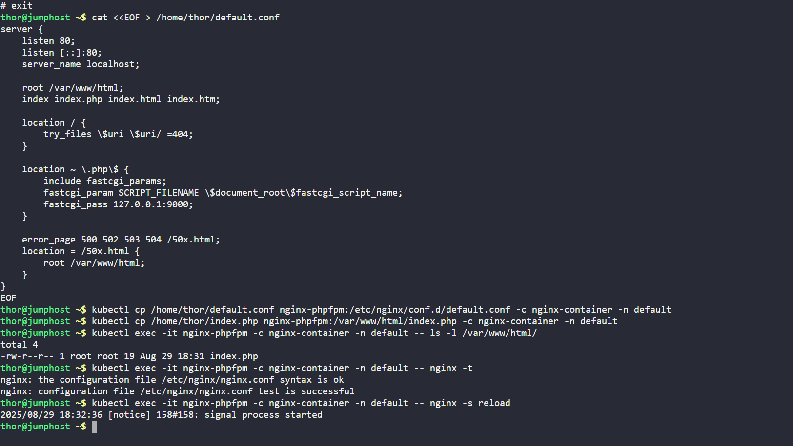
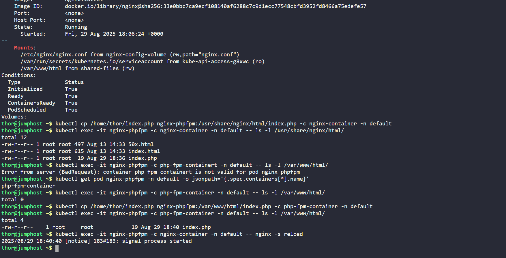
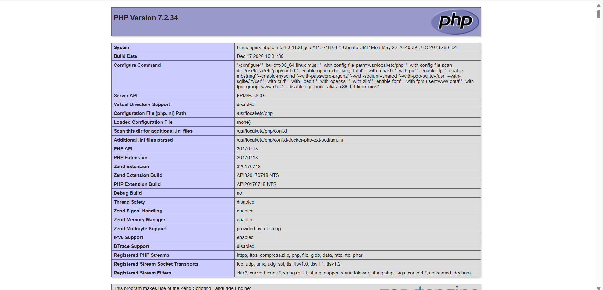

## Day 25 of 100 Days of DevOps - Debugging Nginx + PHP-FPM in Kubernetes (KodeKloud Lab)

## Problem Statement
The Nginx + PHP-FPM Pod (nginx-phpfpm) in Kubernetes crashed into misconfiguration and the hosted website showed only:

File not found.

The lab setup had:

•	Pod: nginx-phpfpm

•	ConfigMap: nginx-config (mounted as /etc/nginx/nginx.conf)

•	Containers:
-nginx-container (serves requests)

-php-fpm-container (executes PHP scripts)

-Volumes: shared-files mapped between /usr/share/nginx/html (nginx) and /var/www/html (php-fpm).

## Diagnosis
When checking the logs of the Nginx container: kubectl logs nginx-phpfpm -c nginx-container -n default, the Nginx config clearly served only HTML files, not PHP:

location / {
 
    root   /usr/share/nginx/html;
    
    index  index.html index.htm;

}

## Main Issue:
•	PHP requests were not passed to php-fpm-container.

•	Document roots were mismatched: nginx used /usr/share/nginx/html, while php-fpm expected /var/www/html.

## Solution
Step 1 - Fixed the Nginx Config
I created a proper default.conf to route PHP requests to php-fpm:

Then copied it into the Nginx container:

kubectl cp /home/thor/default.conf nginx-phpfpm:/etc/nginx/conf.d/default.conf -c nginx-container -n default

Step 2 - Deploy the Website Content

Copied the provided index.php into the shared volume path:

**Copy to nginx side**

kubectl cp /home/thor/index.php nginx-phpfpm:/usr/share/nginx/html/index.php -c nginx-container -n default

**Copy to php-fpm side (shared volume mount)**
kubectl cp /home/thor/index.php nginx-phpfpm:/var/www/html/index.php -c php-fpm-container -n default

Step 3 - Validate and Reload Nginx

kubectl exec -it nginx-phpfpm -c nginx-container -n default -- nginx -t

kubectl exec -it nginx-phpfpm -c nginx-container -n default -- nginx -s reload

Step 4 - Verify

Checked both containers see the file:

kubectl exec -it nginx-phpfpm -c nginx-container -n default -- ls -l /usr/share/nginx/html/

kubectl exec -it nginx-phpfpm -c php-fpm-container -n default -- ls -l /var/www/html/

-Website loaded successfully via Website button (lab URL).

## Business Value
Why does this matter in the real world?

•	Separation of concerns: Nginx handles static files and request routing, while PHP-FPM executes dynamic code.

•	Scalability: With the correct configuration, we can independently scale PHP workers and Nginx frontends.

•	Resilience: Shared volumes ensure consistency of application files across containers in the same Pod.

This lab mirrors real production troubleshooting where misconfigured reverse proxies can take down customer-facing apps.
________________________________________
📸 Suggested Screenshots for GitHub + LinkedIn
1.	Pod status before fix: kubectl get pods -n default -w → (CrashLoopBackOff)
o	Save as 01_pod_crash.png
2.	Default Nginx config (wrong):
3.	kubectl exec -it nginx-phpfpm -c nginx-container -- cat /etc/nginx/conf.d/default.conf
o	Save as 02_wrong_conf.png
4.	Editing and copying new default.conf (kubectl cp success).
o	Save as 03_conf_fix.png
5.	Shared volume check (ls -l in both containers).
o	Save as 04_shared_volume.png
6.	Final success screenshot: Website showing PHP page.
o	Save as 05_success.png

## Reflections (Day 25 / 100)
Today’s lesson was a deep dive into real-world debugging of multi-container pods in Kubernetes.
•	Root cause: Misaligned Nginx + PHP-FPM config.

•	Fix: Corrected nginx.conf and placed index.php into the shared volume.

•	Result: Running website again!

Every failure brings me closer to mastering production-grade systems.
