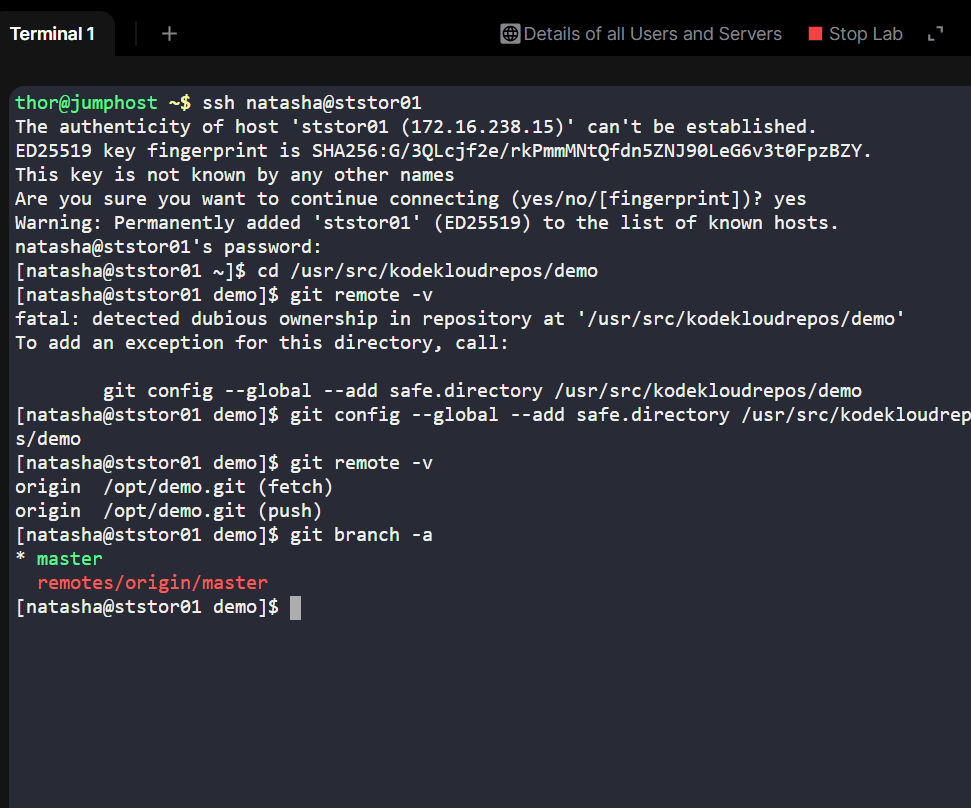
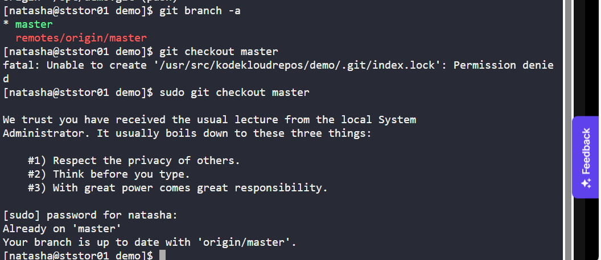
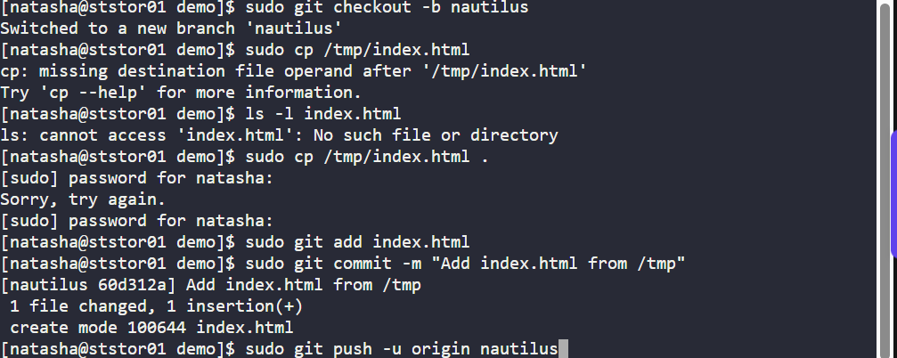
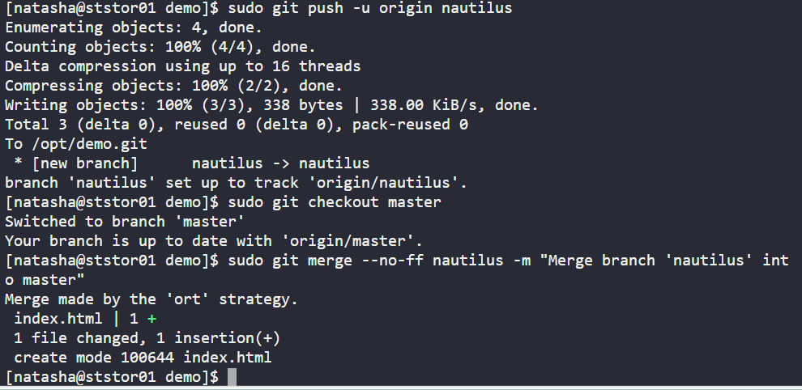
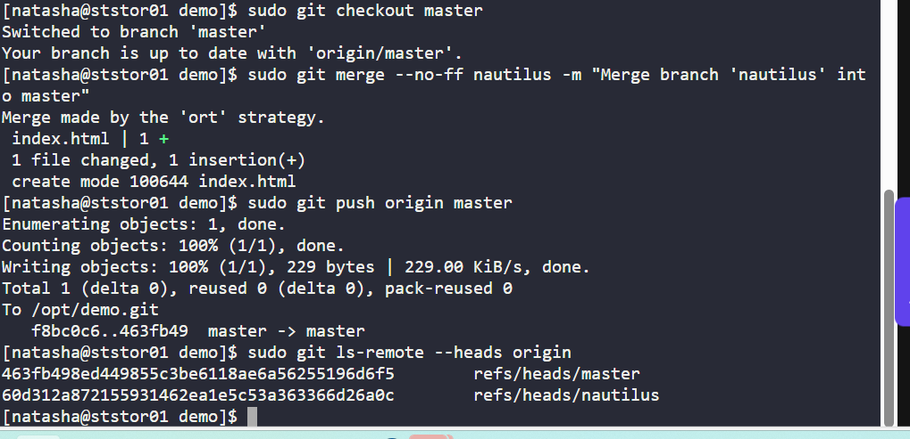

# Day 25 of 100 Days of DevOps - Practicing Git Branching & Collaboration  

As part of my **100 Days of DevOps journey**, I’ve been focusing not only on cloud and automation but also on the **version control practices** that glue DevOps pipelines together.  

Today’s task was about **Git fundamentals** - configuring safe directories, working with feature branches, merging into master, and keeping remote repositories in sync.  

## Business Need  

In real DevOps and cloud-native environments, **teams of engineers often work simultaneously** on the same repository. To avoid conflicts, ensure traceability, and maintain production stability, proper **branching strategies and disciplined commits** are essential.  

This exercise mirrors those scenarios by practicing a **feature branch workflow**, safe directory handling, and controlled merging back to master. These are skills directly applicable to:  

- CI/CD pipelines that automate builds from feature branches.  

- Code reviews where clarity and traceability are critical.  

- Collaborative environments where multiple contributors work in parallel.  

## Step-by-Step Workflow  

### 1. Configure Safe Directory  
1. git remote -v
2. git config --global --add safe.directory /usr/src/kodekloudrepos/demo
3. git branch -a

-Confirmed origin and fixed Git ownership warning.

2. Checkout Master & Sync

sudo git checkout master

sudo git pull origin master

-Ensured the local repo was up to date with the latest master.

3. Create Feature Branch

sudo git checkout -b nautilus

-Created nautilus branch for isolated changes.

4. Add Business Change (index.html)

sudo cp /tmp/index.html .

ls -l index.html

-Brought in new file representing a required update to the application.

5. Commit Feature Work

sudo git add index.html

sudo git commit -m "Add index.html from /tmp"

-Tracked changes and committed them with a clear message.

6. Push Feature Branch

sudo git push -u origin nautilus

-Shared the feature branch with the remote origin.

7. Merge Back into Master

sudo git checkout master

sudo git merge --no-ff nautilus -m "Merge branch 'nautilus' into master"

-Integrated the feature branch safely back into master.

8. Push Updated Master

sudo git push origin master

-Propagated the merged updates to the origin.
9. Verify Remote State

sudo git ls-remote --heads origin

-Confirmed both master and nautilus branches exist at the origin.

## Benefits of the Exercise
Practiced Git branching strategies commonly used in production workflows.

Reinforced safe directory handling and permissions in shared repos.

Demonstrated commit discipline with atomic changes and clear messages.

Mirrored real DevOps collaboration scenarios where multiple engineers contribute features.

This exercise builds confidence for managing feature branching, merging, and remote synchronization — all of which are fundamental in cloud-native development pipelines.

📸 Screenshots
Screenshots captured during this exercise (see screenshots/ folder):

01-safe-directory.png – Fixed repo ownership issue.

04-create-nautilus-branch.png – Created feature branch.

05-copy-file.png – Copied new file into repo.

07-push-nautilus.png – Pushed new branch to origin.

08-merge-master.png – Merged feature branch into master.
