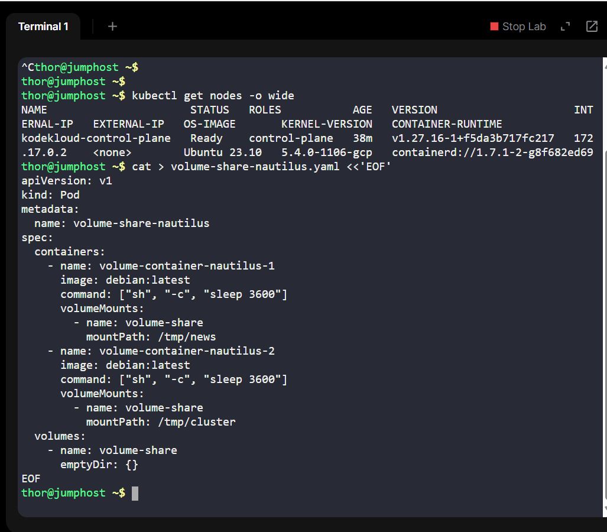
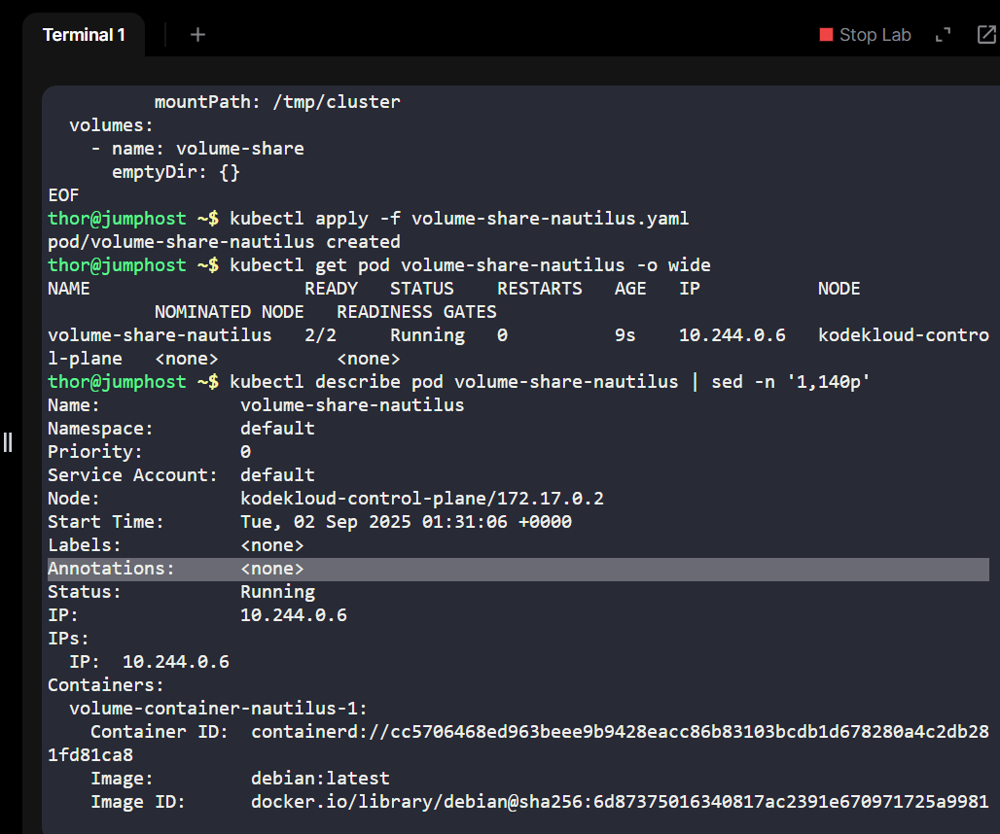
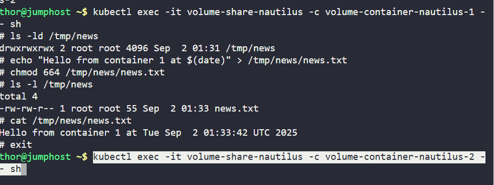
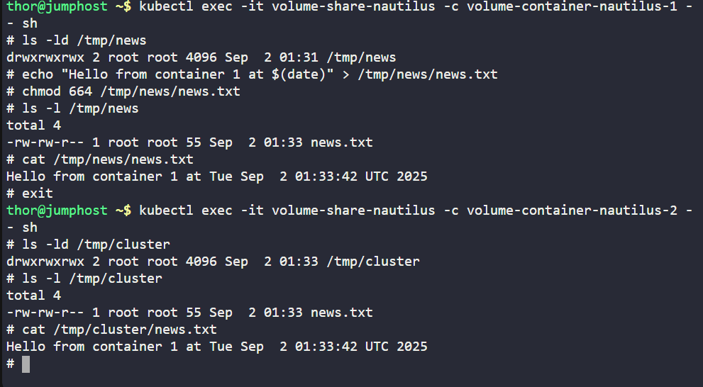

# Day 28 - Sharing Volumes Between Containers in Kubernetes
As part of my 100 Days of DevOps Challenge, today’s focus was on Kubernetes pod volumes, specifically, how multiple containers within a single pod can share data using an emptyDir volume.

This lab builds on my earlier Kubernetes learnings (Pods, Deployments, ConfigMaps, Secrets) and moves deeper into state handling inside clusters.

## Business Need
Modern applications often run in multi-container pods where containers need to exchange data at runtime. For example:

•	A logging sidecar collecting app logs written by the main app container.

•	A data pre-processor feeding real-time files to a consumer container.

•	A CI/CD pipeline step where build artifacts are generated by one container and consumed by another.

Kubernetes’ emptyDir volumes provide a temporary, high-performance storage solution for such cases. This allows containers in the same pod to work together seamlessly without needing external persistent storage.
## Business Value:
•	Faster data exchange between services.

•	Cost savings by reducing dependency on external storage (S3, NFS, etc.) when only ephemeral data is needed.

•	Improved performance as data is stored locally on the pod’s node.

## Task Breakdown
1.	Create a pod with two containers (debian:latest).

-Container 1 mounts /tmp/news.

-Container 2 mounts /tmp/cluster.

-Both share the same emptyDir volume.

2.	Write a file (news.txt) from container 1.
3.	Verify file availability in container 2.
4.	Confirm shared volume works with the correct permissions.

## Execution & Verification
1.	Pod Creation

kubectl apply -f volume-share-nautilus.yaml

kubectl get pods -o wide

•	Verified that the pod is running with 2 containers.

2.	Write File in Container 1

kubectl exec -it volume-share-nautilus -c volume-container-nautilus-1 -- sh

echo "Hello from container 1 at $(date)" > /tmp/news/news.txt

ls -l /tmp/news

3.	Verify in Container 2

kubectl exec -it volume-share-nautilus -c volume-container-nautilus-2 -- sh

ls -l /tmp/cluster

cat /tmp/cluster/news.txt

## Key Learnings

•	emptyDir volumes are tied to the lifecycle of a pod → data is deleted when the pod is removed.

•	Useful for temporary storage, caching, and inter-container communication.

•	Reinforces real-world patterns like sidecar logging and multi-stage pipelines.

## Benefits of This Task
•	Demonstrates how cloud-native workloads handle intra-pod communication.

•	Shows efficiency in DevOps pipelines where containers share artifacts.

•	Aligns with enterprise needs for scalable, cost-effective data handling in Kubernetes.
