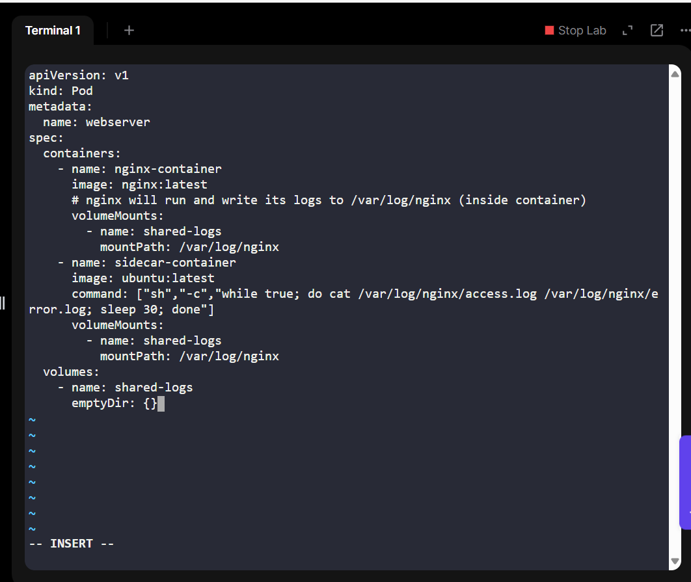
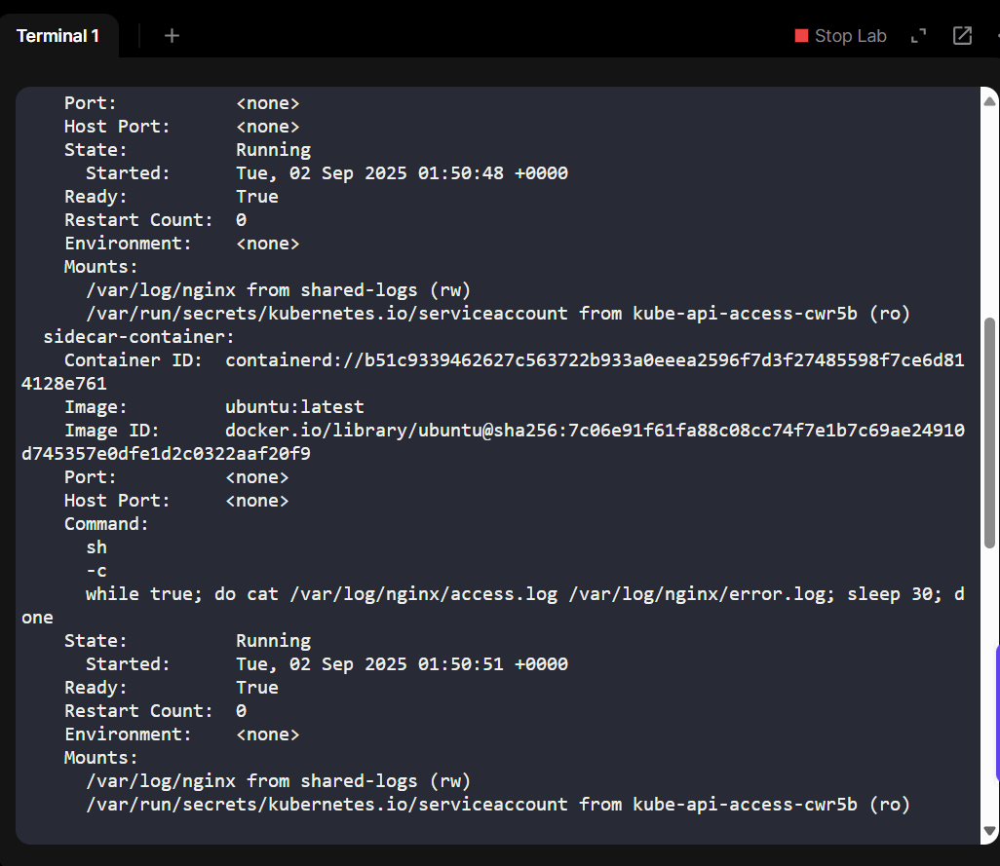
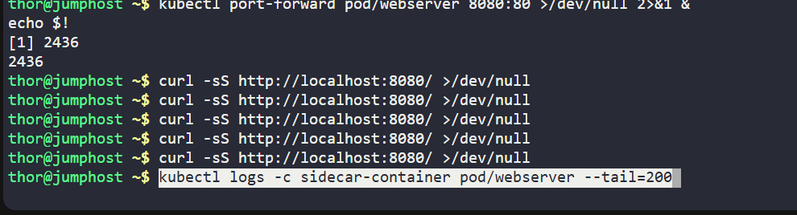
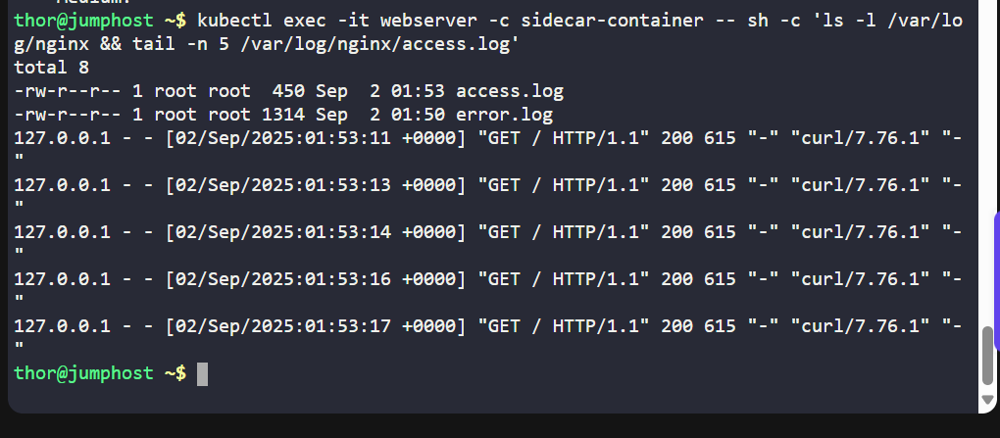
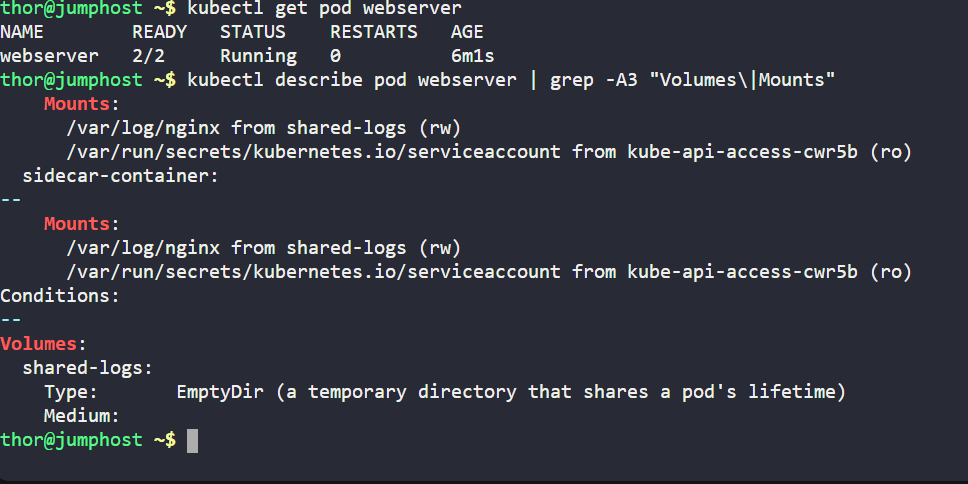

## Day 29 - Implementing the Sidecar Pattern in Kubernetes (Log Aggregation)
As part of my 100 Days of DevOps journey, I explored the Sidecar pattern in Kubernetes by solving a real-world scenario: enabling log aggregation for a web server without mixing responsibilities.

This builds on my earlier days where I worked on pods, volumes, and shared storage — now adding application observability through container design patterns.

## Business Need
In production, web servers like Nginx continuously generate access logs and error logs. These logs:

• Help developers trace bugs and debug issues within the last 24 hours.

• Provide operational visibility for site reliability engineers (SREs).

• But logs are not critical enough to warrant persistent storage, since only short-term availability is required.

### The solution: Implement the Sidecar Pattern.
• Main container (nginx) → Focuses only on serving web pages.

• Sidecar container (ubuntu) → Specializes in shipping/streaming logs.

• Both containers share a temporary (emptyDir) volume for logs.

This separation ensures each container “does one thing, and does it well.”

## Steps Taken
1. Pod Specification (webserver.yaml)

I defined a Pod with two containers and a shared volume
          
2. Apply the Pod

kubectl apply -f webserver.yaml

kubectl get pod webserver -o wide

3. Verify Pod Details

kubectl describe pod webserver | sed -n '1,100p'

This confirmed:

• Two containers (nginx-container & sidecar-container)

• Shared volume shared-logs mounted at /var/log/nginx

4. Generate Logs via Port Forward & Curl
kubectl port-forward pod/webserver 8080:80 >/dev/null 2>&1 &

curl -sS http://localhost:8080/ >/dev/null

This triggered entries in access.log.

5. View Logs in Sidecar

kubectl logs -c sidecar-container pod/webserver --tail=20

I could see Nginx access logs being printed by the sidecar.

6. Inspect Logs Inside Sidecar Container

kubectl exec -it webserver -c sidecar-container -- sh -c 'ls -l /var/log/nginx && tail -n 5 /var/log/nginx/access.log'

This showed that both access.log and error.log exist and contain data.

7. Final Verification

kubectl get pod webserver

Pod remained running with no restarts, lab passed.

## Benefits of This Approach
• Separation of Concerns → Each container focuses on one job (serving traffic vs. log shipping).

• Operational Flexibility → The sidecar can be replaced with another logging agent (e.g., Fluentd, Filebeat) without touching the Nginx container.

• Short-Term Log Availability → Developers get access to the last 24 hours of logs without wasting persistent storage.

• Real-World Relevance → Mirrors how modern Kubernetes platforms handle observability.
