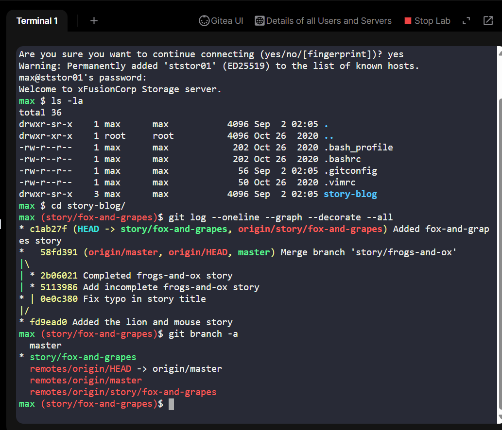
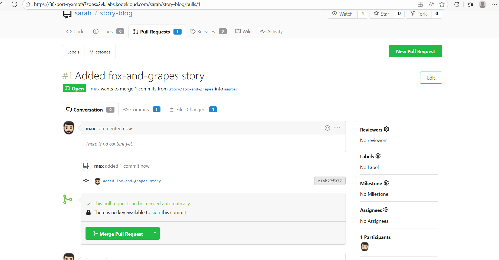
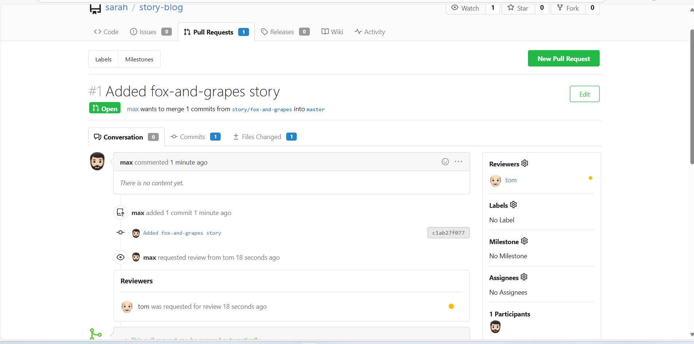
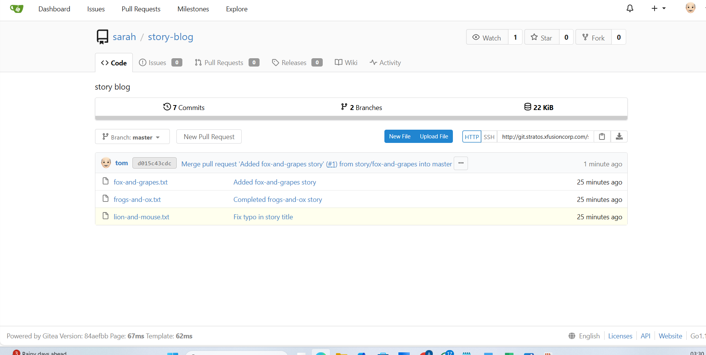
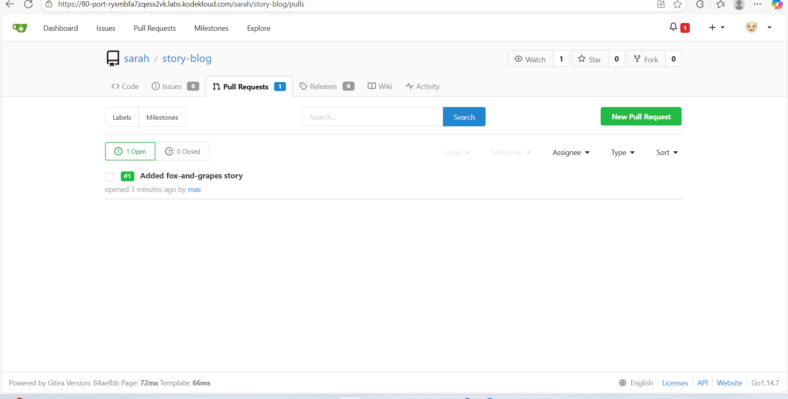

# Day 29: Git Branch Protection and Pull Request Workflow
In this exercise, we focused on implementing a safe Git workflow where no one can push directly to the master branch. This is a common industry best practice to ensure code quality, auditability, and stability in production environments.

## Project Overview
### Business Need:

Direct pushes to master are risky because master represents the final, production-ready code. Any unreviewed change could break builds or production services.

### Goal of the Exercise:
•	Ensure all code changes are first made in feature or story branches.

•	Submit Pull Requests (PRs) for review before merging into master.

•	Assign reviewers to enforce a peer-review workflow.

#### Outcome:
Max’s story “The 🦊 Fox and Grapes 🍇” was successfully merged into master only after review and approval by Tom, demonstrating a safe and collaborative workflow.

## Step-by-Step Instructions
1. SSH into the Storage Server

ssh max@ststor01

# Password: Max_pass123

•	Navigate to Max’s home directory where the repository is cloned.

•	Verify repository structure and existing branches.

2. Explore Repository and Check Commits

cd story-blog/

git log --oneline --graph --decorate --all

git branch -a

•	Confirm Max’s branch story/fox-and-grapes exists.

•	Validate commit history, author info, and previous stories (e.g., Sarah’s stories).

3. Create a Pull Request (PR) via Gitea UI

Steps:

1.	Click the Gitea UI button on the top bar to open the repository in the web portal.

2.	Log in as Max:

-Username: max

-Password: Max_pass123

3.	Create a new PR:

-PR Title: Added fox-and-grapes story

-Pull from branch: story/fox-and-grapes

-Merge into: master

4. Assign a Reviewer

Steps:

-Go to the newly created PR.

-Click Reviewers on the right sidebar.

-Add Tom as a reviewer.

5. Review and Approve PR as Tom

Steps:

-Log out from Max’s account and log in as Tom:

Username: tom

Password: Tom_pass123

-Open the PR titled Added fox-and-grapes story.

-Review the changes and approve the PR.

-Merge the branch into master.

6. Verify Merge

## Key Benefits and Business Impact
•	Branch protection: Prevents accidental or unreviewed changes to production code.

•	Peer review: Ensures higher quality, less error-prone code.

•	Collaboration: Encourages communication between developers (Max) and reviewers (Tom).

•	Auditability: Full history of commits and approvals is preserved.

•	Professional workflow experience: Mirrors real-world DevOps practices in a safe, simulated environment.

### Lab Outcome: Max’s story was successfully merged into master only after peer review, ensuring a safe, collaborative, and professional workflow.
