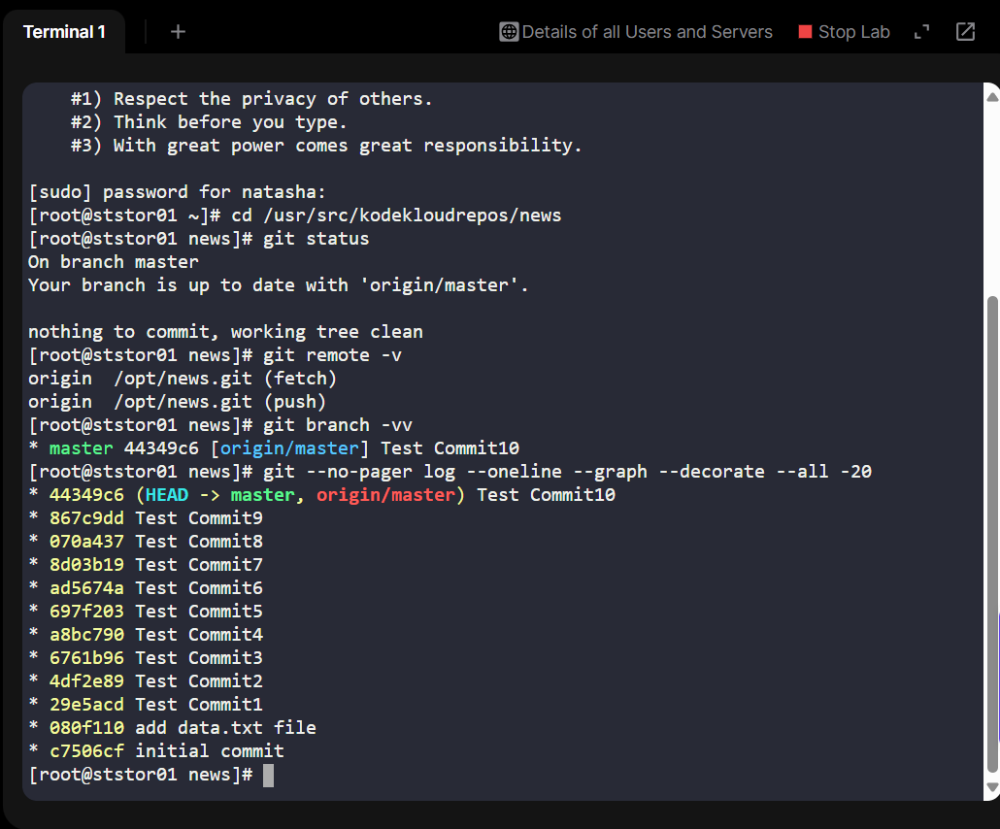
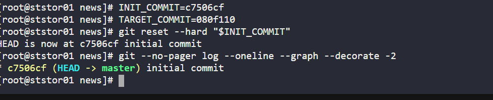
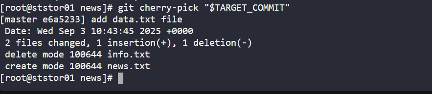
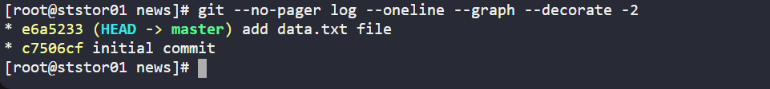
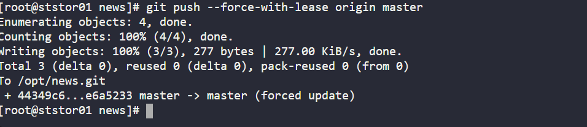
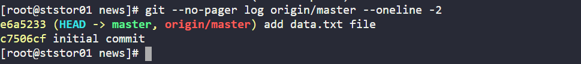

# Day 30 - Git Commit History Rewrite (KodeKloud Lab)
As part of my 100 Days of DevOps challenge, I completed a lab on KodeKloud that focused on resetting and rewriting Git commit history.

This task simulated a real-world DevOps challenge:

A developer pushed several test commits into a shared repository. As a DevOps engineer, I was asked to clean the repository, preserving only the initial commit and the commit that added the data.txt file, and then update the remote repository to reflect the clean history.

## Business Context
In enterprise environments:

•	Messy commit history reduces code readability and complicates auditing.

•	Test commits or accidental pushes increase repository noise.

•	Auditors and compliance teams often require repositories to have meaningful, traceable commit history.

•	CI/CD pipelines depend on clean history for reproducible builds.

By learning how to rewrite history responsibly (and when it’s appropriate), I strengthened skills that directly support:

•	Code maintainability.

•	Collaboration between development and operations.

•	Business agility (teams can trust the state of repositories).

## Technical Walkthrough
I performed this task on the Storage server in Stratos DC inside the KodeKloud environment.

Step 1 - Inspect repository state

git status

git remote -v

git branch -vv

git --no-pager log --oneline --graph --decorate --all -20

•	Confirmed branch master.

•	Remote: /opt/news.git.

•	Found 11 noisy commits, including the ones we want:

-c7506cf initial commit

Step 2 - Reset to initial commit

git reset --hard c7506cf

•	Brought the branch back to its very first commit.

Step 3 – Cherry-pick the meaningful commit

git cherry-pick 080f110

•	Applied the changes from the add data.txt file commit onto the reset branch.

•	This produced a new commit e6a5233 add data.txt file.

Step 4 – Verify clean history

git --no-pager log --oneline --graph --decorate -2

Result: only two commits remain:

e6a5233 add data.txt file

c7506cf initial commit

Step 5 – Push changes safely

git push --force-with-lease origin master

•	Updated remote repository to match the cleaned history.

•	Verified with:

git log origin/master --oneline -2

## Outcome
•	Local and remote repositories now show a minimal, clean commit history.

•	Demonstrated safe use of git reset, git cherry-pick, and git push --force-with-lease.

•	Practiced rollback awareness (via git reflog) in case recovery is needed.

## Benefits of This Exercise
•	For Developers: Easier to review code history and understand meaningful changes.

•	For DevOps Engineers: Builds confidence in handling Git operations that impact shared repositories.

•	For Businesses: Clean history supports compliance, reduces risk of errors, and improves developer productivity.

## Key Takeaways
•	Not every Git rewrite is dangerous — with the right workflow (--force-with-lease, backups, reflog), it can be done responsibly.

•	This skill is essential in DevOps pipelines, especially when enforcing quality and compliance in version control.

•	Day 30 reinforces the importance of discipline in source control — a critical foundation for CI/CD and cloud-native DevOps practices.
