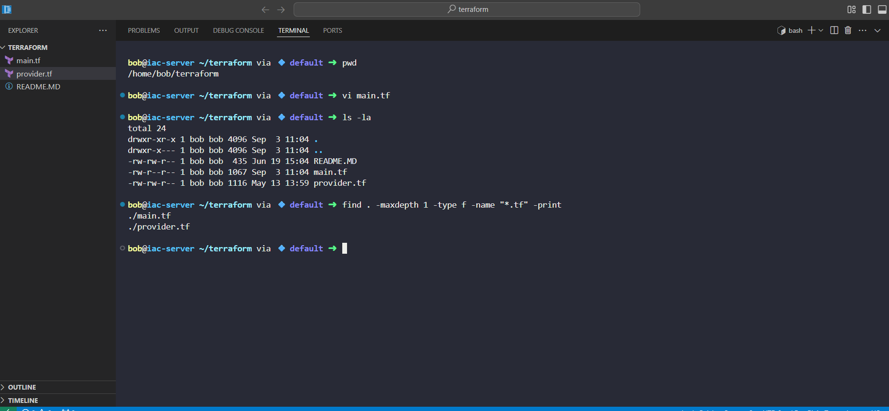
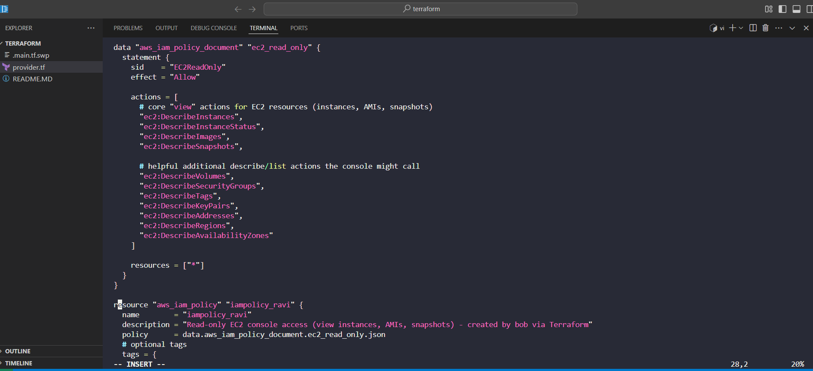
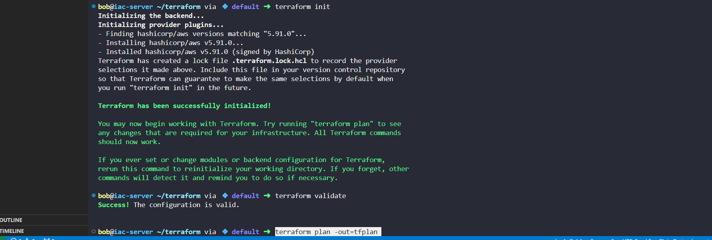
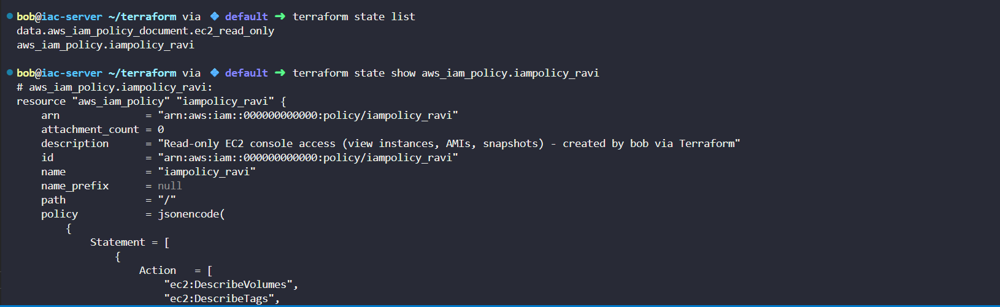

# Day 30 - IAM Policy with Terraform (KodeKloud Lab)

As part of my **[100 Days of DevOps](https://github.com/folaaramide/100-days-of-devops)** journey, I completed a Terraform lab focused on **AWS Identity and Access Management (IAM)**.

## Business Context

When setting up infrastructure in the cloud, **Identity and Access Management (IAM)** is among the first - and most critical - services to configure.  

- Businesses need to **control who can do what** in AWS.  

- Teams require **read-only policies** for auditing, troubleshooting, or giving developers safe visibility into resources.  

- Following the **principle of least privilege** reduces the risk of accidental changes and ensures compliance with security standards.  

In this task, I was asked to create a **read-only IAM policy** that grants access to view Amazon EC2 resources (instances, AMIs, snapshots) in the AWS console.

## Technical Implementation

- **Tooling:** Terraform (Infrastructure as Code).  

- **Region:** `us-east-1`.  

- **Resource:** `aws_iam_policy` named `iampolicy_ravi`.  

- **Permissions:** Read-only access to EC2 console actions.  

The lab specifically required all work to be done in a single file: `/home/bob/terraform/main.tf`.

### Step 1: Prepare Working Directory
pwd

vi main.tf

ls -la

find . -maxdepth 1 -type f -name "*.tf" -print

Step 2: Write the main.tf

Step 3: Initialize Terraform
terraform fmt

terraform init

terraform validate

Step 4: Plan and Apply

terraform plan -out=tfplan

terraform apply -auto-approve

Step 5: Verify in Terraform State

terraform state list

terraform state show aws_iam_policy.iampolicy_ravi

## Outcome
•	Created IAM policy iampolicy_ravi in us-east-1.

•	Policy grants read-only access to EC2 console resources (instances, AMIs, snapshots).

•	Validated with Terraform state (CLI verification not required by the lab).

•	Followed Infrastructure as Code practices — policy definition is version-controlled and reproducible.

## Benefits of This Task
•	For Security: Implements least privilege by granting only read-only access.

•	For Business: Ensures compliance, reduces accidental misconfigurations, and allows safe visibility for non-admin users.

•	For DevOps Practice: Reinforces using Terraform to manage IAM consistently across environments.
