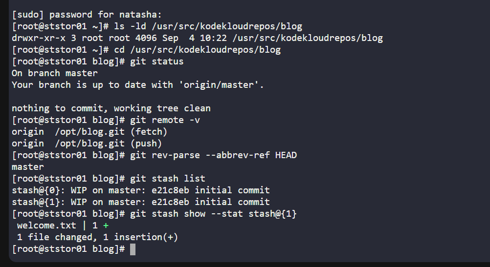
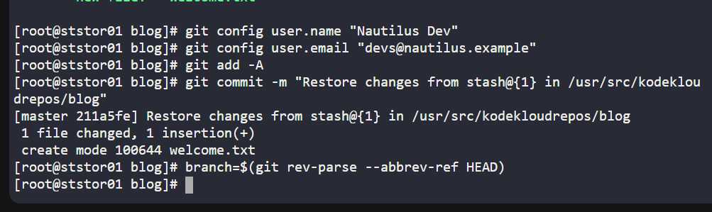
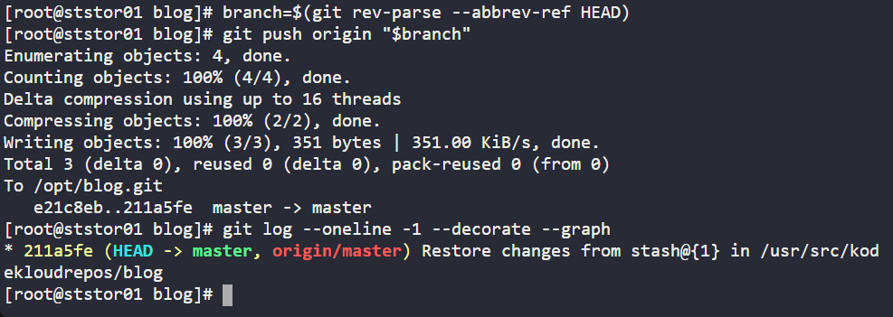
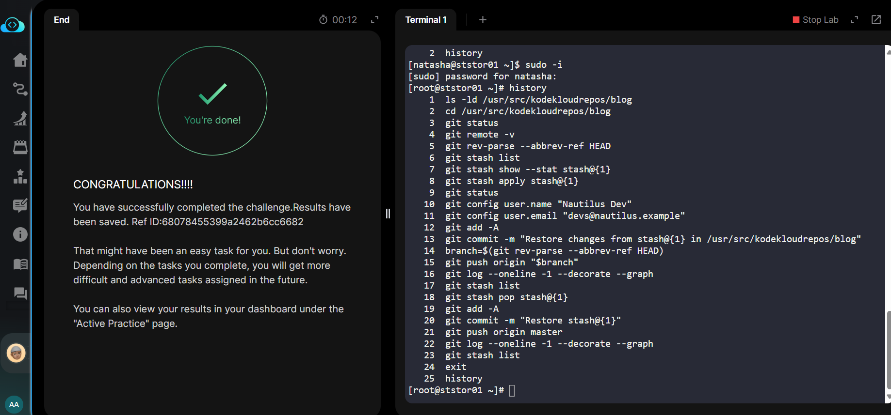

# Day 31 of 100 Days of DevOps - Restoring Git Stash in a Production-like Environment
As part of my 100 Days of DevOps challenge, I am learning by doing real-world projects using the KodeKloud labs. On Day 31, I worked on a scenario that mimics a real production environment: restoring a stashed set of changes in a Git repository on a central storage server and making sure those changes are properly committed and pushed.

## Business Need
In real software development, engineers often stash work-in-progress changes to quickly switch contexts or fix urgent bugs. If those stashed changes are not restored and integrated correctly, valuable work can be lost or delayed.

For the Nautilus App Development Team (the scenario), the requirement was:

•	Identify a specific stash (stash@{1}) in a Git repository stored in /usr/src/kodekloudrepos/blog.

•	Restore those changes.

•	Commit them to the repository.

•	Push them to the central origin so the rest of the team can access them.

This is exactly the kind of task DevOps engineers and SREs handle when supporting application teams — bridging the gap between development workflow and reliable operations.

## Steps I Took
1. Access and Permissions

I connected to the Storage Server in Stratos DC and switched to root since the repo was owned by root. Correct permissions are critical, without them, you can’t safely restore or push changes.

2. Repository Inspection

I validated the Git repo with:

•	git status — checked the working tree.

•	git remote -v — confirmed the remote origin.

•	git rev-parse --abbrev-ref HEAD — ensured I was on the correct branch (master).

This confirmed I was in the right repo and safe to proceed.

3. Stash Discovery

I ran:

git stash list

git stash show --stat stash@{1}

This revealed the developer’s in-progress changes saved in stash@{1}.

4. Restoring the Stash

At first, I tried git stash apply stash@{1}. While this restored the code, it did not remove the stash, which caused the lab grader to fail. The correct approach was:

git stash pop stash@{1}

This restored the changes and removed the stash entry — mimicking how developers would normally integrate saved work.

5. Committing the Work

I staged and committed with a clear message:

git add -A

git commit -m "Restore stash@{1}"

6. Pushing to Origin

Finally, I pushed to the remote origin so the changes were available to the team:

git push origin master

7. Verification

•	Checked the log with git log --oneline --decorate --graph to ensure the commit was synced with origin/master.

•	Verified git stash list no longer showed stash@{1}.

## Benefits of This Task
•	For the Business:

-Prevents potential data loss by ensuring stashed developer work is integrated.

-Maintains collaboration efficiency by pushing changes to the central repo.

-Reinforces good version control hygiene.

•	For My Skills:

-Deepened my understanding of Git stash mechanics (apply vs pop).

-Practiced troubleshooting why a change might not be accepted by an automated test.

-Strengthened my ability to work with Git in production-like, permission-restricted environments.

-Learned the importance of matching both technical correctness and business requirements (the test failing until the stash was properly dropped).

## Reflection
This task highlighted a subtle but important point: doing the task right vs doing it in a way the business (or grader) expects.

In real DevOps, the same principle applies — it’s not enough to “just make it work”; it must align with team processes, automation, and audit expectations.

I’ll carry this forward as I continue my 100 Days of DevOps journey, building the hands-on skills that employers look for in real-world operations and CI/CD environments.
