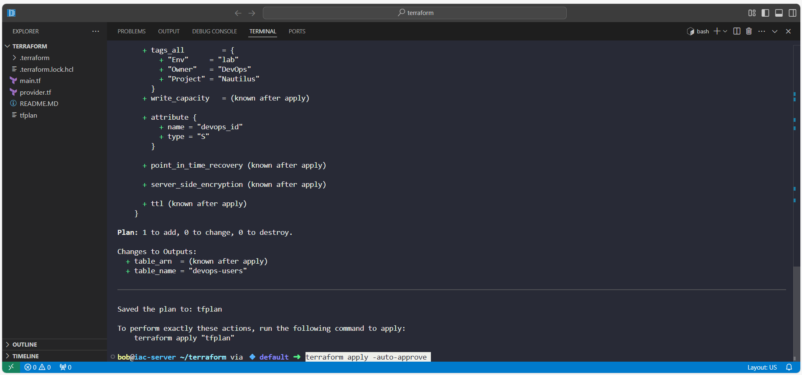

# Day 31 of 100 Days of DevOps/Cloud - Provisioning DynamoDB with Terraform

As part of my **100 Days of DevOps/Cloud journey**, today’s challenge (Day 31) on KodeKloud focused on using **Terraform** to provision an **AWS DynamoDB table**.  

This builds upon the previous days where I’ve automated infrastructure and deployed services with Terraform, Kubernetes, and CI/CD pipelines. Today’s task continues that flow, introducing **NoSQL data infrastructure automation**.  

## Business Context: Why DynamoDB with IaC?

In modern applications:  

-**User data** must be stored in a way that’s **scalable, secure, and cost-efficient**.  

-**DynamoDB** (serverless, NoSQL database) provides **high availability** with virtually unlimited throughput.  

-Using **Terraform (Infrastructure as Code)** ensures the setup is **repeatable, version-controlled, and auditable**, which is essential for compliance and collaboration.  

**Benefit to organizations**: No more manual console clicks. Entire environments can be recreated with a single `terraform apply`. This reduces errors, speeds up deployments, and aligns DevOps teams with **GitOps practices**.

## 🎯 Project Task

The Nautilus DevOps team required:  

1. A **DynamoDB table** named `devops-users`.  

2. The **primary key** set to `devops_id` (String).  

3. The **billing mode** to be `PAY_PER_REQUEST` (on-demand, cost-efficient).  

4. Setup must be done with **Terraform** in a single file: `main.tf`.

## Step-by-Step Implementation

### 1. Environment Setup
- Opened VS Code → Explorer → **Open in Integrated Terminal**.  

- Verified correct directory:

  pwd

  /home/bob/terraform

Checked AWS CLI + identity:

aws sts get-caller-identity

aws configure get region

-Confirmed IAM access + default region = us-east-1.

2️. Terraform Configuration - main.tf

Created the main.tf with all requirements:

3️. Terraform Lifecycle Commands

Initialize Terraform:

terraform init

Validate syntax:

terraform validate

Review plan:

terraform plan -out tfplan

Apply and provision the table:

terraform apply -auto-approve

4️. Verification

Checked DynamoDB via AWS CLI:

aws dynamodb list-tables

aws dynamodb describe-table --table-name devops-users

Output confirmed:

Table status = ACTIVE

Billing mode = PAY_PER_REQUEST

## Key Takeaways
Business Essence: Automating DynamoDB creation saves engineering time, reduces risk, and guarantees consistency across environments.

DevOps Flow: This aligns with GitOps, where infrastructure changes are committed, reviewed, and applied consistently.

Scalability and Cost Efficiency: Using on-demand billing mode (PAY_PER_REQUEST) ensures costs scale directly with usage — perfect for unpredictable workloads.
